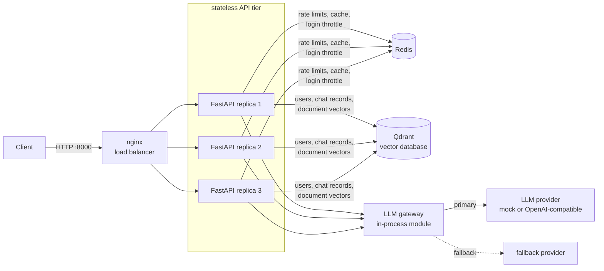
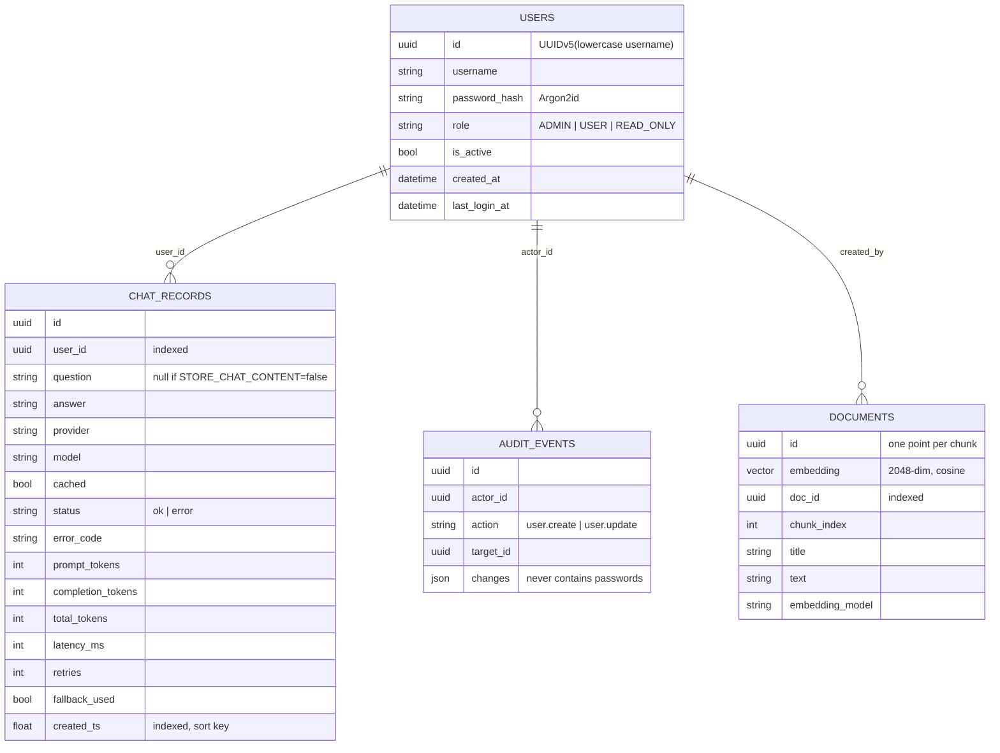

# AI Question-Answering Platform

A small, production-minded API that takes a user's question, optionally grounds it in a
knowledge base (RAG), sends it to an LLM through a resilient gateway, and returns the answer.
It is secured with JWT and role-based access control, rate-limited and cached with Redis,
persisted in a vector database (Qdrant), observable through Prometheus metrics and JSON logs,
and runs as three load-balanced replicas with one Docker Compose command.

Built for the *AI/LLM Platform & DevOps Engineer* technical assessment.

> **Honesty labels used throughout this repository**
> **[IMPLEMENTED]** built, running and tested here · **[CONFIGURED]** configuration exists but was
> never run in a real environment · **[PROPOSED]** design for a future production system only.
>
> Local Docker Compose is **not** a highly available cloud system, and local JWT login is **not**
> enterprise SSO. Nothing in this repository has been deployed to a cloud, and no real LLM
> provider was called during development: every test and measurement uses the mock provider.

## Contents

1. [What it does](#1-what-it-does) · 2. [Architecture](#2-architecture) · 3. [Tech stack](#3-tech-stack-and-why) ·
4. [Quick start](#4-quick-start-docker) · 5. [Using the API](#5-using-the-api) · 6. [Configuration](#6-configuration) ·
7. [Data design](#7-data-design-qdrant) · 8. [Redis](#8-what-redis-does) · 9. [LLM providers](#9-llm-provider-configuration) ·
10. [Errors](#10-error-handling) · 11. [Monitoring](#11-monitoring) · 12. [Testing](#12-testing) ·
13. [Scaling](#13-scaling-strategy-summary) · 14. [Security](#14-security) · 15. [Deployment and migration](#15-deployment-architecture-and-migration) ·
16. [Limitations](#16-limitations) · 17. [Future work](#17-future-improvements) · 18. [Repository layout](#18-repository-layout)

## 1. What it does

| Feature | Status | Notes |
|---|---|---|
| `POST /auth/login`, `GET /auth/me` – JWT (HS256), Argon2id password hashing | IMPLEMENTED | Local identity only |
| RBAC: `ADMIN`, `USER`, `READ_ONLY` via a `require_role` dependency | IMPLEMENTED | Role re-read from the database on every request |
| `POST /chat` – LLM answer with latency, token usage, retries, fallback flag | IMPLEMENTED | |
| RAG – document ingestion, chunking, embeddings, vector search, cited sources | IMPLEMENTED | Default embedder is lexical (see [Limitations](#16-limitations)) |
| Qdrant as the only database (users, chat records, audit events, document vectors) | IMPLEMENTED | Replaces PostgreSQL |
| LLM gateway: timeouts, overall deadline, bounded retries with backoff + jitter, circuit breaker, fallback provider, concurrency cap with load shedding | IMPLEMENTED | |
| Mock LLM provider (default) and OpenAI-compatible HTTP adapter | IMPLEMENTED | Adapter tested against stubbed HTTP only |
| Redis: distributed rate limiting, login throttling, response cache | IMPLEMENTED | |
| `/health`, `/health/live`, `/health/ready`, `/metrics` (Prometheus), JSON logs | IMPLEMENTED | |
| Dockerfile (multi-stage, non-root), Compose with nginx + 3 API replicas | IMPLEMENTED | Single host |
| `GET /chat/history`, `/admin/users` management, audit trail (`GET /admin/audit`) | IMPLEMENTED | |
| GitHub Actions workflow (lint, type check, tests, audit, image build) | CONFIGURED | Same steps pass locally; not yet run on GitHub |
| Kubernetes manifests incl. HPA (`k8s/`) | CONFIGURED | YAML parses; never applied to a cluster |
| AWS ALB / ECS or EKS / managed Redis and Qdrant / queue workers | PROPOSED | [docs/scaling-analysis.md](docs/scaling-analysis.md) |
| OAuth2/OIDC with an identity provider behind an API gateway | PROPOSED | [docs/architecture.md](docs/architecture.md#6-evolution-to-ssooidc-proposed) |

## 2. Architecture

The diagram shows what is **[IMPLEMENTED]** and runs locally with Docker Compose on one machine.
The **[PROPOSED]** cloud architecture is a separate diagram in
[docs/scaling-analysis.md §13](docs/scaling-analysis.md#13-target-production-architecture-proposed).



A `/chat` request: nginx → request-id/metrics middleware → JWT + role check → Redis rate limit →
Redis cache lookup → embed question and search Qdrant for context → LLM gateway (timeout, retry,
breaker, fallback) → write the record to Qdrant → cache the answer → respond.

The API replicas hold no state of their own: any replica can serve any request, which is what
makes horizontal scaling possible. Details: [docs/architecture.md](docs/architecture.md).

## 3. Tech stack and why

| Choice | Why this | Why not the alternative |
|---|---|---|
| Python 3.12 + FastAPI | Async-native (an LLM proxy mostly waits on I/O), Pydantic validation, auto OpenAPI docs, dependency injection fits RBAC | Flask: manual validation and sync by default. Django: heavier than this API needs |
| Qdrant (vector DB) | One datastore for both RAG vectors and application records; vector search is first-class | PostgreSQL would be the conventional choice for users/records (ACID, constraints); the trade-off is discussed in [section 7](#7-data-design-qdrant) |
| Redis 7 | Atomic counters and TTLs shared by all replicas | In-process dictionaries give every replica its own limit |
| PyJWT + argon2-cffi | Small focused libraries; Argon2id is the current password-hashing recommendation | python-jose (maintenance concerns); SHA-256 is far too fast for passwords |
| httpx | Async HTTP with explicit timeouts, easy to stub in tests | `requests` blocks the event loop; vendor SDKs hide retries and timeouts |
| Hand-written retry loop | ~30 lines the author can explain line by line, deterministic in tests | tenacity works but hides the logic |
| prometheus-client | De facto metrics standard | Custom JSON metrics need custom tooling |
| stdlib `logging` + JSON formatter | No extra dependency | `print` has no levels, structure or request ids |
| pytest + fakeredis + Qdrant in-memory mode | Full suite runs in seconds with no Docker and no API key | Tests that need live services get skipped |
| Docker Compose + nginx | Reproducible, shows real load balancing across replicas | Bare-metal setup is not reproducible |

## 4. Quick start (Docker)

Prerequisites: Docker Desktop (or Docker Engine + Compose v2) and Python 3.12+ (only for the two
helper scripts).

```bash
git clone <your-repo-url> ai-qa-platform
cd ai-qa-platform
python scripts/make_env.py          # creates .env with a random JWT secret and admin password
docker compose up --build -d        # nginx + 3 API replicas + Qdrant + Redis
python scripts/smoke_test.py        # 21 end-to-end checks; expect "ALL CHECKS PASSED"
```

Then open <http://localhost:8000/docs> (Swagger UI; set `DOCS_ENABLED=false` to hide it).

* The first admin is created by the one-shot `init` service from `ADMIN_USERNAME` /
  `ADMIN_PASSWORD` in `.env`. The username is `admin`; **read the generated password from `.env`**.
  No default password exists anywhere in the repository.
* Change the number of replicas with `APP_REPLICAS=5 docker compose up -d`, then
  `docker compose exec nginx nginx -s reload` so nginx picks up the new set.
* Stop: `docker compose down` (data kept in named volumes) · wipe: `docker compose down -v`.
* If port 8000 is taken, set `HOST_PORT` in `.env`.

### Run without Docker (development)

```bash
python -m venv .venv && source .venv/bin/activate      # Windows: .venv\Scripts\activate
pip install -r requirements-dev.txt
docker compose -f docker-compose.yml -f docker-compose.dev.yml up -d qdrant redis
python -m app.database.seed                            # create collections + admin
uvicorn app.main:app_factory --factory --reload
```

## 5. Using the API

All examples use `curl` in a bash-style shell (on Windows PowerShell use `curl.exe`, or just use
the Swagger UI).

```bash
# 1. Log in (the password is ADMIN_PASSWORD from .env)
TOKEN=$(curl -s localhost:8000/auth/login -H 'Content-Type: application/json' \
  -d '{"username":"admin","password":"<ADMIN_PASSWORD>"}' | python -c "import sys,json; print(json.load(sys.stdin)['access_token'])")

# 2. Add knowledge (ADMIN)
curl -s localhost:8000/documents -H "Authorization: Bearer $TOKEN" -H 'Content-Type: application/json' \
  -d '{"title":"Redis notes","text":"Redis is an in-memory data store used for caching and rate limiting."}'

# 3. Ask
curl -s localhost:8000/chat -H "Authorization: Bearer $TOKEN" -H 'Content-Type: application/json' \
  -d '{"question":"What is Redis used for?"}'
```

Example `/chat` response (mock provider):

```json
{
  "id": "b84f0e8b-ba03-49bb-b586-3eb6390b4d93",
  "answer": "[mock] Based on the knowledge base: Redis is an in-memory data store used for caching and rate limiting.",
  "provider": "mock",
  "model": "mock-1",
  "cached": false,
  "usage": {"prompt_tokens": 29, "completion_tokens": 18, "total_tokens": 47},
  "latency_ms": 7,
  "retries": 0,
  "fallback_used": false,
  "sources": [{"doc_id": "c4712634-b243-41a8-9fcd-23d413bca284", "title": "Redis notes", "chunk_index": 0, "score": 0.5}]
}
```

`usage` is passed through from the provider and is `null` when the provider does not report it
(and for cache hits, where no tokens were spent). The mock's counts are word counts, a simulation.

### Endpoints

| Method and path | Roles | Purpose |
|---|---|---|
| `POST /auth/login` | public | Username + password → `{access_token, token_type, expires_in}` |
| `GET /auth/me` | any authenticated | Current user (never includes the password hash) |
| `POST /chat` | ADMIN, USER | `{question, model?, temperature?, use_rag?}` → answer |
| `GET /chat/history?limit=&offset=&user_id=` | any (own); ADMIN (others, or `user_id=all`) | Stored chat records, newest first |
| `POST /documents` | ADMIN | Ingest `{title, text, source?}` into the knowledge base |
| `GET /documents` | any authenticated | List documents |
| `POST /documents/search` | any authenticated | Vector search only, no LLM call |
| `DELETE /documents/{doc_id}` | ADMIN | Remove a document and its chunks |
| `GET /admin/users`, `POST /admin/users`, `PATCH /admin/users/{id}` | ADMIN | Manage users (role, active flag, password) |
| `GET /admin/audit` | ADMIN | Audit trail: user and knowledge-base changes, newest first |
| `GET /health`, `/health/live`, `/health/ready` | public | See [Monitoring](#11-monitoring) |
| `GET /metrics` | ADMIN token, or `METRICS_SCRAPE_TOKEN` | Prometheus text format |

### RBAC matrix (enforced by `tests/api/test_auth_api.py::test_rbac_matrix`)

| Capability | ADMIN | USER | READ_ONLY |
|---|:-:|:-:|:-:|
| Log in, `GET /auth/me` | ✔ | ✔ | ✔ |
| `POST /chat` (costs LLM tokens) | ✔ | ✔ | ✘ 403 |
| `GET /chat/history` (own) | ✔ | ✔ | ✔ |
| `GET /chat/history` (others) | ✔ | ✘ 403 | ✘ 403 |
| List / search documents (permitted data, no LLM cost) | ✔ | ✔ | ✔ |
| Ingest / delete documents | ✔ | ✘ 403 | ✘ 403 |
| `/admin/*` | ✔ | ✘ 403 | ✘ 403 |
| `/metrics` | ✔ | ✘ 403 | ✘ 403 |

Missing, malformed, expired or forged token → **401** with `WWW-Authenticate: Bearer`.
Valid token but insufficient role → **403**. A deactivated account → **401** immediately (the
user is loaded from the database on every request, so there is no wait for token expiry).

## 6. Configuration

Everything is read from environment variables by one module, `app/core/config.py`.
[.env.example](.env.example) documents every variable. The important ones:

| Variable | Default | Meaning |
|---|---|---|
| `APP_ENV` | `prod` in `.env.example` | `prod` refuses to start with a weak or default `JWT_SECRET` |
| `JWT_SECRET` | none | ≥ 32 random characters |
| `JWT_EXPIRE_MINUTES` | 30 | Access-token lifetime |
| `ADMIN_USERNAME`, `ADMIN_PASSWORD` | `admin`, none | First admin, seeded by the `init` job |
| `APP_REPLICAS`, `HOST_PORT` | 3, 8000 | Compose only |
| `QDRANT_URL`, `REDIS_URL` | localhost | Compose overrides them with service names |
| `STORE_CHAT_CONTENT` | true | `false` stores usage metadata but no question/answer text |
| `CHAT_RATE_LIMIT` / `CHAT_RATE_WINDOW_SECONDS` | 20 / 60 | Per-user `/chat` limit |
| `LOGIN_MAX_ATTEMPTS` / `LOGIN_LOCKOUT_SECONDS` | 5 / 300 | Brute-force throttle per username + IP |
| `CACHE_ENABLED` / `CACHE_TTL_SECONDS` | true / 600 | Response cache |
| `LLM_PROVIDER` / `LLM_FALLBACK_PROVIDER` | `mock` / empty | `mock` or `openai_compatible` |
| `LLM_TIMEOUT_SECONDS` / `LLM_OVERALL_DEADLINE_SECONDS` | 15 / 40 | Per attempt / per request |
| `LLM_MAX_RETRIES`, `LLM_BACKOFF_BASE_SECONDS`, `LLM_BACKOFF_MAX_SECONDS` | 2, 0.5, 8 | Retry policy |
| `LLM_MAX_CONCURRENCY` / `LLM_QUEUE_WAIT_SECONDS` | 20 / 5 | In-flight LLM calls per replica / wait before shedding |
| `BREAKER_FAILURE_THRESHOLD` / `BREAKER_RESET_SECONDS` | 5 / 30 | Circuit breaker |
| `OPENAI_BASE_URL`, `OPENAI_API_KEY`, `OPENAI_MODEL` | OpenAI URL, empty, empty | Real provider |
| `RAG_TOP_K`, `RAG_SCORE_THRESHOLD`, `RAG_CHUNK_SIZE`, `RAG_CHUNK_OVERLAP` | 4, 0.08, 800, 100 | Retrieval tuning |
| `EMBEDDING_PROVIDER`, `EMBEDDING_DIM` | `hash`, 2048 | `hash` or `openai_compatible` |

No secret is hard-coded. `.env` is git-ignored; only `.env.example` (no values) is committed.

## 7. Data design (Qdrant)

Qdrant is the only database. It is used in two ways:



* `documents` is a real vector collection: each point is one text chunk plus its embedding.
* `users`, `chat_records` and `audit_events` are **payload-only** collections (no vectors): Qdrant
  acts as a JSON document store looked up by id or by an indexed payload field.
* **"Migrations"**: `app/database/bootstrap.py` idempotently creates collections and payload
  indexes. It runs once in the `init` Compose service before any replica starts.
* **No DB access while waiting for the LLM**: the record is written after the gateway returns.

**Trade-off, stated plainly.** A relational database gives ACID transactions, unique constraints
and joins. Qdrant gives none of those. This project compensates where it matters:

| Relational feature | What is done here instead |
|---|---|
| `UNIQUE(username)` | Point id is a deterministic UUIDv5 of the lower-cased username, so duplicates cannot exist; creation is serialised with a Redis `SET NX` lock |
| Transactions | Each operation is a single-point write; there are no multi-record invariants |
| `ORDER BY … LIMIT … OFFSET` | Ordered scroll on an indexed `created_ts`; offset is applied in the app and capped at 1000 |
| Schema migrations | Idempotent bootstrap; payloads are schemaless, so adding a field needs no migration |

For a system with billing, complex reporting or many relations, PostgreSQL (optionally with
`pgvector`) would be the better system of record, with Qdrant kept for vectors only.

**Retention** [PROPOSED]: chat text is personal data. `STORE_CHAT_CONTENT=false` disables storing
it today; a scheduled job deleting records older than N days is future work.

## 8. What Redis does

| Responsibility | Key | Mechanism | If Redis is down |
|---|---|---|---|
| `/chat` rate limit | `rl:chat:{user_id}:{window}` | `INCR` + `EXPIRE` in one `MULTI/EXEC` (atomic, shared by all replicas) | **Fail open** with a per-process cap; `/health` shows `degraded` |
| Login throttle | `rl:login:{username}:{ip}` | Failed attempts counted; locked after 5 for 300 s | **Fail closed**: login returns 503 |
| Response cache | `cache:chat:{sha256}` | Key = user id + normalised question + provider + model + temperature + prompt version + RAG flag + KB version; TTL 600 s; errors and fallback answers are never cached | Treated as a miss |
| KB version | `kb:version` | Incremented on ingest/delete, so cached answers built from old documents stop matching | Cache is bypassed |
| User-creation lock | `lock:user:{id}` | `SET NX EX 10` | User creation returns 503 |

The cache is **per user** by design: a shared cache could leak one user's answer to another.

## 9. LLM provider configuration

* **`mock` (default)** needs no key, is deterministic, and prefixes every answer with `[mock]`.
  All automated tests use it.
* **`openai_compatible`** talks to any service that implements the OpenAI Chat Completions HTTP
  API. Set in `.env`:

  ```
  LLM_PROVIDER=openai_compatible
  OPENAI_BASE_URL=<base URL from your provider's documentation>
  OPENAI_API_KEY=<your key>
  OPENAI_MODEL=<model name from your provider's documentation>
  LLM_FALLBACK_PROVIDER=mock        # optional: degrade to a labelled mock answer
  ```

  then `docker compose up -d`. Model names, prices and rate limits change; this repository
  deliberately hard-codes none of them. **This adapter has only been tested against stubbed HTTP
  responses** (`tests/unit/test_rag_and_adapters.py`), not against a live provider.
  To verify a live provider with one real request (plus a bad-key and a timeout check), run
  `python scripts/verify_llm.py`; it never prints the key. Until that has been run with a key,
  real-provider behaviour is unverified.
* With no key configured, `/health` reports `llm: unconfigured` (status `degraded`) and `/chat`
  returns a clean `503 LLM_NOT_CONFIGURED` — or the fallback's answer if one is configured.
* A mock fallback exists for demos and graceful degradation only; responses carry
  `"fallback_used": true` and `"provider": "mock"` so it can never pass as a real answer.

## 10. Error handling

Every error uses one envelope and never contains stack traces, provider messages or connection
details:

```json
{"error": {"code": "RATE_LIMITED", "message": "Chat rate limit exceeded.", "request_id": "…"}}
```

| HTTP | `code` | When |
|---|---|---|
| 401 | `UNAUTHENTICATED`, `INVALID_TOKEN`, `TOKEN_EXPIRED`, `INVALID_CREDENTIALS` | Missing/invalid token; bad login (one generic message for unknown user, wrong password and disabled account) |
| 403 | `FORBIDDEN` | Role not allowed |
| 404 / 405 / 409 | `NOT_FOUND` / `METHOD_NOT_ALLOWED` / `CONFLICT` | Unknown resource / method / duplicate username |
| 413 | `PAYLOAD_TOO_LARGE` | Body over `MAX_BODY_BYTES` (nginx returns the same JSON envelope at its 300 kB limit) |
| 422 | `VALIDATION_ERROR`, `MODEL_NOT_ALLOWED` | Invalid body (field names reported, submitted values never echoed) |
| 429 | `RATE_LIMITED` | Chat limit or login lockout; includes `Retry-After` |
| 502 | `LLM_BAD_RESPONSE`, `LLM_BAD_REQUEST` | Provider returned an unusable result |
| 503 | `LLM_UNAVAILABLE`, `LLM_RATE_LIMITED`, `LLM_CIRCUIT_OPEN`, `LLM_OVERLOADED`, `LLM_NOT_CONFIGURED`, `DATABASE_UNAVAILABLE`, `SERVICE_UNAVAILABLE` | Dependency unavailable after retries and fallback |
| 504 | `LLM_TIMEOUT` | Provider timed out after bounded retries |
| 500 | `INTERNAL_ERROR` | Anything unexpected (details only in the logs) |

Retry policy: timeouts, 5xx and 429 are retried up to `LLM_MAX_RETRIES` with exponential backoff
and full jitter (a provider `Retry-After` is honoured); an empty completion is retried once; 400,
401 and 403 are never retried. Nothing is retried past the overall deadline.

## 11. Monitoring

| Endpoint | Question it answers | Checks dependencies? |
|---|---|---|
| `GET /health/live` | Should the orchestrator restart this process? | No |
| `GET /health/ready` | Should the load balancer send traffic here? | Yes: 503 unless Qdrant answers. Redis is reported but does not gate readiness, because `/chat` keeps working without it |
| `GET /health` | What would a human or dashboard want to see? | Yes: `ok`, `degraded` (e.g. Redis down), `unhealthy` (Qdrant down) |

```bash
curl -s localhost:8000/health
curl -s localhost:8000/metrics -H "Authorization: Bearer $TOKEN" | grep -E "^(llm_|cache_|rate_limit)"
docker compose logs -f app          # JSON application logs
docker compose logs -f nginx        # access log: status, request_time, which replica answered
```

Metrics (low-cardinality labels only — route templates, never raw URLs or user ids):
`http_requests_total`, `http_request_duration_seconds`, `http_errors_total`, `llm_requests_total`,
`llm_request_duration_seconds`, `llm_failures_total`, `llm_retries_total`, `llm_fallbacks_total`,
`llm_tokens_total`, `llm_circuit_state`, `rate_limit_events_total`, `cache_requests_total`,
`rag_retrievals_total`, `chat_persist_failures_total`, `dependency_up`.

`/metrics` requires an ADMIN token (or `METRICS_SCRAPE_TOKEN` for a scraper). Through nginx each
call reaches one replica; a real Prometheus should scrape each replica directly [PROPOSED].

Logs are one JSON object per line with `request_id`, `route`, `status`, `latency_ms`, `user_id`.
Questions, answers, passwords, tokens and API keys are not logged; a redaction filter is a second
line of defence.

## 12. Testing

```bash
pip install -r requirements-dev.txt
pytest                                   # 150 tests, no Docker, no network, no API key
pytest --cov=app --cov-report=term-missing
ruff check . && ruff format --check . && mypy app
pip-audit -r requirements.txt

# integration tests against real Redis + Qdrant containers
docker compose -f docker-compose.yml -f docker-compose.dev.yml up -d qdrant redis
RUN_INTEGRATION=1 pytest -m integration

python scripts/smoke_test.py             # end-to-end against the running stack
```

Recorded results (2026-10-03): 150 passed, 96 % coverage, 3/3 integration tests passed, smoke test
21/21, `mypy` and `pip-audit` clean; all of it repeated from a fresh clone. Full output and what was *not* tested: [docs/test-report.md](docs/test-report.md).

## 13. Scaling strategy (summary)

The assessment scenario is 100 requests/second with spikes to 500. The honest answer has two
parts. The **gateway tier** scales horizontally: replicas are stateless, and shared state lives
in Redis and Qdrant. The **LLM provider** is the real ceiling: by Little's Law, 100 RPS at 5 s per
call means about 500 calls in flight, and the tokens per minute this implies must fit the
provider's quota. So the design relies on caching, per-user limits, a concurrency cap with load
shedding, circuit breaking, fallback, and (proposed) queues and multiple providers.

What was actually measured, on one laptop with the mock LLM
([raw output](docs/evidence/load-test.txt)): with a simulated 1 s model latency, 3 replicas × 20
slots sustained 53.0 req/s (theory: at most 60); one overloaded replica shed 300 of 600 requests
with fast 503s instead of hanging. **500 RPS was not tested and is not claimed.**
Full analysis: [docs/scaling-analysis.md](docs/scaling-analysis.md).

## 14. Security

Argon2id hashing · pinned-algorithm JWT with `sub/role/iat/exp/jti` · startup refusal of weak
secrets in `prod` · deny-by-default RBAC from the database · login throttling · per-user rate
limits · input and body-size limits · password change invalidates older tokens · strict CORS (off unless configured, never with credentials) ·
security headers · uniform error envelope · non-root container · no published database ports ·
prompt-injection hardening (fixed system prompt, delimited untrusted input, no tools or secrets
exposed to the model) · secret redaction in logs · audit events for admin actions.

Threat model with residual risks: [docs/security-threat-model.md](docs/security-threat-model.md).
If a secret is ever committed or pasted somewhere: rotate it first, then clean up.

## 15. Deployment architecture and migration

* [IMPLEMENTED] Docker Compose on one host: nginx → 3 replicas → Qdrant + Redis.
* [CONFIGURED] `k8s/`: Deployment with liveness/readiness/startup probes and resource limits,
  Service, Ingress, HorizontalPodAutoscaler, ConfigMap, Secret template, init Job.
* [PROPOSED] AWS: Route 53 → ALB → ECS/EKS across availability zones → ElastiCache + a Qdrant
  cluster → LLM providers, with secrets in Secrets Manager.

The phased migration from a single EC2 server (10 → 10,000 users) with risks and rollback for each
phase is in [docs/migration-plan.md](docs/migration-plan.md).

## 16. Limitations

* **No real LLM was called.** The OpenAI-compatible adapter is verified against stubbed HTTP only.
* **Nothing is deployed to a cloud**; Kubernetes manifests were never applied to a cluster.
* **Single-node Qdrant and Redis**: a Compose stack on one machine is not highly available.
* **Qdrant as system of record**: no transactions, constraints or joins (see section 7).
* **The default `hash` embedder is lexical**: it matches shared words, not meaning. Use
  `EMBEDDING_PROVIDER=openai_compatible` for semantic search (requires re-ingesting documents).
* **Circuit-breaker state is per replica**, not shared.
* **Fixed-window rate limiting** allows up to 2× the limit across a window boundary.
* **A single token cannot be revoked before expiry** (30 min). Deactivating the account or changing
  its password invalidates all of its tokens immediately.
* **Document ingestion is synchronous**; there is no background queue or worker.
* **No TLS locally**; in production TLS terminates at the load balancer.
* After changing the replica count, nginx must be reloaded.
* The body-size limit relies on `Content-Length` plus nginx `client_max_body_size`.
* The GitHub Actions workflow has not run yet (the repository has not been pushed).

## 17. Future improvements

Background queue and workers for long generations and bulk ingestion · streaming responses ·
OIDC login with an identity provider · refresh tokens and a `jti` denylist · shared circuit-breaker
state · sliding-window or token-bucket limiter · per-tenant token budgets · semantic cache ·
re-ranking and hybrid search · Prometheus + Grafana + alerting · Qdrant replication and snapshots ·
data-retention job · OpenTelemetry tracing.

## 18. Repository layout

```
app/
  main.py                 app factory, middleware (request id, metrics, headers, error fallback)
  container.py            builds and wires the long-lived objects (one set per process)
  api/deps.py             current user, require_role, metrics access
  api/routes/             auth, chat, documents, admin, ops (health + metrics)
  core/                   config, security (hashing + JWT), logging, errors
  models/                 plain domain dataclasses
  schemas/                Pydantic request/response models
  repositories/           Qdrant access: users, chats + audit, documents
  services/               auth_service, chat_service, rate_limiter, cache
  services/llm/           base (contract + errors), mock, openai_compat, circuit_breaker, gateway
  services/rag/           embeddings, knowledge_base (chunk, embed, search)
  database/               client, bootstrap ("migration"), seed (init job)
  monitoring/metrics.py   Prometheus metric definitions
tests/unit, tests/api, tests/integration
docker/nginx.conf · Dockerfile · docker-compose.yml · docker-compose.dev.yml
k8s/                      [CONFIGURED] manifests
scripts/                  make_env.py, smoke_test.py, load_test.py, verify_llm.py
docs/                     architecture, scaling analysis, threat model, migration plan,
                          technical report, test report, audit report, submission checklist,
                          demo script, viva prep, code guide, evidence/
```

Layering rule: routes validate and delegate; services hold the logic; repositories are the only
code that talks to Qdrant; nothing under `services/llm/` imports FastAPI.
