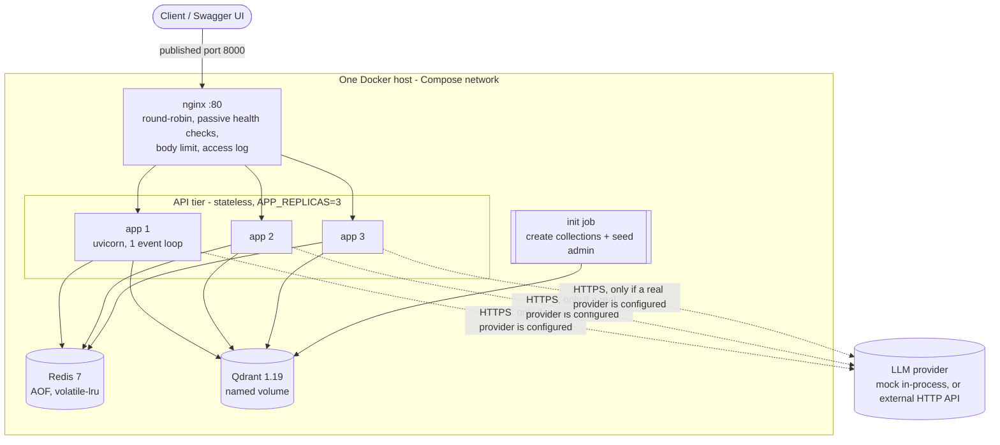
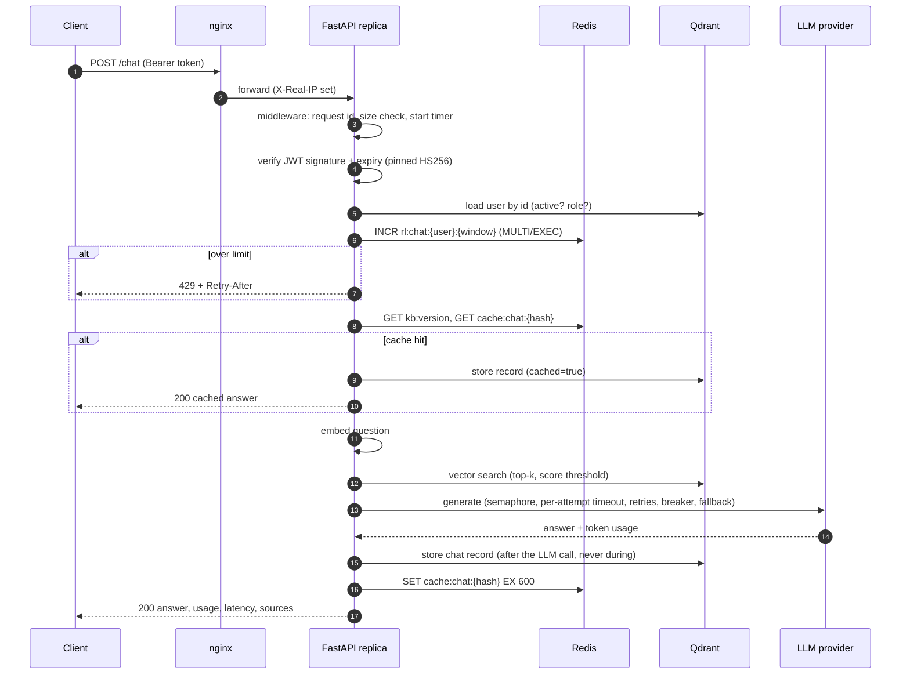

# Architecture

Labels: **[IMPLEMENTED]** built and tested here · **[CONFIGURED]** config exists, never run in a
real environment · **[PROPOSED]** future design only.

## 1. Design goals

1. A working, testable API first; sophistication second.
2. A **modular monolith**: one deployable service with clear internal layers. Microservices would
   add network hops, deployment complexity and failure modes without solving a problem this
   system has.
3. **Stateless replicas**: all shared state lives in Redis or Qdrant, so any replica can serve any
   request and replicas can be added or removed freely.
4. Every dependency failure has a decided, tested behaviour.

## 2. Component status

| Component | Status | Where |
|---|---|---|
| Stateless FastAPI app | IMPLEMENTED | `app/main.py`, `app/container.py` |
| JWT authentication, Argon2id hashing | IMPLEMENTED | `app/core/security.py`, `app/services/auth_service.py` |
| RBAC (ADMIN, USER, READ_ONLY) | IMPLEMENTED | `app/api/deps.py` (`require_role`) |
| Qdrant as system of record + vector index | IMPLEMENTED | `app/repositories/`, `app/database/` |
| RAG (chunk, embed, retrieve, cite) | IMPLEMENTED | `app/services/rag/` |
| Redis rate limiting, login throttle, cache | IMPLEMENTED | `app/services/rate_limiter.py`, `cache.py` |
| LLM gateway (timeout, retry, breaker, fallback, concurrency cap) | IMPLEMENTED | `app/services/llm/` |
| Mock provider; OpenAI-compatible adapter | IMPLEMENTED (adapter tested against stubbed HTTP only) | `mock.py`, `openai_compat.py` |
| Prometheus metrics, JSON logs, health endpoints | IMPLEMENTED | `app/monitoring/`, `app/core/logging.py`, `app/api/routes/ops.py` |
| Dockerfile, Compose, nginx load balancer, 3 replicas | IMPLEMENTED (single host) | `Dockerfile`, `docker-compose.yml`, `docker/nginx.conf` |
| GitHub Actions CI | CONFIGURED | `.github/workflows/ci.yml` |
| Kubernetes manifests + HPA | CONFIGURED (YAML parsed only) | `k8s/` |
| Background queue and workers | PROPOSED | — |
| AWS ALB / ECS or EKS / ElastiCache / Qdrant cluster | PROPOSED | [scaling-analysis.md](scaling-analysis.md) |
| OAuth2/OIDC + identity provider + API gateway | PROPOSED | section 6 |

## 3. Runtime topology [IMPLEMENTED]



Only nginx publishes a port. Redis and Qdrant are reachable only inside the Compose network.
Start order is enforced with health checks: Qdrant healthy → `init` completes → replicas start →
replicas healthy → nginx starts.

## 4. Layers inside the service

```
HTTP request
  │
  ▼
middleware (app/main.py)        request id, body-size limit, metrics, access log, security headers,
  │                             last-resort error handling
  ▼
routes (app/api/routes)         validate input with Pydantic, check role, call ONE service method
  │
  ▼
services (app/services)         business logic: orchestration, limits, cache, retries
  │                 │
  ▼                 ▼
repositories        llm gateway + providers        rag (embedder + knowledge base)
(Qdrant only)       (no FastAPI imports)
```

Rules that are kept in the code:

* Routes contain no business logic and no database calls beyond a repository read for history.
* Only `app/repositories/` talks to Qdrant; only `rate_limiter.py`, `cache.py`,
  `knowledge_base.py` (version counter) and `auth_service.py` (lock) talk to Redis.
* `app/services/llm/` never imports FastAPI: the gateway raises its own error classes, and
  `chat_service.py` maps them to HTTP in one table.
* Configuration is read once, in `app/core/config.py`.
* `app/container.py` builds one set of long-lived objects per process; tests inject fakes there.

## 5. Life of a `/chat` request [IMPLEMENTED]



Design decisions worth defending:

| Decision | Reason | Cost |
|---|---|---|
| Rate limit before cache lookup | Every request counts, even cheap cache hits, so the endpoint cannot be hammered for free | A user's cache hits consume quota |
| User loaded from Qdrant on every request | Deactivation and role changes apply immediately; the JWT's `role` claim is never trusted for authorisation | One extra read per request (could be cached in Redis for a few seconds later) |
| Retrieval failure degrades to "no context" | An answer without sources is better than a 503 | The answer may be less grounded; `rag_retrievals_total{outcome="error"}` shows it |
| Record written after the LLM returns | No database work is pinned while waiting on a slow provider | A crash between answer and write loses the record (the answer is still returned; `chat_persist_failures_total`) |
| Failed chats are stored too | Usage and reliability reporting need the failures | A little more storage |
| Fallback answers are not cached | When the primary recovers, users get the primary again | Slightly lower hit rate during an outage |
| Argon2 runs in a worker thread | Hashing is CPU-heavy by design and would freeze the event loop | Thread hop on login only |

## 6. Evolution to SSO/OIDC [PROPOSED]

Today the application is its own identity provider: it stores password hashes and signs HS256
tokens with a shared secret. That is right for an MVP and wrong for an enterprise.

```
Browser/App ──(1) OAuth2 Authorization Code + PKCE──▶ Identity Provider (Cognito / Entra ID / Keycloak / Auth0)
     ◀────────────(2) ID token + access token (JWT, RS256/ES256)──────────────┘
     │
     └─(3) Authorization: Bearer <access token>──▶ API Gateway ──▶ AI service
                                                   │ validates signature via JWKS,
                                                   │ coarse throttling, WAF
                                                   ▼
                                            service re-validates token,
                                            maps IdP groups/claims → ADMIN / USER / READ_ONLY
```

What changes in this code base:

| Today | With OIDC |
|---|---|
| `POST /auth/login` verifies a password | Removed; the IdP handles login, MFA, password policy, lockout |
| `decode_access_token` uses a shared HS256 secret | Verifies RS256/ES256 with the IdP's public keys fetched from its JWKS URL (cached, rotated), and checks `iss`, `aud`, `exp` |
| `role` comes from the `users` collection | Derived from a groups/roles claim; a local profile row is created on first login |
| `require_role` | Unchanged — the RBAC layer does not care who issued the identity |
| Login throttle in Redis | Moves to the IdP and the gateway |

RBAC answers "what may this role do". Its limit is that it cannot express rules about a
*specific resource* ("only documents of my department"); that needs attribute-based checks
(ABAC), a natural next step once documents carry an owner or tenant attribute.

## 7. Failure behaviour (summary)

| Failure | Behaviour | Verified by |
|---|---|---|
| Redis down | `/chat` keeps working: limiter fails open with a per-process cap, cache bypassed. Login returns 503 (throttle fails closed). `/health` = `degraded`; `/health/ready` stays 200 so the load balancer keeps routing | Unit + API tests; live `docker compose stop redis` |
| Qdrant down | Requests needing data return `503 DATABASE_UNAVAILABLE`; `/health` = `unhealthy` (503); `/health/live` stays 200 | API tests (patched client) |
| LLM slow | Per-attempt timeout → bounded retries → `504 LLM_TIMEOUT` | Unit + API tests |
| LLM 5xx / 429 | Backoff with jitter (honours `Retry-After`) → fallback provider if configured → `503` | Unit + API tests |
| LLM down for a while | Circuit opens after 5 failures: instant `503 LLM_CIRCUIT_OPEN`, one trial call after 30 s | Unit + API tests |
| Too many concurrent LLM calls | Wait ≤ 5 s for a slot, then `503 LLM_OVERLOADED` | Unit test; load-test run 3 |
| One replica dies | nginx stops routing to it after failed connects; Compose restarts it | Design; not chaos-tested |

More on scaling and recovery: [scaling-analysis.md](scaling-analysis.md).
