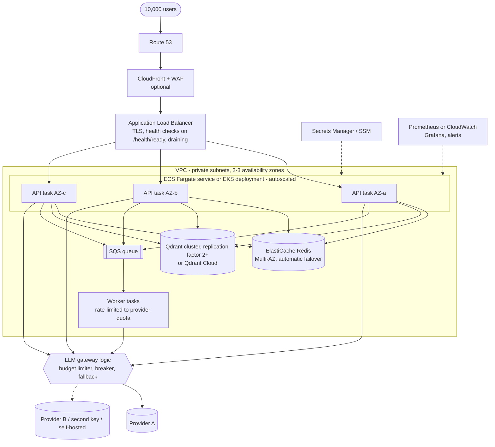

# Scaling and distributed-systems analysis

Scenario from the assessment: **100 requests/second normally, spikes to 500 requests/second**;
today one EC2 server and about 10 users, growing to 10,000 users.

Labels: **[IMPLEMENTED]** · **[CONFIGURED]** · **[PROPOSED]**. This document does **not** claim the
system handles 500 RPS. It explains what would have to be true for it to, and reports the small
measurements that were actually taken (section 12).

## 1. The key distinction: two different throughputs

| | Gateway tier (this code) | LLM provider |
|---|---|---|
| What limits it | CPU per request, Redis and Qdrant round trips | Requests/minute (RPM), tokens/minute (TPM), concurrent requests, latency |
| How to scale it | Add stateless replicas | Cannot be scaled by us: quota, more keys/providers, caching, or doing less |
| Typical time per request | Milliseconds | Seconds |

Accepting 500 HTTP requests per second is an ordinary engineering problem. Getting 500 LLM
completions per second is a **quota and cost** problem. Most of this document follows from that.

## 2. Arithmetic

**Little's Law**: requests in flight ≈ arrival rate × time each one takes.

| Traffic | LLM latency | In-flight LLM calls | Replicas needed at `LLM_MAX_CONCURRENCY=20` |
|---|---|---|---|
| 100 RPS | 2 s | 200 | 10 |
| 100 RPS | 5 s | 500 | 25 |
| 500 RPS | 2 s | 1,000 | 50 |
| 500 RPS | 5 s | 2,500 | 125 |

(The per-replica cap is a setting; an async replica can hold more than 20 waiting calls, so fewer,
larger replicas are possible. The in-flight total does not change.)

**Provider quota.** Assume, purely for illustration, 1,000 tokens per request (prompt + context +
completion). RAG makes prompts larger, so this is not pessimistic.

| Traffic | RPM needed | TPM needed (at the assumed 1,000 tokens/request) |
|---|---|---|
| 100 RPS | 6,000 | 6,000,000 |
| 500 RPS | 30,000 | 30,000,000 |

These must be compared with the limits your provider currently publishes for your account tier.
**No provider figures are quoted here on purpose**: they differ by provider, model and tier and
change often. The point survives any specific number: sustained 500 RPS of uncached LLM traffic
on a single key is unlikely to fit an entry-level quota, so it needs some combination of caching,
queueing, several keys or providers, a negotiated enterprise quota, a self-hosted model, or
rejecting part of the load.

**Cost.** Tokens dominate cost, not servers. Whatever the price per million tokens is, 6 million
tokens per minute is 8.64 billion tokens per day. Per-user limits, an output-token cap
(`LLM_MAX_OUTPUT_TOKENS`), caching and cheaper models for easy questions matter far more than
instance sizing.

## 3. Bottlenecks, most serious first

1. **LLM provider quota and latency** — external, slowest, least controllable.
2. **Token cost** — grows linearly with traffic.
3. **Database writes** — every chat writes one record. Qdrant applies updates to a collection
   through a write-ahead log and the app waits for each write to be applied; at high rates,
   batch the writes or move usage records to a queue/stream (section 8).
4. **Per-replica CPU** — one Python event loop per replica: JSON, JWT, embedding the question.
   Argon2 password hashing is deliberately expensive, so it is kept off the hot path
   (login only, in a worker thread).
5. **Redis** — a handful of O(1) commands per request; a single node is normally enough at this
   scale. Cluster mode comes later, if ever.

## 4. Horizontal scaling of the API [IMPLEMENTED locally]

Replicas are interchangeable because nothing a request needs later is kept in process memory:

| State | Where it lives |
|---|---|
| Who the user is | In the JWT the client sends, re-checked against Qdrant |
| Rate-limit counters, login lockouts | Redis |
| Cached answers | Redis |
| Users, chat records, documents | Qdrant |

Two things *are* per process, by choice, and are documented limitations: the circuit breaker
state and the LLM concurrency semaphore. With N replicas each learns about an outage separately,
and the global concurrency ceiling is N × `LLM_MAX_CONCURRENCY`.

What would break statelessness: an in-process cache or limiter (each replica would have its own
copy — a user would get N times the limit), server-side sessions in memory, or files on local disk.

## 5. Load balancing

* [IMPLEMENTED] nginx round-robins across replicas discovered through Docker DNS, with passive
  health checks (`max_fails=3 fail_timeout=10s`) and retry of a refused connection on the next
  replica. Requests that already reached a replica are not replayed (POST is not idempotent).
* [PROPOSED] AWS Application Load Balancer: active health checks on `/health/ready`, so a
  replica that lost Redis or Qdrant stops receiving traffic; **connection draining**
  (deregistration delay) lets in-flight requests finish during deployments — the app cooperates
  through uvicorn's 30 s graceful shutdown; TLS termination; idle timeout above
  `LLM_OVERALL_DEADLINE_SECONDS`.
* Least-outstanding-requests routing suits long LLM calls better than round-robin, because
  request durations vary widely.

## 6. Autoscaling [CONFIGURED: `k8s/app.yaml` HPA · PROPOSED: ECS]

* **Kubernetes HPA** changes the replica count from a metric; **ECS Service Auto Scaling** does
  the same with target tracking on CloudWatch metrics. Conceptually identical.
* **CPU is a poor signal here.** An LLM proxy spends its time waiting on the network, so CPU can
  be 10 % while every concurrency slot is full. Better signals: in-flight requests per replica,
  queue wait time, or p95 latency — exposed as custom metrics (Prometheus Adapter / KEDA on
  Kubernetes; ALB `RequestCountPerTarget` on ECS). The included HPA uses CPU only because that
  works with no extra components, and says so in a comment.
* **Scale out fast, scale in slowly**: 0 s stabilisation up, 300 s down, so a spike is met
  quickly and replicas are not removed during a lull between bursts.
* Autoscaling takes tens of seconds to minutes. A jump from 100 to 500 RPS is absorbed first by
  headroom, rate limits and load shedding, and only then by new replicas.
* **Adding replicas does not add LLM quota.** Past the provider's limit, more replicas only
  produce more 429s.

## 7. Rate limiting [IMPLEMENTED]

Two layers protect two different things:

| Layer | Protects | Mechanism |
|---|---|---|
| Per-user limit (`CHAT_RATE_LIMIT` per window) | Fairness and cost | Redis fixed window, atomic `INCR`+`EXPIRE` in `MULTI/EXEC` |
| Per-replica concurrency cap + queue wait | The provider and the replica itself | `asyncio.Semaphore`; shed with 503 after `LLM_QUEUE_WAIT_SECONDS` |

Why Redis: an in-process counter is private to one replica. With 3 replicas and a limit of 20, a
user could make 60 requests. One atomic counter in Redis gives one limit. The integration test
fires 50 concurrent hits from two connections at a real Redis and exactly 20 are allowed.

Fixed window is simple and explainable; its flaw is that a burst across a window boundary can
reach twice the limit. A sliding window or token bucket (a Lua script) removes that. A global
"provider budget" limiter (one shared RPM/TPM counter for all users) is [PROPOSED] and is the
right tool for staying under the provider's quota.

## 8. Background queues [PROPOSED]

Request/response is right when the answer arrives in a few seconds. It is wrong for long
generations, bulk document ingestion and batch jobs, where holding an HTTP connection open ties
up a slot and a client timeout wastes the tokens already paid for.

```
POST /jobs ──▶ enqueue (SQS, or Redis via ARQ) ──▶ 202 Accepted + job id
                         │
                         ▼
                   worker pool (rate-limited to the provider quota)
                         │
GET /jobs/{id} ◀── status / result in Redis or Qdrant
```

A queue turns a spike into a backlog instead of a wave of failures, and lets workers consume at
exactly the rate the provider allows. Requirements: idempotency keys (a retried job must not be
billed twice), a visibility timeout longer than the LLM deadline, a dead-letter queue, and a
maximum queue age after which a job is refused rather than answered uselessly late.
This is not built: document ingestion here is synchronous.

## 9. Caching [IMPLEMENTED]

* Key: SHA-256 of user id, normalised question, provider, model, temperature, prompt version,
  RAG flag and knowledge-base version. TTL 10 minutes. Only successful primary answers.
* **Per user**, so one user's answer is never shown to another. The price is a low hit rate:
  it only helps when the same user repeats a question. No hit rate was measured on real traffic.
* Invalidation without key scans: bumping `PROMPT_VERSION` in code or ingesting/deleting a
  document (which increments `kb:version`) changes every key, so stale entries are simply never
  read again and expire on their own.
* [PROPOSED] A shared cache for clearly public questions, or a semantic cache (reuse the answer
  to a *similar* question via vector search), would raise the hit rate — at a privacy and
  correctness risk that must be decided deliberately.

## 10. Connections and pools

* Each replica keeps one HTTP connection pool to Qdrant and one Redis connection pool
  (`app/container.py`); connections are reused, not opened per request.
* The general rule still applies: **replicas × pool size must fit the server's limit**. With a
  relational database (the usual shape of this problem) 50 replicas × a pool of 10 = 500
  connections, more than a default PostgreSQL allows, which is why a pooler such as PgBouncer or
  RDS Proxy would be placed in between. Qdrant and Redis serve many connections cheaply, but
  the same multiplication should be checked against Redis `maxclients` when replicas grow.
* No pooled connection is held while waiting for the LLM (the record is written afterwards).

## 11. Timeouts, retries, circuit breaking, degradation [IMPLEMENTED]

* **Timeout vs deadline.** Each attempt has a timeout (15 s). The whole request has a deadline
  (40 s) fixed at the start; no retry begins if its delay would cross it. nginx's read timeout
  (60 s) is above the deadline, so the app always answers before the proxy gives up.
* **Retries amplify load.** With 2 retries, a struggling provider can receive 3× the traffic
  exactly when it is least able to cope (a retry storm). Mitigations in place: a small retry
  budget, exponential backoff, **full jitter** (random delay between 0 and the cap, so clients
  that failed together do not return together), honouring `Retry-After`, never retrying 400/401,
  and the circuit breaker, which stops calls altogether after 5 consecutive failures.
* **Circuit breaker**: closed → open (fail in microseconds, provider gets a rest) → half-open
  (one trial call after 30 s) → closed on success.
* **Graceful degradation ladder**, cheapest first: serve from cache → answer without RAG context
  if retrieval fails → fallback provider (clearly labelled) → shed with a fast 503 and
  `Retry-After` → [PROPOSED] smaller/cheaper model, queue-and-notify.

## 12. What was measured

Raw output: [evidence/load-test.txt](evidence/load-test.txt). Conditions: 2026-10-03, one laptop
(Intel Core i5-12500H, 16 logical CPUs, 16 GB RAM, Windows 11, Docker Desktop with a 16-CPU /
7.6 GB WSL2 VM), **mock LLM**, 3 replicas, load generator `scripts/load_test.py` running in a
container on the same Docker network, every question unique (cache bypassed).

| Run | Setup | Result | Reading |
|---|---|---|---|
| 1 | Mock latency 1 s, via nginx, 3 replicas × 20 slots, 100 concurrent clients, 600 requests | 53.0 req/s, all 200, client p50 1.80 s | Little's Law predicts a ceiling of 60 req/s (60 slots ÷ 1 s). Observed 53.0 |
| 2 | Same, one replica addressed directly | 19.2 req/s, all 200, p50 5.0 s | Ceiling 20 req/s (20 slots ÷ 1 s); 100 clients ÷ 20 per second ≈ 5 s each |
| 3 | One replica, 300 concurrent clients, 600 requests | 300 × 200, 300 × 503 | Requests that waited over 5 s for a slot were shed with `LLM_OVERLOADED`. Nothing hung |
| 4 | Mock latency 0, via nginx, 3 replicas, 50 concurrent clients, 3,000 requests | 118.5 req/s, all 200. Client p50 273 ms, but **nginx measured p50 25 ms, p95 39 ms, p99 117 ms** per request | The single-process Python load generator was the bottleneck, so 118.5 req/s is a **lower bound** for this setup, not its capacity |
| 5 | Mock latency 0, one replica directly, 50 concurrent clients | 72.1 req/s, p50 638 ms | One replica (one event loop) saturates at roughly this rate on this machine |

What these runs show: the concurrency cap behaves as the arithmetic says, load is spread evenly
across replicas (≈ one third each), and overload produces fast, explicit rejections.

What they do **not** show: anything about a real LLM provider, a cloud environment, sustained
load, or 500 RPS. The gateway's true ceiling on this laptop was not found, because the load
generator ran out first. **500 RPS: not benchmarked.**

A lesson from doing this: an early run looked far slower than predicted. Comparing three clocks
(client latency, nginx `request_time`, the app's own `latency_ms` log field) showed the delay was
inside the load generator. Measuring at more than one point is what made the result trustworthy.

## 13. Target production architecture [PROPOSED]



Why each piece: **ALB** spreads load and removes unhealthy tasks. **Several availability zones**
so one data-centre failure is survivable. **ECS Fargate** if the team is small (no nodes to
manage); **EKS** if Kubernetes skills and tooling already exist — the application does not care.
**ElastiCache** and a **replicated Qdrant** remove the two single points of failure the Compose
stack has. **SQS + workers** absorb spikes and long jobs. **Two providers** (or two keys) so one
provider's outage or quota is not ours. **Secrets Manager** so no secret is in an image, a
repository or a task definition in plain text.

For a system that grows relational needs (billing, reporting), add **RDS PostgreSQL** as the
system of record and keep Qdrant for vectors; that is the main alternative to the single-database
choice made here.

## 14. Failure recovery

| Component fails | Effect today (Compose) | Production answer [PROPOSED] |
|---|---|---|
| One API replica | nginx routes around it; Docker restarts it | ALB health check + orchestrator replaces the task; ≥ 2 AZs |
| Redis | Chat continues without cache/shared limits; login refused; `/health/ready` fails | ElastiCache Multi-AZ failover (typically well under a few minutes); counters and cache are disposable, so data loss is acceptable (RPO: not applicable) |
| Qdrant | Data-dependent endpoints return 503 | Replication factor ≥ 2 across AZs; scheduled snapshots to S3. RPO = snapshot interval for a full loss; RTO = time to restore a snapshot — both to be measured in a restore drill |
| LLM provider | Retries → fallback → breaker → fast 503 | Second provider or key; queue for non-interactive work |
| Whole host / AZ | Outage (single host) | Multi-AZ; infrastructure as code to rebuild |
| Bad deployment | `docker compose up` replaces all replicas | Rolling or blue/green with automatic rollback on failed health checks |

No backup or restore procedure has been implemented or tested in this repository.

## 15. Observability and SLOs

Metrics that exist today map onto the "golden signals":

| Signal | Metric |
|---|---|
| Traffic | `http_requests_total` |
| Errors | `http_errors_total`, `llm_failures_total{error_type}` |
| Latency | `http_request_duration_seconds`, `llm_request_duration_seconds` |
| Saturation | `rate_limit_events_total`, `llm_failures_total{error_type="LLMOverloadedError"}`, `llm_circuit_state` |
| Cost | `llm_tokens_total{type}` |
| Dependencies | `dependency_up{dependency}` |

Example SLOs to adopt [PROPOSED; targets to be set from real traffic]: availability of `/chat`
(non-5xx) over 30 days; p95 gateway overhead (request time minus LLM time); alert when the
circuit is open for more than a few minutes, when the fallback rate rises, or when token spend
per hour exceeds budget.
