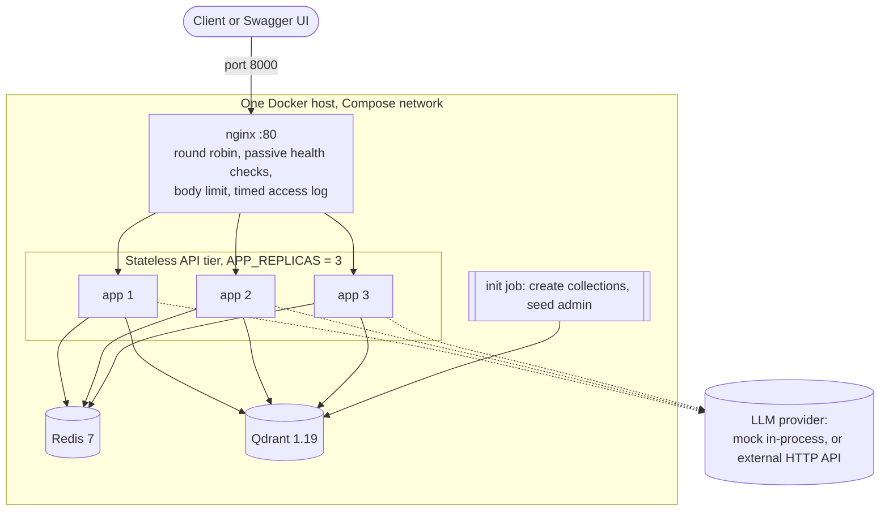
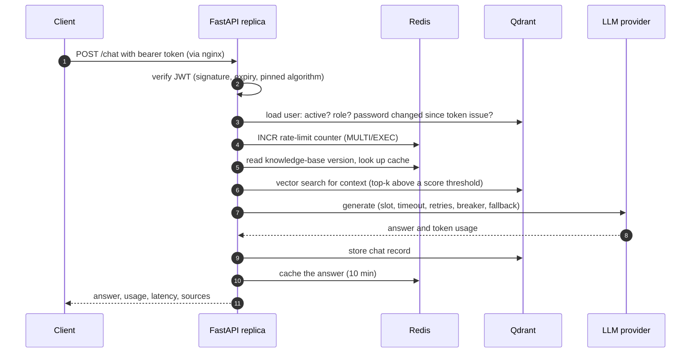
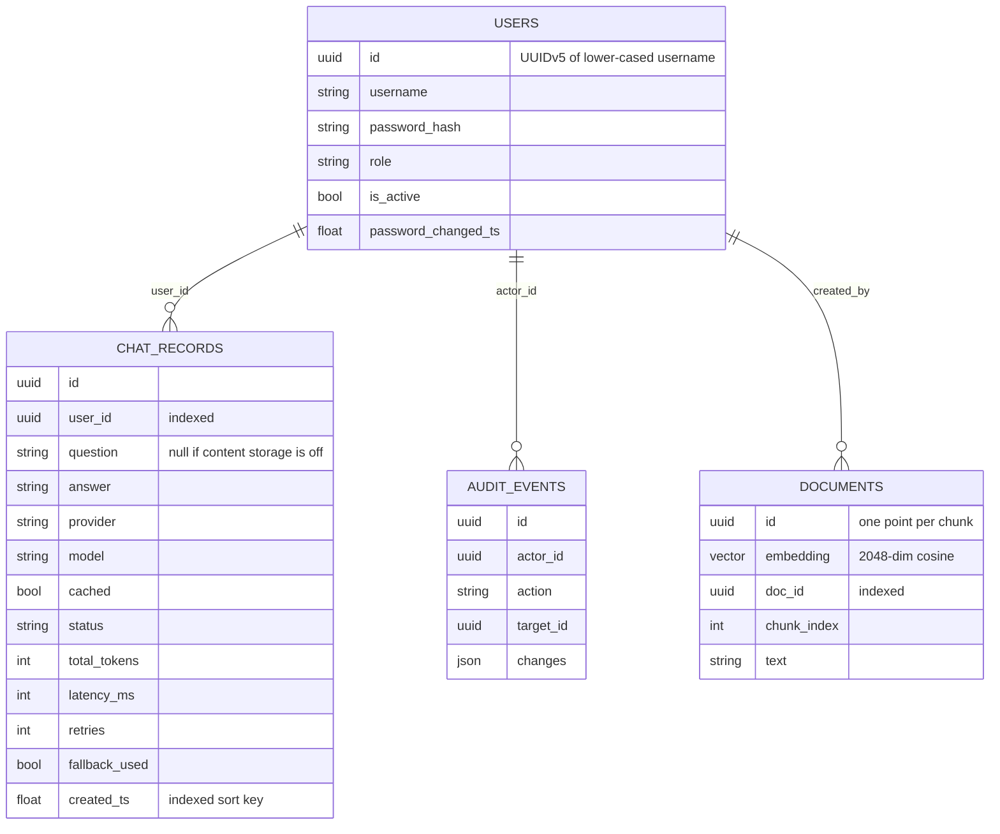
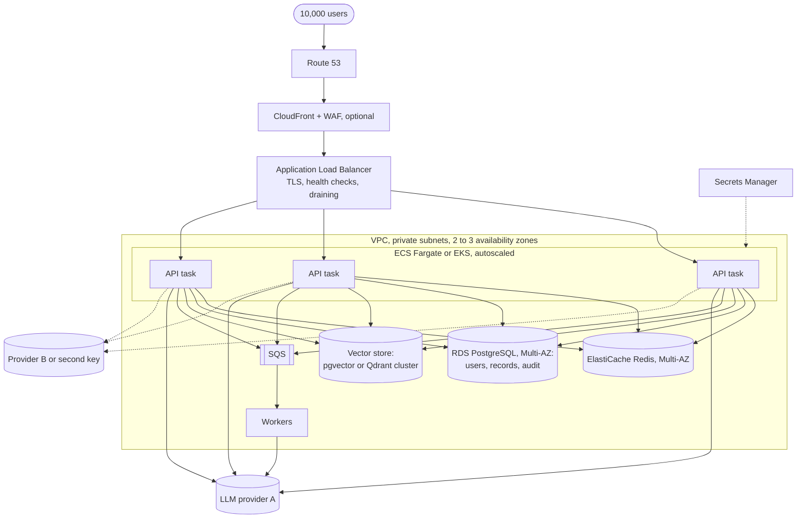

# AI Question-Answering Platform — Technical Report

**Assessment:** AI/LLM Platform & DevOps Engineer — Technical Assessment
**Repository state described:** final audited version, 3 October 2026
**Length:** about 10,000 words; 30–35 pages when exported with the diagrams rendered

---

## How to read this report

Every capability in this report belongs to exactly one of four classes. The class is stated
wherever a capability is discussed, and section 1.2 lists all of them in one place.

| Class | Meaning |
|---|---|
| **A — Implemented and verified** | Code exists in the repository and its behaviour was demonstrated by automated tests, by the live Docker stack, or both. Evidence is in `docs/evidence/`. |
| **B — Implemented, not independently verified** | Code or configuration exists, but it was never exercised against the real external system it targets. |
| **C — Proposed production architecture** | A design for a real deployment. Nothing was built or run. |
| **D — Future enhancement** | An improvement to the application itself that is not implemented. |

Two statements apply to the whole document. **No real LLM provider was called at any point**:
every result uses the built-in mock provider. **Nothing was deployed to a cloud**: every
measurement was taken on one laptop.

---

## 1. Executive summary

### 1.1 What was built

The project is an HTTP API that accepts a question from an authenticated user, optionally
retrieves relevant passages from a knowledge base, sends the question to a large language model
(LLM) through a fault-tolerant gateway, and returns the answer together with latency and token
usage. It is written in Python 3.12 with FastAPI and runs as three identical containers behind
an nginx load balancer, with Redis for shared short-lived state and Qdrant for persistent data.

The assessment evaluates "implementation skills and architectural thinking". The implementation
is therefore deliberately small — a modular monolith of about 1,700 statements — while the
behaviours that matter in production were built and tested rather than only described:
authentication and role checks, rate limiting shared by all replicas, bounded retries with a
circuit breaker and fallback, load shedding, health and readiness semantics, metrics, and
structured logs.

One decision departs from the assessment's default. **Qdrant, a vector database, is the only
database.** It stores the vectors for retrieval-augmented generation (RAG) and also users, chat
records and audit events. The assessment allows "PostgreSQL or another database" and lists a
vector database for RAG as optional; it also says PostgreSQL "should be used where appropriate".
Section 8.5 evaluates this decision critically and states what a production system should do
differently.

### 1.2 Status of every capability

| Capability | Class | Evidence or reason |
|---|---|---|
| `POST /auth/login`, JWT (HS256), Argon2id password hashing | A | Unit + API tests |
| RBAC for ADMIN, USER, READ_ONLY | A | Role-matrix test: 12 endpoints × 3 roles |
| `POST /chat` with latency, token usage, retries, fallback flag | A | API tests, smoke test |
| LLM gateway: timeout, deadline, retries with backoff and jitter, circuit breaker, fallback, concurrency cap | A | Deterministic unit tests; load-test run 3 |
| Mock LLM provider | A | Used by all tests |
| RAG: ingestion, chunking, embedding, vector search, cited sources | A | API tests, smoke test, integration test on real Qdrant |
| Qdrant persistence for users, chat records, audit events | A | Integration test; restart test with named volume |
| Redis rate limiting, login throttle, response cache | A | Unit tests; integration test on real Redis (50 concurrent hits → exactly 20 allowed) |
| `/health`, `/health/live`, `/health/ready`, `/metrics` | A | API tests; live Redis-stop experiment |
| Docker image (multi-stage, non-root), Compose with nginx and 3 replicas | A | Smoke test 21/21 from a fresh clone; `id` shows uid 10001 |
| Type checking, linting, dependency audit | A | `mypy`, `ruff`, `pip-audit` all clean |
| OpenAI-compatible LLM adapter | **B** | Tested against stubbed HTTP only; no live call |
| OpenAI-compatible embedding adapter | **B** | Tested against stubbed HTTP only |
| GitHub Actions workflow | **B** | The same steps pass locally; never executed on GitHub |
| Kubernetes manifests with HPA | **B** | Parsed as YAML; no cluster was available |
| AWS load balancer, ECS/EKS, managed Redis and Qdrant, queues, secrets manager | C | Sections 14–15 |
| OAuth2/OIDC single sign-on behind an API gateway | C | Section 6.5 |
| PostgreSQL as system of record beside Qdrant | C | Section 8.5 |
| Background workers, streaming, token budgets, shared breaker state, semantic cache | D | Section 20 |

### 1.3 Measured results

All figures were produced on 3 October 2026 on one laptop (Intel Core i5-12500H, 16 logical
CPUs, 16 GB RAM, Windows 11, Docker Desktop 29.8.1) with the mock LLM.

| Check | Result |
|---|---|
| Unit and API tests | 150 passed, 3 skipped (integration tests, opt-in) |
| Statement coverage | 96 % (1,703 statements, 67 missed) |
| Integration tests on real Redis 7.4 and Qdrant 1.19.1 | 3 passed |
| `ruff check`, `ruff format --check`, `mypy app` | Clean |
| `pip-audit -r requirements.txt` | No known vulnerabilities found |
| End-to-end smoke test, 3 replicas | 21 of 21 checks; three distinct replicas answered |
| Fresh clone following only the README | Stack started; smoke test 21 of 21; tests passed in a new virtual environment |
| Load, 1 s simulated LLM latency, 3 replicas | 53.0 req/s, all HTTP 200 (theoretical ceiling 60) |
| Load, zero simulated latency, 3 replicas | 118.5 req/s, all HTTP 200 — a lower bound: the load generator was the bottleneck |
| 500 requests/second | **Not tested, not claimed** |

A second, independent run of the load tests during the final audit reproduced these results
(52.7, 111.9 and identical shedding counts; section 18).

---

## 2. Requirements and scope

### 2.1 The assessment

The assessment asks for a small production-ready question-answering API that demonstrates LLM
integration, FastAPI, authentication, Docker, Redis, a database, scaling, monitoring and
deployment. It requires four endpoints (`POST /auth/login`, `POST /chat`, `GET /health`,
`GET /metrics`), JWT authentication with an explanation of RBAC and of the path to SSO/OIDC,
containerisation with Compose or Kubernetes, a written scaling analysis for 100–500
requests/second, and a migration plan from a single EC2 server. A complete 500 RPS environment
is explicitly not required.

### 2.2 Compliance summary

The full requirement-by-requirement matrix, with file locations and verification method, is in
[audit-report.md](audit-report.md). In summary:

| Assessment area | Status |
|---|---|
| Required endpoints | All four implemented and tested |
| `/chat`: authenticate, call LLM, handle timeout/errors, retry/fallback, record latency and token usage, correct HTTP errors | Implemented and tested with the mock; **real-provider path unverified** |
| JWT authentication, RBAC explanation, OIDC explanation | Implemented (JWT, RBAC); documented (OIDC) |
| Dockerfile, Compose, environment configuration, no hard-coded secrets, README | Implemented; verified from a fresh clone |
| Redis integration | Implemented and tested |
| Database integration | Implemented with Qdrant; **PostgreSQL is not used** (section 8.5) |
| Scaling scenario: nine listed topics and a diagram | Documented, with supporting local measurements |
| Architecture and migration question: nine listed topics | Documented |
| Basic tests, architecture diagram | Implemented |
| Five-minute video | Script prepared and rehearsed; **recording is the student's task** |

### 2.3 Out of scope

Billing, multi-tenancy, a user interface, streaming responses, conversation memory across
turns, and fine-tuning are not part of the assessment and were not built.

---

## 3. Technology choices and trade-offs

| Choice | Reason | Alternative and why not |
|---|---|---|
| Python 3.12, FastAPI | An LLM proxy spends most of its time waiting on the network; `async` handles many waiting requests on one thread. Pydantic gives validation and an OpenAPI page for free; dependency injection expresses RBAC cleanly | Flask: synchronous by default, manual validation. Django: more framework than this API needs |
| Qdrant | One datastore for vectors and application records; vector search is its core feature | PostgreSQL (with `pgvector`): the conventional and, for user data, the safer choice — see section 8.5 |
| Redis 7 | Atomic counters with expiry, shared by all replicas | In-process counters: each replica would enforce its own limit |
| PyJWT, argon2-cffi | Small, focused libraries. Argon2id is memory-hard, the current recommendation for password storage (RFC 9106) | SHA-256 is fast by design, which is wrong for passwords |
| httpx, no vendor SDK | Timeouts and every error path are explicit and easy to stub | A vendor SDK hides its own retry and timeout behaviour, which would stack with the gateway's |
| Hand-written retry loop | About thirty lines; deterministic under test through injected clock and jitter | `tenacity` is sound but hides the logic the assessment asks to be explained |
| prometheus-client | The de facto standard for pull-based metrics | Custom JSON metrics need custom tooling |
| Standard-library logging with a JSON formatter | No dependency; one line per event with a request id | `print` has no levels or structure |
| pytest, fakeredis, Qdrant in-memory mode | The whole suite runs in about 20 s with no Docker, network or API key | Tests that need live services tend to be skipped |
| Docker Compose, nginx | One command starts a load-balanced stack on any machine | Kubernetes is not needed to run or demonstrate the system |

A modular monolith was chosen over microservices. Splitting the gateway, authentication and
retrieval into separate services would add network hops, deployment units and partial-failure
cases without solving any problem this system has. The internal boundaries (section 4.2) are
kept clean so that a later split remains possible.

---

## 4. System architecture

### 4.1 Runtime topology — class A



Only nginx publishes a port. Start order is enforced by health checks: Qdrant healthy → the
`init` job creates collections and seeds the administrator → replicas start → nginx starts.

The assessment's reference flow is *Users → Load Balancer → FastAPI instances → Redis/Queue →
LLM Gateway → LLM APIs*. Each element exists here except the queue, which is proposed (section
14.6). The LLM gateway is a module inside each replica, not a separate service.

### 4.2 Internal layers

```
middleware      request id, body-size limit, metrics, access log, security headers   app/main.py
routes          validate input, check role, call one service method                  app/api/routes/
services        business logic: limits, cache, orchestration, retries                app/services/
repositories    the only code that talks to Qdrant                                   app/repositories/
llm gateway     provider contract, adapters, breaker (imports no web framework)      app/services/llm/
```

`app/container.py` creates one set of long-lived objects per process (Qdrant client, Redis
client, gateway, services). Tests inject fakes at this single point. Configuration is read in
one module, `app/core/config.py`; no other code reads environment variables.

### 4.3 Life of a `/chat` request



Decisions embodied in this flow:

| Decision | Reason | Cost |
|---|---|---|
| The user is loaded from the database on every request | Deactivation, role changes and password changes take effect immediately; the role in the token is never trusted | One extra read per request |
| Rate limit before cache lookup | Every request counts, so cache hits cannot be used to hammer the service for free | Cache hits consume quota |
| A retrieval failure degrades to "no context" | An ungrounded answer is better than an error | Visible only through a metric and a log line |
| The record is written after the LLM returns | No database work is held open while waiting on a slow provider | A crash in between loses the record; the answer is still returned |
| Fallback answers are not cached | When the primary recovers, users get the primary again | Lower hit rate during an outage |

---

## 5. API design

### 5.1 Endpoints

| Method and path | Roles | Purpose |
|---|---|---|
| `POST /auth/login` | public | Username and password → access token |
| `GET /auth/me` | any authenticated | Current user |
| `POST /chat` | ADMIN, USER | Ask a question |
| `GET /chat/history` | own: any role; others: ADMIN | Stored records, newest first |
| `POST /documents`, `DELETE /documents/{id}` | ADMIN | Manage the knowledge base |
| `GET /documents`, `POST /documents/search` | any authenticated | List documents; vector search without an LLM call |
| `GET/POST /admin/users`, `PATCH /admin/users/{id}` | ADMIN | Manage users |
| `GET /admin/audit` | ADMIN | Audit trail |
| `GET /health`, `/health/live`, `/health/ready` | public | Section 12 |
| `GET /metrics` | ADMIN token or scrape token | Prometheus text format |

### 5.2 Example

The request and response below were captured from the running stack (mock provider) on 3 October 2026.

```bash
curl -s localhost:8000/chat -H "Authorization: Bearer $TOKEN" \
  -H 'Content-Type: application/json' -d '{"question":"What is Redis used for?"}'
```

```json
{
  "id": "b84f0e8b-ba03-49bb-b586-3eb6390b4d93",
  "answer": "[mock] Based on the knowledge base: Redis is an in-memory data store used for caching and rate limiting.",
  "provider": "mock",
  "model": "mock-1",
  "cached": false,
  "usage": {"prompt_tokens": 29, "completion_tokens": 18, "total_tokens": 47},
  "latency_ms": 7,
  "retries": 0,
  "fallback_used": false,
  "sources": [{"doc_id": "c4712634-b243-41a8-9fcd-23d413bca284", "title": "Redis notes", "chunk_index": 0, "score": 0.5}]
}
```

`usage` carries the provider's own numbers and is `null` when a provider reports none, and for
cache hits, where no tokens were spent. The mock's counts are word counts — a simulation, like
its answers, which are always prefixed `[mock]`.

Request validation (`app/schemas/`): `question` is stripped and must be 1–4,000 characters;
`temperature` 0–1; `model` must be on a server-side allow-list; unknown fields are rejected, so a
client cannot send `role` or `user_id`.

### 5.3 Errors

Every error has one shape and never contains a stack trace, a provider message or a connection
detail:

```json
{"error": {"code": "RATE_LIMITED", "message": "Chat rate limit exceeded.", "request_id": "…"}}
```

| Status | Codes | Cause |
|---|---|---|
| 401 | `UNAUTHENTICATED`, `INVALID_TOKEN`, `TOKEN_EXPIRED`, `INVALID_CREDENTIALS` | No or bad token; failed login |
| 403 | `FORBIDDEN` | Role not permitted |
| 404, 405, 409 | `NOT_FOUND`, `METHOD_NOT_ALLOWED`, `CONFLICT` | |
| 413 | `PAYLOAD_TOO_LARGE` | Body too large (same envelope from nginx and from the app) |
| 422 | `VALIDATION_ERROR`, `MODEL_NOT_ALLOWED` | Invalid body; the field is named, the submitted value is never echoed |
| 429 | `RATE_LIMITED` | Chat limit or login lockout, with `Retry-After` |
| 502 | `LLM_BAD_RESPONSE`, `LLM_BAD_REQUEST` | Unusable provider result |
| 503 | `LLM_UNAVAILABLE`, `LLM_RATE_LIMITED`, `LLM_CIRCUIT_OPEN`, `LLM_OVERLOADED`, `LLM_NOT_CONFIGURED`, `DATABASE_UNAVAILABLE` | A dependency is unavailable after retries and fallback |
| 504 | `LLM_TIMEOUT` | Provider timed out after bounded retries |
| 500 | `INTERNAL_ERROR` | Unexpected; details only in the log |

Every response carries `X-Request-ID` (propagated if the client sends a well-formed one) and
`X-Served-By` (the replica's hostname).

---

## 6. Authentication and authorisation

### 6.1 Login — class A

Passwords are hashed with Argon2id using the library's recommended parameters and a random salt
per password. Hashing is CPU-heavy by design, so it runs in a worker thread
(`asyncio.to_thread`) and does not block the event loop.

`POST /auth/login` returns one generic message for an unknown user, a wrong password and a
disabled account. For an unknown user a dummy hash is still verified, so response time does not
reveal which usernames exist. Failed attempts are counted in Redis per username and client IP;
after five failures the pair is locked for 300 seconds.

### 6.2 Tokens — class A

Tokens are JWTs signed with HS256 carrying `sub`, `role`, `iat`, `exp` (30 minutes) and `jti`.
Verification pins the algorithm, so a token with `alg: none` or a different algorithm is
rejected, and requires all claims. In `prod` mode the application refuses to start if
`JWT_SECRET` is the development default or shorter than 32 characters.

A JWT is normally "stateless": the server trusts what the token says. This project trusts the
token only for *identity*. Account state comes from the database on every request, which gives
three properties that pure JWT systems lack:

* a deactivated account stops working immediately;
* a role change takes effect immediately, and a forged `role` claim gains nothing;
* a password change invalidates every token issued before it.

What remains impossible is revoking one specific token of an active account before it expires.

### 6.3 RBAC — class A

| Capability | ADMIN | USER | READ_ONLY |
|---|:-:|:-:|:-:|
| Log in, `GET /auth/me` | ✔ | ✔ | ✔ |
| `POST /chat` | ✔ | ✔ | 403 |
| Own chat history | ✔ | ✔ | ✔ |
| Other users' history | ✔ | 403 | 403 |
| List and search documents | ✔ | ✔ | ✔ |
| Ingest and delete documents | ✔ | 403 | 403 |
| `/admin/*` | ✔ | 403 | 403 |
| `/metrics` | ✔ | 403 | 403 |

Enforcement is one reusable dependency, `require_role(*roles)`, declared on each route: access
is denied unless a role is listed. The matrix above is asserted row by row by
`test_rbac_matrix`. The mapping follows the assessment: Admin manages users and configuration
and reads metrics; User uses the chat API; Read-only accesses permitted data (documents and its
own history) but cannot spend LLM tokens.

### 6.4 Limits of this design

Role-based control decides by *role*, not by *resource*. It cannot express "only documents of my
department"; that requires attribute-based checks once documents carry an owner or tenant.
Identity is local: there is no single sign-on, no multi-factor authentication and one shared
signing secret.

### 6.5 Evolution to SSO/OIDC — class C

```
User ─▶ Application ─▶ Identity Provider (OAuth2 Authorization Code + PKCE)
User ◀─ ID token + access token (JWT signed RS256/ES256)
User ─▶ API Gateway (verifies signature via JWKS, throttles) ─▶ AI service
```

| Today | With an identity provider |
|---|---|
| `/auth/login` checks a password | Removed. The provider handles login, MFA and lockout |
| HS256 with a shared secret | RS256/ES256 verified with public keys from the provider's JWKS endpoint; `iss`, `aud`, `exp` checked |
| Role stored in the `users` collection | Derived from a group or role claim; a local profile is created on first login |
| `require_role` | Unchanged: the authorisation layer does not depend on who issued the identity |

---

## 7. LLM integration

### 7.1 Provider contract

`app/services/llm/base.py` defines a small protocol — `generate(request) → result`,
`configured`, `healthcheck()` — and a set of error classes. Two providers implement it.

* **Mock (class A)**: deterministic, needs no key, and can be scripted in tests to time out,
  return 5xx, return 429 with `Retry-After`, reject credentials, or return an empty answer.
* **OpenAI-compatible (class B)**: one adapter for any service exposing the OpenAI Chat
  Completions HTTP interface. Base URL, key and model come from configuration; no model name,
  price or limit is hard-coded, because these change and must be read from the provider's
  current documentation.

### 7.2 Gateway behaviour — class A

For each call, `LLMGateway.generate`:

1. **Acquires a concurrency slot.** A semaphore caps in-flight calls per replica
   (`LLM_MAX_CONCURRENCY`, default 20). A request waits at most `LLM_QUEUE_WAIT_SECONDS` (5 s)
   and is then rejected with `LLM_OVERLOADED` rather than queued without bound.
2. **Fixes an overall deadline** (40 s). No retry starts if its delay would cross it.
3. **Consults the circuit breaker** for the provider.
4. **Calls with a per-attempt timeout** (15 s).
5. **Classifies the failure** and retries only what can succeed on retry, with exponential
   backoff and full jitter: a random delay between zero and `base × 2^attempt`, capped.
6. **Falls back** to the second provider if the first fails for good.

| Error class | Trigger | Retried | Counts toward breaker | HTTP result if final |
|---|---|---|---|---|
| `LLMTimeoutError` | No answer in time | Yes, up to 2 | Yes | 504 |
| `LLMServerError` | Provider 5xx, network failure | Yes, up to 2 | Yes | 503 |
| `LLMRateLimitError` | Provider 429 | Yes, honouring `Retry-After` | Yes | 503 + `Retry-After` |
| `LLMContentError` | Empty or malformed completion | Once | No | 502 |
| `LLMAuthError` | Provider 401/403 | **No** | Yes | 503 (logged as critical) |
| `LLMBadRequestError` | Provider 400 | **No**, and no fallback | No | 502 |
| `LLMConfigError` | No key or model configured | No | No | 503 |
| `LLMCircuitOpenError` | Breaker open | No | — | 503 |
| `LLMOverloadedError` | No slot within the wait | No | — | 503 + `Retry-After` |

**Why jitter.** If many requests fail together and all retry after exactly one second, they
arrive together again. Random delays spread them out.

**Why a circuit breaker.** After five consecutive failures the breaker opens: calls fail in
microseconds instead of each waiting for a timeout, and the provider receives no traffic for 30
seconds. One trial call is then allowed; success closes the breaker, failure reopens it.

**Why retries are small.** Two retries can triple the load on a struggling provider. The retry
budget, the deadline and the breaker together bound that amplification.

### 7.3 Prompt construction

The system prompt is fixed in code and versioned (`PROMPT_VERSION`). User text and retrieved
passages appear only in the user message, inside `<context>` and `<question>` delimiters, and the
system prompt instructs the model to treat both as untrusted data. Section 13 discusses what
this does and does not achieve.

### 7.4 Verification status and procedure for a real provider

The adapter's request shape, response parsing, usage extraction and all nine error
classifications are tested with `httpx.MockTransport`. **It has not been run against a live
provider**, because no API key was available. Until that is done, the following remain
unverified: the exact request fields a given provider accepts, real latency, real token counts,
and the provider's actual error bodies and status codes.

`scripts/verify_llm.py` performs the verification in one command once a key is placed in `.env`.
It sends one real completion through the gateway and reports model, latency and token usage;
then confirms that a deliberately invalid key is classified as an authentication error, is not
retried, and is answered by the fallback; then confirms that a 1 ms timeout produces a timeout
error after exactly two retries. It never prints the key. Run without a key, it exits with code
2 and sends nothing — which is its current recorded result.

---

## 8. Data design

### 8.1 Collections — class A



`documents` is a true vector collection. `users`, `chat_records` and `audit_events` are created
with no vector configuration: Qdrant is used there as a JSON store addressed by id or by an
indexed payload field.

### 8.2 Schema management

Qdrant has no SQL schema. `app/database/bootstrap.py` idempotently creates collections and
payload indexes, and refuses to continue if the existing `documents` collection was built for a
different embedding size. It runs once, in the `init` container, before any replica starts.

### 8.3 What replaces relational guarantees

| Relational feature | Substitute here | Weakness |
|---|---|---|
| `UNIQUE(username)` | The point id is a deterministic UUIDv5 of the lower-cased username; creation is serialised by a Redis `SET NX` lock | Correctness depends on application code and on Redis being available |
| Transactions | Each operation writes a single point | No multi-record invariants are possible |
| Foreign keys | None | A chat record can reference a user that no longer exists |
| `ORDER BY … OFFSET` | Ordered scroll on an indexed timestamp; offset applied in the application and capped at 1,000 | Deep pagination is inefficient |
| Migrations | Idempotent bootstrap; payloads are schemaless | No versioned history of schema changes |

### 8.4 Privacy

`STORE_CHAT_CONTENT=false` stores usage metadata but not the question or answer text. A
retention job that deletes old records is a future enhancement (class D).

### 8.5 Evaluation of the database decision

Three architectures were compared against the assessment and against conventional practice.

| Criterion | Qdrant only (implemented) | PostgreSQL + Qdrant | PostgreSQL + `pgvector` |
|---|---|---|---|
| Transactional integrity | None; uniqueness by construction plus a lock | Full ACID for users, records, audit | Full ACID for everything |
| Relational queries and reporting | Filter and sort on one collection; no joins, no aggregates | Full SQL for application data | Full SQL, including joins with vector results |
| Auditability | Events are ordinary mutable points | Append-only tables, constraints, row-level permissions | Same as PostgreSQL + Qdrant |
| Persistence and recovery | Named volume; snapshots available but not implemented | Mature backup and point-in-time recovery for the critical data | One backup procedure for all data |
| Vector search at scale | Purpose-built: filtering, quantisation, horizontal scaling | Same as Qdrant only | Adequate for small and medium corpora; fewer tuning options |
| Operational complexity | Two data services (Qdrant, Redis) | Three data services | Two data services (PostgreSQL, Redis) |
| Fit with the assessment text | Meets "or another database"; does **not** meet "PostgreSQL should be used where appropriate" | Meets both sentences and the optional vector database | Meets both; uses an extension rather than a separate vector database |

**Assessment.** The Qdrant-only design is defensible for this project's access patterns — every
query is a key lookup, a filtered scan of one collection, or a vector search — and it keeps the
system small enough to explain completely. It is not what a production team should choose for
user accounts, audit trails or usage records. Those need constraints and transactions, and an
auditor will expect an append-only store.

**Recommendation.** For production: PostgreSQL as the system of record for users, chat and
usage records and audit events, with vectors either in `pgvector` (one fewer service, right for
a modest corpus) or in Qdrant (when the corpus or query load grows). The change is contained:
only the three modules in `app/repositories/` and the bootstrap talk to the database; services
and routes would not change.

**Minimum for assessment compliance.** No code change is strictly required, because the
assessment permits another database. The honest minimum is what this report does: state the
deviation, justify it, and show the migration path. If the evaluator treats PostgreSQL as
mandatory, the smallest change is to move the three payload-only collections to PostgreSQL
behind the existing repository interfaces and keep Qdrant for `documents`.

---

## 9. Retrieval-augmented generation

### 9.1 Pipeline — class A

**Ingestion** (`POST /documents`, ADMIN): the text is split into chunks of at most 800
characters. Paragraphs are packed together until the next would overflow; an over-long paragraph
is cut into windows that overlap by 100 characters. Each chunk is embedded and stored as one
point with its text and metadata. A Redis counter, `kb:version`, is incremented.

**Retrieval** (inside `/chat`): the question is embedded with the same embedder; Qdrant returns
up to four chunks whose cosine similarity is at least 0.08; they are passed to the model as
delimited context and listed in the response as `sources`.

**Cache consistency.** `kb:version` is part of the cache key. Ingesting or deleting a document
changes every key, so answers built from the old knowledge base are never served again and
expire on their own. No key scanning is needed.

### 9.2 The default embedder is lexical

An embedding is a vector representing a text such that similar texts have nearby vectors. Real
embedding models capture meaning. The default here, `HashEmbedder`, does not: it lower-cases the
text, removes stop-words, hashes each distinct word into one of 2,048 positions with a sign,
weights it by `1 + log(count)`, and normalises. Two texts are similar only if they share words;
"car" and "automobile" are unrelated to it.

It exists so that the full pipeline runs, and is tested, with no model download, API key or
network. During the audit its first version (384 positions) was found to produce spurious
similarity between unrelated texts through hash collisions, and realistic chunks scored below
the threshold; widening it to 2,048 positions fixed both.

`OpenAICompatibleEmbedder` (class B) calls a real embedding model. Vectors from different
embedders are not comparable, so switching requires re-ingesting the documents.

**Retrieval quality was not evaluated.** There is no test set of questions with known relevant
passages, so no recall or precision figure can be stated.

---

## 10. Redis

| Responsibility | Key | Mechanism | Behaviour if Redis is down |
|---|---|---|---|
| Chat rate limit | `rl:chat:{user}:{window}` | `INCR` + `EXPIRE` in one `MULTI/EXEC` | **Fail open** with a per-process cap |
| Login throttle | `rl:login:{username}:{ip}` | Failures counted; lock after 5 for 300 s | **Fail closed**: login returns 503 |
| Response cache | `cache:chat:{sha256}` | Per-user key; 10-minute expiry | Treated as a miss |
| Knowledge-base version | `kb:version` | `INCR` on change | Cache bypassed |
| User-creation lock | `lock:user:{id}` | `SET NX EX 10` | User creation returns 503 |

**Why Redis is required with several replicas.** A counter in one process's memory is invisible
to the others. With three replicas and a limit of 20, a user could make 60 requests. One atomic
counter gives one limit. The integration test fires 50 concurrent requests from two connections
at a real Redis; exactly 20 are allowed.

**Algorithm.** A fixed window: the key contains the window number, so each window has a fresh
counter that expires by itself. Its known flaw is that a burst spanning a window boundary can
reach twice the limit. A sliding window or token bucket removes this at the cost of a Lua script.

**The two failure policies are deliberately different.** Chat fails open: answering questions
matters more than perfect limiting for the duration of an outage, and a local cap still applies.
Login fails closed: an attacker must not gain unlimited password guesses because the throttle
store is unavailable.

**The cache is per user.** A shared cache could show one user's answer to another. The price is
a low hit rate; no hit rate was measured on real traffic.

---

## 11. Deployment

### 11.1 Image — class A

A two-stage Dockerfile: the first stage installs pinned dependencies into a virtual environment;
the runtime stage copies only that environment and the application. The process runs as uid
10001 (verified with `docker compose exec app id`). The container health check calls
`/health/live`. `uvicorn` runs as process 1 and receives `SIGTERM` directly; it stops accepting
connections and gives in-flight requests 30 seconds. Keep-alive is 75 seconds, longer than
nginx's 60-second upstream idle timeout, so the proxy rather than the application closes idle
connections — a change made after a load test exposed occasional connection resets.

One worker process per container: capacity is added with containers, not processes.

### 11.2 Compose — class A

`docker compose up --build -d` starts nginx, three API replicas, Redis (append-only file
enabled; `volatile-lru` eviction so only keys with an expiry are evicted), Qdrant on a named
volume, and the one-shot `init` job. Qdrant and Redis publish no host ports. A development
override file exposes them on `127.0.0.1` for local runs and integration tests.

nginx resolves the service name to all replica addresses when it starts and distributes requests
round robin. After changing the replica count it must be reloaded. Its access log records
status, request time and which replica answered — no query strings or headers.

**This is a single-host stack. It demonstrates the architecture; it is not highly available.**

### 11.3 Kubernetes — class B

`k8s/` contains a Deployment (liveness, readiness and startup probes, resource requests and
limits, non-root, read-only root filesystem), Service, Ingress, HorizontalPodAutoscaler,
ConfigMap, a Secret template without values, a Qdrant StatefulSet, a Redis Deployment and the
init Job. The files were parsed as YAML (11 resources). No cluster was available, so they were
not validated by `kubectl` and not applied. They may contain errors only a cluster would reveal.

### 11.4 Configuration and secrets

All configuration comes from environment variables. `.env` is ignored by Git and excluded from
the image build context; `.env.example` contains no values. `scripts/make_env.py` generates a
random JWT secret and administrator password, so no default credential exists in the
repository. Appendix A lists the variables.

---

## 12. Observability

### 12.1 Health endpoints — class A

| Endpoint | Question | Behaviour |
|---|---|---|
| `/health/live` | Should this process be restarted? | Always 200 while the process runs; checks nothing else |
| `/health/ready` | Should traffic be sent here? | 503 unless Qdrant answers with all collections present |
| `/health` | What should a person see? | `ok`; `degraded` (Redis down, or no LLM configured); `unhealthy` (Qdrant down, 503) |

Readiness does not depend on Redis. Chat is designed to work without Redis; a readiness probe
that failed on Redis would make a load balancer remove every replica at once and convert a
degraded service into an outage. An earlier version did include Redis; the final audit found the
contradiction with the fail-open policy and corrected it. Stopping the Redis container on the
live stack gave `/health` = degraded, `/health/ready` = 200, `/health/live` = 200.

### 12.2 Metrics — class A

| Signal | Metrics |
|---|---|
| Traffic and errors | `http_requests_total{method,route,status}`, `http_errors_total{route,code}` |
| Latency | `http_request_duration_seconds`, `llm_request_duration_seconds` |
| LLM reliability | `llm_requests_total{provider,outcome}`, `llm_failures_total{provider,error_type}`, `llm_retries_total`, `llm_fallbacks_total`, `llm_circuit_state` |
| Cost | `llm_tokens_total{provider,type}` |
| Protection | `rate_limit_events_total{scope}`, `cache_requests_total{result}` |
| Dependencies | `dependency_up{dependency}`, `rag_retrievals_total{outcome}`, `chat_persist_failures_total` |

Labels take values only from small fixed sets. The route label is the route *template*
(`/admin/users/{user_id}`), never the raw URL, and no label carries a user id or question text;
otherwise each distinct value would create a new time series.

`/metrics` requires an ADMIN token or a dedicated scrape token. Each replica has its own
counters, so a request through nginx shows one replica; a Prometheus server should scrape
replicas directly (class C).

### 12.3 Logs — class A

One JSON object per line with timestamp, level, request id, route template, status, latency and
user id. Questions, answers, passwords, tokens and keys are not logged. A redaction filter masks
token- and key-shaped strings as a second line of defence.

---

## 13. Security analysis

The full threat model, with likelihood, impact and residual risk for each threat, is in
[security-threat-model.md](security-threat-model.md). The table below is the summary.

| Threat | Implemented control | Residual risk |
|---|---|---|
| Credential exposure | Argon2id; password policy; no default password; hashes never returned or logged | No breached-password check; no MFA |
| Token theft | 30-minute expiry; pinned algorithm; tokens never logged; deactivation and password change invalidate tokens | A stolen token works until expiry otherwise; **no TLS locally**; shared HS256 secret |
| Brute-force login | Lock after 5 failures per username + IP; fails closed; uniform errors; timing equalisation | Attack from many IPs gets 5 guesses per IP; no global per-account lock |
| Cost abuse | Per-user limit shared by replicas; input, body and output caps; model allow-list; READ_ONLY cannot call the LLM | No token *budget*, only a request count; 2× burst at window edges |
| Prompt injection | Fixed system prompt; delimited untrusted input; model has no tools, secrets or other users' data; only ADMIN ingests documents | **Cannot be fully prevented**; a poisoned document affects all users |
| Sensitive data in logs | Content never logged; values never echoed in validation errors; redaction filter | Chat text is stored unencrypted in Qdrant by default; questions are sent to the provider |
| Secret leakage through Git | `.env` ignored; secrets only from environment; startup refuses weak secrets | Nothing prevents pasting a key into a tracked file |
| Dependency vulnerabilities | Exact pins; `pip-audit` clean; slim non-root image | Point-in-time result; image not scanned |
| Unauthorised admin access | Deny by default; role from database; no public sign-up; self-demotion blocked; audit trail | One compromised admin has full control; Redis and Qdrant have no passwords inside the Compose network |

**On prompt injection.** A successful injection here can change only the text of the attacker's
own answer, because the model can take no action and sees no secret. That bounds the impact; it
does not prevent the attack. The more serious case is indirect injection through an ingested
document, which would affect every user whose question retrieves it. Restricting ingestion to
administrators and auditing it are the controls in place.

**Review status.**

| Check | Result |
|---|---|
| Security-relevant automated tests | Passing |
| Static analysis (Ruff security rules), type checking | Clean |
| `pip-audit` | No known vulnerabilities |
| Git history | Pattern scan for keys and tokens, and a search for the actual `.env` values: nothing found |
| Dedicated secret scanner, image scan, penetration test | **Not done** |

---

## 14. Scaling analysis

### 14.1 Two different throughputs

| | Gateway tier (this code) | LLM provider |
|---|---|---|
| Limited by | CPU per request, Redis and Qdrant round trips | Requests per minute, tokens per minute, concurrency, latency |
| Time per request | Milliseconds | Seconds |
| Scaled by | Adding stateless replicas | Quota, more keys or providers, caching, or doing less |

Accepting 500 HTTP requests per second is ordinary engineering. Obtaining 500 completions per
second is a quota and cost problem.

### 14.2 Arithmetic

**Little's Law**: requests in flight ≈ arrival rate × time per request.

| Traffic | LLM latency (assumed) | In flight | Replicas at 20 slots each |
|---|---|---|---|
| 100 req/s | 2 s | 200 | 10 |
| 100 req/s | 5 s | 500 | 25 |
| 500 req/s | 2 s | 1,000 | 50 |
| 500 req/s | 5 s | 2,500 | 125 |

**Provider quota.** *Assumption, for illustration only:* 1,000 tokens per request including
retrieved context.

| Traffic | Requests per minute | Tokens per minute at the assumed size |
|---|---|---|
| 100 req/s | 6,000 | 6,000,000 |
| 500 req/s | 30,000 | 30,000,000 |

These must be compared with the limits the chosen provider currently publishes for the account's
tier. No provider figures are quoted here because they vary by provider, model and tier and
change often. The conclusion holds regardless: sustained 500 req/s of uncached traffic on one key
will need some combination of caching, queueing, several keys or providers, a negotiated quota,
a self-hosted model, or rejecting part of the load.

**Users.** *Assumption:* if 10 % of 10,000 users are active at peak and each asks once every 30
seconds, the load is about 33 req/s. The assessment's 100 req/s is then a comfortable design
point and 500 req/s a spike.

### 14.3 Bottlenecks in order

1. LLM provider quota and latency.
2. Token cost, which grows linearly with traffic and dominates infrastructure cost.
3. Database writes: one record per chat, applied in order per collection.
4. CPU per replica: one event loop each.
5. Redis: a few O(1) commands per request; one node suffices at this scale.

### 14.4 The nine topics the assessment lists

| Topic | In this project | In production (class C) |
|---|---|---|
| Horizontal scaling | Replicas hold no request state; three run behind nginx (A) | Tens of replicas across availability zones |
| Load balancing | nginx round robin with passive health checks (A) | Application Load Balancer with checks on `/health/ready`, connection draining, least-outstanding-requests routing |
| Kubernetes HPA | Manifest present (B) | Scale on in-flight requests per pod, not CPU: an LLM proxy waits on the network, so CPU stays low while every slot is full. Scale out immediately, scale in after five minutes |
| Redis | Shared rate limits and cache (A) | Managed, replicated Redis |
| Background queues | Not built | Section 14.6 |
| Rate limiting | Per user in Redis; per replica concurrency cap (A) | Plus a global provider budget shared by all replicas |
| LLM API limits | Output cap, model allow-list, `Retry-After` honoured (A) | Shared RPM/TPM counters; several keys or providers |
| Concurrent requests | Semaphore with bounded wait, then shed (A) | Same, sized from measured latency |
| Failure recovery | Timeouts, retries, breaker, fallback, degradation (A) | Plus a second provider and queued work |

Autoscaling adds replicas, not provider quota. Past the provider's limit, more replicas only
produce more 429 responses.

### 14.5 Graceful degradation

In order of preference: serve from cache → answer without retrieved context if retrieval fails →
fallback provider, clearly labelled → reject quickly with 503 and `Retry-After`. Rejecting early
is itself a feature: a fast refusal costs the client milliseconds, a queue without bound costs
everyone the whole service.

### 14.6 Background queues — class C

Synchronous request and response is right when an answer arrives in seconds. It is wrong for
long generations and bulk ingestion.

```
POST /jobs ─▶ queue (SQS, or Redis via ARQ) ─▶ 202 Accepted + job id
                     └─▶ workers, consuming at the provider's allowed rate
GET /jobs/{id} ◀── status and result
```

A queue converts a spike into a backlog. It requires idempotency keys, a visibility timeout
longer than the LLM deadline, a dead-letter queue, and a maximum age after which a job is
refused. Document ingestion in this project is synchronous.

---

## 15. Production architecture and migration from a single EC2 server

Everything in this section is **class C**.

### 15.1 Target



| Component | Why |
|---|---|
| Load balancer | Spreads load, removes unhealthy tasks, terminates TLS, drains connections during deployments |
| Several availability zones | One data-centre failure is survivable |
| ECS Fargate, or EKS | Fargate if the team is small (no nodes to manage); EKS if Kubernetes skills exist. The application does not care |
| Managed Redis and database | Removes the two single points of failure of the Compose stack; backups and failover are the provider's job |
| Queue and workers | Absorb spikes and long jobs at the provider's allowed rate |
| Two providers or keys | One provider's outage or quota is not the service's outage |
| Secrets manager | No secret in an image, a repository or a task definition |

### 15.2 Why the single server fails today

Requests wait on a slow provider with no timeout until workers are exhausted; nothing limits
in-flight work, so memory grows until the process dies; one crash is a full outage; data shares
a disk with the application; deployments are manual restarts; nobody knows it is failing until
users complain.

### 15.3 Phases

| Phase | Goal | Main steps | Rollback |
|---|---|---|---|
| 0 Baseline | Know what "normal" is | Add health checks, metrics and logs; record a week of traffic, latency and token use; take a backup and **test restoring it**; inventory every secret | Not applicable |
| 1 Remove the single point of failure | Same shape, two instances | Run the container image on the existing server first; move secrets to a secrets manager and rotate them; create managed data stores and copy the data; load balancer in front of two instances in two zones; lower DNS TTL, then switch | Point DNS back to the untouched old server |
| 2 Orchestrate | Capacity follows traffic; deployments cannot cause an outage | ECS or EKS; autoscaling on in-flight requests; CI/CD with rolling or blue/green deployment and automatic rollback; infrastructure as code | Redeploy the previous image tag |
| 3 Protect provider and budget | Survive spikes and provider incidents | Queue and workers; global RPM/TPM budget in Redis; second provider; per-user token quotas; dashboards and alerts; WAF | Each item is behind a configuration flag |
| 4 Enterprise identity | Single sign-on | Identity provider and API gateway; both login methods in parallel, then remove local login | Keep local login until SSO is proven |

### 15.4 Minimal-downtime cut-over

1. Build the new environment beside the old one; do not modify the old server.
2. Restore a snapshot into the new data store. For the remaining gap, either dual-write for a
   short period, or accept a read-only window of minutes at a quiet hour. For a ten-user system
   the second is the honest, simple choice.
3. Shift traffic gradually with weighted DNS or weighted target groups — 5 %, 25 %, 50 %, 100 % —
   watching error rate and latency at each step.
4. Agree the rollback trigger, action and decision-maker before starting.
5. Keep the old server until the new one has carried a normal peak; then decommission it and
   rotate every secret it held.

Tokens help: a JWT issued by the old environment is valid in the new one while both share the
signing key, so users are not logged out.

### 15.5 Secrets and configuration

Secrets live in a secrets manager and are injected as environment variables when a task starts,
with access granted per service by IAM role and a rotation schedule. Non-secret configuration is
versioned with the infrastructure code. The same image runs in every environment; only
configuration differs. The application's refusal to start with a weak secret turns a dangerous
misconfiguration into an immediate, visible deployment failure.

---

## 16. Failure handling and recovery

| Failure | Behaviour | Verified |
|---|---|---|
| Redis down | Chat continues (local rate cap, no cache); login returns 503; `/health` degraded; replicas stay ready | Unit and API tests; live container stop |
| Qdrant down | Data-dependent routes return 503 `DATABASE_UNAVAILABLE`; `/health` unhealthy; liveness unaffected | API tests with a patched client; **not** by stopping the container |
| Record cannot be written after the LLM answered | The answer is returned; a metric and an error log record the loss | API test |
| LLM slow | Timeout per attempt → 2 retries → 504 | Unit and API tests |
| LLM 5xx or 429 | Backoff with jitter → fallback → 503 | Unit and API tests |
| LLM down for a period | Breaker opens after 5 failures; immediate 503; one trial after 30 s | Unit and API tests |
| Overload | Wait up to 5 s for a slot, then 503 | Unit test; load-test run 3 |
| One replica dies | nginx routes around it; Docker restarts it | Design only; not tested |
| Data survives restart | Named volumes | `docker compose down` then `up`: users and records still present |

**Recovery objectives were not measured.** No backup or restore procedure exists in the
repository. In production (class C): the cache and counters in Redis are disposable; Qdrant or
PostgreSQL need replication across zones and scheduled backups, with the recovery point equal to
the backup interval and the recovery time established by a restore drill.

---

## 17. Testing and verification evidence

### 17.1 Method

The main suite needs no Docker, network or API key: Qdrant runs in the client's in-memory mode,
Redis is `fakeredis`, the LLM is the mock. API tests drive the real FastAPI application through
an in-process transport, so middleware, dependencies, exception handlers and routing are all
exercised. Time-dependent logic uses injected clocks, so backoff, breaker and window tests are
deterministic and instant.

Three opt-in integration tests repeat the critical paths against real Redis and Qdrant
containers, because fakes cannot prove atomicity or server-side behaviour.

### 17.2 Results

| Check | Result | Evidence file |
|---|---|---|
| `pytest` | 150 passed, 3 skipped | `evidence/pytest-coverage.txt` |
| Coverage | 96 % (1,703 statements, 67 missed) | same |
| Integration | 3 passed | `evidence/pytest-integration.txt` |
| `ruff`, `mypy` | Clean | — |
| `pip-audit` | No known vulnerabilities found | `evidence/pip-audit.txt` |
| Smoke test | 21 of 21 | `evidence/smoke-test.txt` |
| Load tests | Section 18 | `evidence/load-test.txt`, `evidence/load-test-rerun.txt` |

The complete mapping from required test cases to test names is in
[test-report.md](test-report.md).

### 17.3 Reproducibility

During the final audit the repository was cloned into a new folder and started by following only
the README, on a different port. The stack came up, the smoke test passed 21 of 21, the README's
example requests returned the documented shapes, and the test suite, type check and dependency
audit passed in a newly created virtual environment.

### 17.4 Defects found by testing

| Found by | Defect | Fix |
|---|---|---|
| Load test | Occasional connection reset at high concurrency | Keep-alive longer than the proxy's idle timeout |
| Load test | Recreating one service silently reduced the API to one replica | Replica count declared in the Compose file |
| Retrieval check | Hash collisions gave unrelated texts spurious similarity | 2,048 positions, log weighting, larger stop-word list |
| Audit | Readiness failed on Redis although chat is designed to survive it | Readiness gates on the database only |
| Audit | A password change left old tokens valid | Tokens issued before the change are rejected |
| Audit | Knowledge-base changes were not audited; the audit trail could not be read | Audit events for ingest and delete; `GET /admin/audit` |
| Audit | nginx answered oversized bodies with an HTML page | Same JSON error envelope |
| Audit | Type checker reported 14 issues | Fixed; `mypy` added to the CI workflow |
| Rehearsal | The demo script changed directory, breaking its own `docker compose` commands | Script corrected and every command re-run |

### 17.5 Not tested

A real LLM or embedding provider. Any cloud deployment. Kubernetes on a cluster. The CI workflow
on GitHub. 500 req/s or sustained load. Killing Qdrant or a replica under load. Backup and
restore. TLS. A dedicated secret scanner, an image scan, or a penetration test. Retrieval
quality.

---

## 18. Performance measurements

**Conditions.** One laptop (section 1.3), mock LLM, three replicas, a single-process Python load
generator running in a container on the same Docker network, every question unique so the cache
is bypassed. `MOCK_LATENCY_SECONDS` makes the mock sleep to simulate a model's response time.

| Run | Setup | First run | Audit re-run | Interpretation |
|---|---|---|---|---|
| 1 | 1 s simulated latency, via nginx, 3 replicas × 20 slots, 100 clients | 53.0 req/s, all 200 | 52.7 req/s, all 200 | Little's Law ceiling: 60 slots ÷ 1 s = 60 req/s |
| 2 | Same, one replica directly | 19.2 req/s | 19.1 req/s | Ceiling: 20 slots ÷ 1 s = 20 req/s |
| 3 | One replica, 300 clients, 600 requests | 300 × 200, 300 × 503 | 300 × 200, 300 × 503 | Requests waiting over 5 s were shed; nothing hung |
| 4 | Zero latency, via nginx, 3 replicas, 50 clients | 118.5 req/s; client p50 273 ms; **nginx p50 25 ms, p95 39 ms** | 111.9 req/s; nginx p50 26 ms, p95 40 ms | The load generator was the bottleneck: a lower bound |
| 5 | Zero latency, one replica directly | 72.1 req/s | 72.0 req/s | One event loop saturates near this rate on this machine |

**What the runs separate.**

* *Simulated model latency versus application overhead.* Runs 1–3 are dominated by the simulated
  one second; runs 4–5 measure only the gateway's own work.
* *Client-side versus server-side bottleneck.* In run 4 the client measured a median of 273 ms
  while nginx measured 25 ms for the same requests. The difference is time spent inside the load
  generator. The server's real ceiling was therefore not found.
* *Mock versus real provider.* None of these numbers says anything about a real provider, whose
  latency is variable and whose quota, not the gateway, sets the limit.

**What the runs establish.** The concurrency cap behaves as the arithmetic predicts; load is
spread evenly across replicas; overload produces fast, explicit rejections rather than hangs;
and results are repeatable.

**What they do not establish.** Capacity at 500 req/s, behaviour under sustained load, or
anything about a cloud environment.

**A methodological lesson.** An early run appeared far slower than predicted. Comparing three
clocks — the client's latency, nginx's request time and the application's logged latency —
located the delay inside the load generator. Request timings were then added to the nginx access
log so that every later run has a server-side measurement.

---

## 19. Limitations and trade-offs

| # | Limitation | Consequence | Class of remedy |
|---|---|---|---|
| 1 | No real LLM was called | Real latency, token counts and error bodies are unverified | Run `scripts/verify_llm.py` with a key |
| 2 | Nothing is deployed to a cloud | All production claims are designs | C |
| 3 | Qdrant is the system of record | No transactions, constraints or joins | C (PostgreSQL) |
| 4 | Single-node Qdrant and Redis | The Compose stack is not highly available | C |
| 5 | The default embedder is lexical | Retrieval misses synonyms; quality unmeasured | Configure the embedding adapter |
| 6 | Breaker and concurrency cap are per replica | Each replica learns of an outage separately; the global ceiling is replicas × 20 | D |
| 7 | Fixed-window rate limiting | Up to 2× the limit across a boundary | D |
| 8 | One token cannot be revoked | A stolen token of an active account works for up to 30 minutes | D |
| 9 | No TLS locally | Traffic is plain HTTP on the laptop | C (terminate at the load balancer) |
| 10 | Ingestion is synchronous and the hash embedder runs on the event loop | A very large document delays other requests on that replica | D (queue) |
| 11 | Redis and Qdrant have no passwords in Compose | Protection relies on network isolation | C |
| 12 | No backups | Loss of the volume loses the data | C |
| 13 | Body-size limit relies on `Content-Length` and on nginx | A chunked upload is bounded only by nginx | D |
| 14 | After changing replica count nginx must be reloaded | Manual step | C (a load balancer with service discovery) |
| 15 | Kubernetes and CI were never run | They may contain errors | Run them |

The recurring trade-off is **explainability against completeness**. A vector database alone, a
hand-written retry loop, a fixed window, and a lexical embedder are each simpler than the
production-grade alternative, and each is documented with what it gives up.

---

## 20. Future enhancements — class D

1. Verify one real provider and one real embedding model; record real latency and token use.
2. Evaluate retrieval quality on a small labelled question set.
3. Background queue and workers for long generations and bulk ingestion.
4. Streaming responses.
5. Global provider budget (requests and tokens per minute) and per-user token quotas.
6. Sliding-window or token-bucket limiter; circuit-breaker state shared through Redis.
7. Refresh tokens and a `jti` denylist; then OIDC.
8. Retention job; encryption at rest; append-only audit log.
9. Prometheus, Grafana and alerts; request tracing.
10. Secret and image scanning in CI.

---

## 21. Conclusion

The project meets the assessment's functional requirements with working, tested code, and
answers its architectural questions with reasoning grounded in what that code does. Its central
finding is that the throughput of an LLM service is set by the provider — latency, quota and
cost — not by the web tier, and that the engineering task is therefore to protect the provider
and the budget: limit, cache, bound concurrency, fail fast, and degrade deliberately.

Three points should be stated to any evaluator without being asked. No real model was called.
Nothing runs in a cloud. And the database choice departs from convention: defensible for this
scope, not recommended for production, with a contained migration path.

---

## References

* FastAPI documentation — https://fastapi.tiangolo.com
* Qdrant documentation — https://qdrant.tech/documentation
* Redis documentation — https://redis.io/docs
* Prometheus documentation — https://prometheus.io/docs
* Docker documentation — https://docs.docker.com
* Kubernetes, Horizontal Pod Autoscaling — https://kubernetes.io/docs
* RFC 7519, JSON Web Token (JWT)
* RFC 9106, Argon2 Memory-Hard Function for Password Hashing
* OWASP Top 10 for Large Language Model Applications — https://owasp.org
* AWS Architecture Blog, "Exponential Backoff And Jitter"
* Little's Law: reference to be added by student
* Rate limits and pricing of the chosen LLM provider: reference to be added by student

## Appendix A — Configuration

| Variable | Default | Purpose |
|---|---|---|
| `APP_ENV` | `prod` | `prod` refuses a weak `JWT_SECRET` |
| `JWT_SECRET` | none | At least 32 random characters |
| `JWT_EXPIRE_MINUTES` | 30 | Token lifetime |
| `ADMIN_USERNAME`, `ADMIN_PASSWORD` | `admin`, none | First administrator, seeded by the init job |
| `APP_REPLICAS`, `HOST_PORT` | 3, 8000 | Compose only |
| `DOCS_ENABLED` | true | Serve Swagger UI |
| `STORE_CHAT_CONTENT` | true | Store question and answer text |
| `CHAT_RATE_LIMIT`, `CHAT_RATE_WINDOW_SECONDS` | 20, 60 | Per-user chat limit |
| `LOGIN_MAX_ATTEMPTS`, `LOGIN_LOCKOUT_SECONDS` | 5, 300 | Login throttle |
| `CACHE_ENABLED`, `CACHE_TTL_SECONDS` | true, 600 | Response cache |
| `LLM_PROVIDER`, `LLM_FALLBACK_PROVIDER` | `mock`, empty | `mock` or `openai_compatible` |
| `LLM_TIMEOUT_SECONDS`, `LLM_OVERALL_DEADLINE_SECONDS` | 15, 40 | Per attempt; per request |
| `LLM_MAX_RETRIES`, `LLM_BACKOFF_BASE_SECONDS`, `LLM_BACKOFF_MAX_SECONDS` | 2, 0.5, 8 | Retry policy |
| `LLM_MAX_CONCURRENCY`, `LLM_QUEUE_WAIT_SECONDS` | 20, 5 | Slots per replica; wait before shedding |
| `LLM_MAX_OUTPUT_TOKENS` | 512 | Output cap |
| `BREAKER_FAILURE_THRESHOLD`, `BREAKER_RESET_SECONDS` | 5, 30 | Circuit breaker |
| `OPENAI_BASE_URL`, `OPENAI_API_KEY`, `OPENAI_MODEL` | provider URL, empty, empty | Real provider |
| `RAG_TOP_K`, `RAG_SCORE_THRESHOLD` | 4, 0.08 | Retrieval |
| `RAG_CHUNK_SIZE`, `RAG_CHUNK_OVERLAP` | 800, 100 | Chunking, in characters |
| `EMBEDDING_PROVIDER`, `EMBEDDING_DIM` | `hash`, 2048 | Embedder and vector size |

## Appendix B — Commands

```bash
python scripts/make_env.py                    # create .env with random secrets
docker compose up --build -d                  # nginx + 3 replicas + Qdrant + Redis
python scripts/smoke_test.py                  # 21 end-to-end checks
pytest --cov=app                              # 150 tests
ruff check . && ruff format --check . && mypy app
pip-audit -r requirements.txt
RUN_INTEGRATION=1 pytest -m integration       # needs the dev override stack
python scripts/verify_llm.py                  # one live LLM request (needs a key)
docker compose down                           # stop, keep data
```
