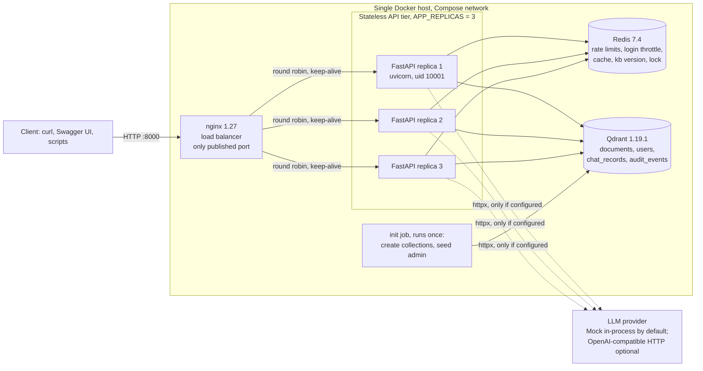
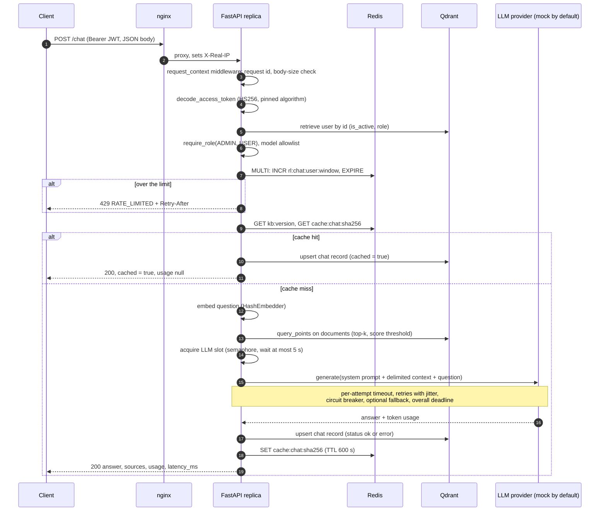
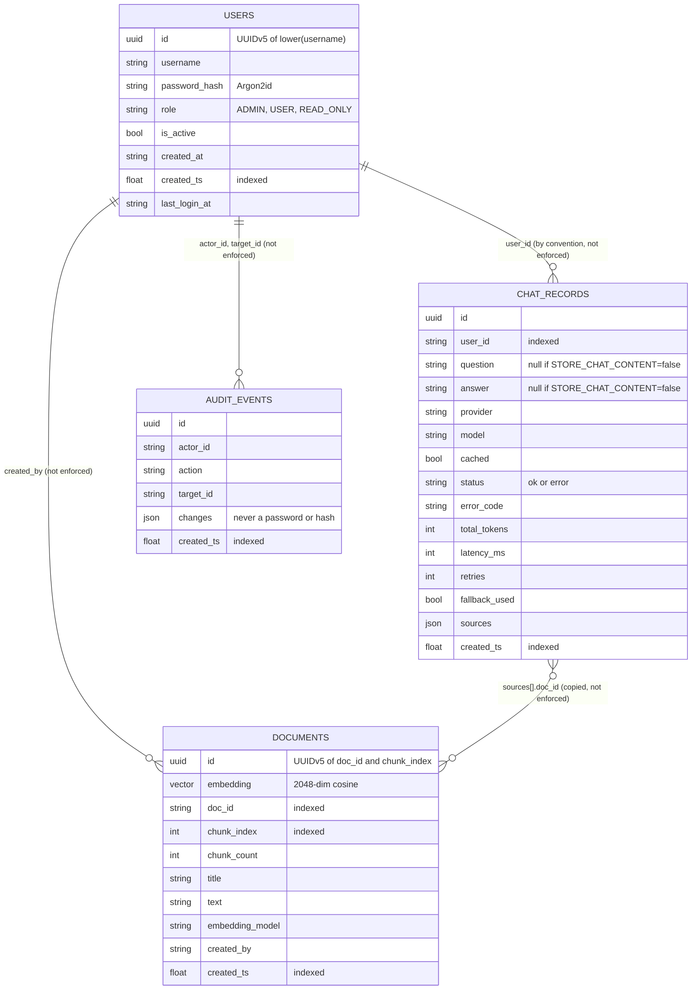
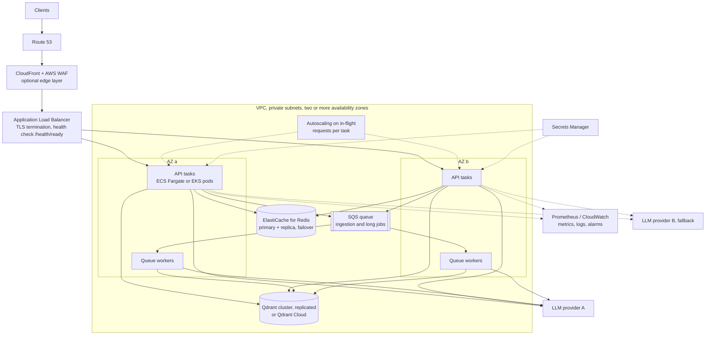

# AI Question-Answering Platform: Technical Report

Assessment: AI/LLM Platform and DevOps Engineer (technical assessment submission)
Report date: 2026-10-03
Repository root: `ai-qa-platform/`

> **Note on length.** This report is written in Markdown. The page count depends on the export format (font, margins, how tables and Mermaid diagrams are rendered), so no page count is claimed. The document is roughly thirteen thousand words, a large share of which is tables.

> **How to read the status labels.** Every component named in this report carries exactly one label:
>
> | Label | Meaning |
> |---|---|
> | **[IMPLEMENTED]** | Built in this repository, run locally, and covered by automated tests or the live smoke test. |
> | **[CONFIGURED]** | Configuration files exist, but they were never executed in a real environment. |
> | **[PROPOSED]** | Design only. Nothing was built or run. |
>
> Three statements apply to the whole document. (1) Nothing was deployed to a cloud. (2) No real LLM provider was called at any point; every result uses the mock provider, and the OpenAI-compatible adapter was tested only against stubbed HTTP responses. (3) 500 requests per second was not tested and is not claimed.

Related documents (written separately; this report does not depend on their content): [README](../README.md), [architecture](architecture.md), [scaling analysis](scaling-analysis.md), [security threat model](security-threat-model.md), [migration plan](migration-plan.md), [test report](test-report.md), [viva preparation](viva-prep.md), [demo script](demo-script.md). Raw evidence is in [`docs/evidence/`](evidence/).

---

## 1. Executive Summary

This project is an HTTP API that answers questions with a large language model (LLM) and is built the way a small production service would be built: authenticated, role-restricted, rate-limited, observable, containerised and horizontally scalable.

What exists and runs **[IMPLEMENTED]**:

- A FastAPI application (Python 3.12) with JWT login (HS256), Argon2id password hashing and three roles (ADMIN, USER, READ_ONLY) enforced by a `require_role` dependency.
- **Qdrant, a vector database, as the only database.** It stores the retrieval index for RAG (`documents`: 2048-dimensional cosine vectors plus text chunks) and three payload-only collections with no vectors (`users`, `chat_records`, `audit_events`). PostgreSQL was deliberately not used; section 7 explains what that decision costs.
- Retrieval-augmented generation (RAG): an ADMIN ingests documents, `/chat` retrieves the most similar chunks and passes them to the LLM as delimited, untrusted context, and the answer lists its `sources`.
- Redis for everything that must be shared between replicas: the per-user rate limit, the login brute-force throttle, the per-user response cache, a knowledge-base version counter and a short user-creation lock.
- An LLM gateway with a provider abstraction, a deterministic mock provider (the default), one OpenAI-compatible HTTP adapter, per-attempt timeout, overall deadline, bounded retries with exponential backoff and full jitter, a per-provider circuit breaker, an optional fallback provider and a concurrency cap with load shedding.
- Prometheus metrics, JSON logs with request IDs and secret redaction, and three health endpoints.
- A multi-stage, non-root Docker image and a Docker Compose stack: nginx load balancer, three API replicas, Qdrant, Redis, and a one-shot `init` job.

What exists only as files **[CONFIGURED]**: Kubernetes manifests in `k8s/`. They were parsed as YAML only; no cluster was available, so `kubectl --dry-run` could not be executed. The GitHub Actions workflow in `.github/workflows/ci.yml` is in the same position: the file exists, but this report contains no evidence of a hosted run, and the same commands were run locally instead.

What is design only **[PROPOSED]**: everything about AWS (ALB, ECS/EKS, ElastiCache, a managed or clustered Qdrant, SQS workers, Secrets Manager, WAF), OAuth2/OIDC, token revocation and multi-region operation.

Measured results (2026-10-03, one laptop, mock LLM; details in sections 24 and 25):

| Check | Result |
|---|---|
| Unit and API tests | 146 passed, 3 skipped (integration tests, skipped by default), about 14 s |
| Coverage | 96% (1,625 statements, 65 missed) |
| Integration tests on real Redis 7.4 and Qdrant 1.19.1 | 3 passed |
| `pip-audit -r requirements.txt` | No known vulnerabilities found |
| `ruff check`, `ruff format --check` | Clean |
| Live smoke test, 3 replicas | 21 of 21 checks passed; three distinct replicas answered |
| Load, 1 s simulated LLM latency, 3 replicas | 53.0 req/s, all HTTP 200 (prediction: at most 60 req/s) |
| Load, zero simulated latency, 3 replicas | 118.5 req/s, all HTTP 200; a lower bound, because the load generator was the bottleneck |

The central engineering conclusion is in section 20: the throughput of this kind of system is set by the LLM provider (latency, requests per minute, tokens per minute), not by the web tier, and "supporting 500 RPS" is a capacity-planning and quota problem that code alone cannot solve.

## 2. Project Background

An LLM is easy to call once from a script. It is harder to offer it to many users as a service, because the model is slow (seconds per call), expensive (billed per token), rate-limited by its provider and capable of failing in several different ways. A platform team places a gateway in front of the model that authenticates callers, limits them, caches what can be cached, retries what can be retried, records what happened and stays up when a dependency does not.

The assessment asks for such a gateway plus the operational material around it: containers, a scaling argument from a handful of users to hundreds of requests per second, a migration path from a single server and a security analysis. The brief allows "PostgreSQL or another database" and lists a vector database for RAG as optional. This submission uses that freedom: it makes the vector database the single datastore and makes RAG a first-class feature.

## 3. Problem Definition

Build a question-answering API that:

1. only authenticated users can call, with different permissions per role;
2. forwards questions to an LLM through a layer that tolerates slow, failing and rate-limited providers;
3. grounds answers in an organisation's own documents (RAG);
4. cannot be abused cheaply (brute-force logins, unlimited paid LLM calls);
5. runs as several identical replicas behind a load balancer without the replicas disagreeing about rate limits or cached data;
6. can be observed (metrics, logs, health) and diagnosed;
7. is accompanied by an honest account of how it would scale and where it would break.

The difficult parts are not the endpoint itself. They are shared state across replicas, failure handling for a dependency with latency measured in seconds, and stating clearly what was built versus what was only designed.

## 4. Objectives

| # | Objective | Status |
|---|---|---|
| O1 | Secure REST API with JWT authentication and three-role RBAC | [IMPLEMENTED] |
| O2 | LLM gateway: timeout, deadline, retries with backoff and jitter, circuit breaker, fallback, load shedding | [IMPLEMENTED] |
| O3 | RAG over a vector database, with source citation | [IMPLEMENTED] |
| O4 | Distributed rate limiting, login throttling and response caching in Redis | [IMPLEMENTED] |
| O5 | Persistence of users, chat records and audit events | [IMPLEMENTED] (in Qdrant) |
| O6 | Metrics, structured logs, health/liveness/readiness endpoints | [IMPLEMENTED] |
| O7 | Non-root container image and a multi-replica Compose stack behind a load balancer | [IMPLEMENTED] |
| O8 | Automated tests, lint, dependency audit | [IMPLEMENTED] (run locally) |
| O9 | Kubernetes manifests | [CONFIGURED] |
| O10 | Scaling design to 100–500 RPS and migration plan from a single EC2 instance | [PROPOSED] |

## 5. Functional Requirements

| ID | Requirement | Where it is implemented |
|---|---|---|
| F1 | Log in with username and password, receive a bearer token | `POST /auth/login`, `app/services/auth_service.py` |
| F2 | Report the current identity | `GET /auth/me` |
| F3 | Ask a question and receive an answer with provider, model, token usage, latency, retry count and sources | `POST /chat`, `app/services/chat_service.py` |
| F4 | Read chat history: own history for every role, any user's history for ADMIN | `GET /chat/history`, `app/api/routes/chat.py` |
| F5 | ADMIN creates, lists and updates users (role, active flag, password) | `/admin/users`, `app/api/routes/admin.py` |
| F6 | ADMIN ingests and deletes knowledge-base documents | `POST /documents`, `DELETE /documents/{doc_id}` |
| F7 | Any authenticated role lists documents and runs retrieval-only search | `GET /documents`, `POST /documents/search` |
| F8 | Per-user rate limit on `/chat` shared by all replicas | `app/services/rate_limiter.py` |
| F9 | Repeated identical questions by the same user are answered from cache | `app/services/cache.py` |
| F10 | Health, liveness, readiness and Prometheus metrics endpoints | `app/api/routes/ops.py` |
| F11 | Every chat request, successful or failed, is recorded | `ChatService._persist`, `app/repositories/chats.py` |
| F12 | User-administration actions are recorded as audit events | `AuditRepository.add` |

## 6. Non-functional Requirements

| Area | Requirement | How it is met | Status |
|---|---|---|---|
| Security | No plaintext passwords; no secrets in code or logs | Argon2id; settings only from environment; log redaction | [IMPLEMENTED] |
| Security | Deny by default | `require_role` lists allowed roles; anything else is 403 | [IMPLEMENTED] |
| Reliability | A slow or failing provider must not hang requests | Per-attempt timeout (15 s), overall deadline (40 s), circuit breaker | [IMPLEMENTED] |
| Reliability | Overload must be shed, not queued without bound | Semaphore of 20 per replica, 5 s maximum wait, then 503 | [IMPLEMENTED] |
| Reliability | Redis outage must not take `/chat` down | Limiter and cache fail open; login fails closed | [IMPLEMENTED] |
| Scalability | Replicas must be stateless and interchangeable | All shared state is in Redis or Qdrant | [IMPLEMENTED] |
| Observability | Request-level tracing by ID; bounded metric cardinality | `X-Request-ID`, route templates as labels | [IMPLEMENTED] |
| Portability | Runs with one command and no API key | Compose plus mock provider and hash embedder | [IMPLEMENTED] |
| Maintainability | Layered code, tests without external services | routes → services → repositories; fakes for Redis and Qdrant | [IMPLEMENTED] |
| Availability | No single point of failure | Not met locally: Qdrant and Redis are single nodes on one host | [PROPOSED] for production |
| Confidentiality in transit | TLS | Not present locally; terminated at the load balancer in the target design | [PROPOSED] |

## 7. Technology Selection and Justification

| Choice | Why this | Why not the alternative |
|---|---|---|
| **Python 3.12** | Dominant language of the LLM ecosystem; mature async I/O; `StrEnum`, modern typing syntax and built-in `TimeoutError` semantics for asyncio are used in the code. | Go or Node would give higher raw throughput per core, but the workload is I/O-bound (waiting on the provider), so the language is not the bottleneck. |
| **FastAPI** | Native `async`, dependency injection (used for authentication and RBAC), request validation and OpenAPI/Swagger generated from the same Pydantic models. | **Flask** is synchronous by default; long LLM waits would tie up a worker each. **Django** brings an ORM, admin and templating built around a relational database that this project does not have. |
| **Pydantic v2 + pydantic-settings** | One validation mechanism for request bodies and for configuration. `Settings` refuses to start in `prod` with a weak JWT secret. `extra="forbid"` on request models rejects unexpected fields. | Hand-written validation is error-prone; reading `os.getenv` in many places scatters configuration. |
| **Qdrant as the only database** | See the comparison below this table. | See below. |
| **Redis** | Atomic counters (`INCR`), keys with TTL and `SET NX` are exactly the primitives needed for rate limits, lockouts, caches and locks, shared by every replica. | In-process memory is invisible to other replicas. Using Qdrant for counters would be slow and non-atomic. Memcached lacks transactions and persistence. |
| **PyJWT** | Small, focused library; the code pins the algorithm and the required claims explicitly. | Larger auth frameworks hide those decisions. `python-jose` offers no advantage for one symmetric algorithm. |
| **argon2-cffi** | Argon2id is memory-hard and is the algorithm standardised in RFC 9106. The library's default parameters are used. | bcrypt is acceptable but not memory-hard. A plain SHA-256 is fast, which is the wrong property for password storage. |
| **httpx** | Async client with explicit timeouts and connection pooling; `httpx.MockTransport` lets the provider adapter be tested without a network. | A vendor SDK would hide the request, the timeout and the error paths, and would bind the code to one provider. `requests` is synchronous. |
| **Hand-written retry loop** | About thirty lines in `gateway.py`. It must interact with an overall deadline, a circuit breaker, a provider `Retry-After` header and a different budget for content errors. Sleep, random and clock are injected so tests are instant and deterministic. | `tenacity` is a good library, but expressing those interactions through decorators would be harder to read and to explain than the explicit loop. |
| **prometheus-client** | The standard exposition format; pull model; counters, gauges and histograms are sufficient. | A hosted APM agent would add an external dependency and a cost. OpenTelemetry is listed as future work. |
| **Standard-library JSON logging** | One formatter class and a `ContextVar` for the request ID; no dependency. | `structlog` or `loguru` are pleasant but not needed for one line format. |
| **pytest + fakeredis + Qdrant in-memory mode** | The whole suite runs in about 14 s with no Docker and no network. Three opt-in integration tests cover what fakes cannot (real payload indexes, real atomicity). | Running every test against containers would be slower and would not run on a machine without Docker. |
| **Ruff** | One fast tool for linting and formatting, including security (`S`), bug-prone (`B`) and async (`ASYNC`) rule sets. | Black + flake8 + isort + bandit is four tools for the same result. |
| **Docker, Compose, nginx** | The image is the unit of deployment in every target (Compose, ECS, Kubernetes). Compose reproduces the production shape (load balancer, replicas, datastores) on one machine. nginx plays the role an ALB plays in the cloud. | A bare `uvicorn` process demonstrates nothing about replicas or shared state. Kubernetes locally was not available. |
| **GitHub Actions** | Workflow file defines lint, tests, audit and image build. | Status: [CONFIGURED]. The same four steps were run locally. |

### 7.1 Qdrant versus PostgreSQL (+pgvector) versus MongoDB

PostgreSQL would be the conventional choice for users and chat records, and this report does not claim otherwise.

| Criterion | Qdrant only (chosen) | PostgreSQL + pgvector | MongoDB (+ vector search) |
|---|---|---|---|
| Vector similarity search | Core purpose; HNSW index, score threshold, payload filtering | Available through the pgvector extension | Available in some editions |
| Transactions across records | None | Full ACID | Multi-document transactions |
| Unique constraints | None | Yes | Unique indexes |
| Joins, ad hoc reporting | None | SQL | Aggregation pipeline |
| Schema migrations tooling | None needed; none available | Mature (for example Alembic) | Varies |
| Number of datastores to run | One (plus Redis) | One (plus Redis) if pgvector is used | One (plus Redis) |

**What is lost without PostgreSQL** (all visible in the code):

- *No unique constraint.* Username uniqueness is obtained by construction: the point ID is a UUIDv5 of the lower-cased username (`user_id_for` in `app/repositories/users.py`), and creation is serialised by a Redis `SET NX` lock (`UserService.create`).
- *No transactions.* Creating a user and writing its audit event are two separate writes; a crash between them leaves a user without an audit record.
- *No joins.* Chat history returns `user_id`, not a username.
- *No numeric offset in ordered scroll.* Pagination reads `limit + offset` points and slices in Python; the routes cap `offset` at 1,000 to keep that bounded.
- *No SQL.* Questions such as "tokens per user per day" need application code or an export.

**Why a single vector database was still chosen:**

1. The access patterns are narrow: fetch a user by ID, append a chat record, list records by `user_id` ordered by time, and vector search. Qdrant's retrieve, upsert, filtered ordered scroll and query cover all four.
2. RAG is a first-class feature here, so a vector index is required in any case. One datastore means one backup procedure, one health check and one failure mode to reason about.
3. The assessment permits it, and making the constraint explicit is more instructive than hiding it.

If the product grew to need billing, reporting or relational integrity, the recommendation in section 28 is to move `users`, `chat_records` and `audit_events` to PostgreSQL and keep Qdrant for vectors only. The repository layer (`app/repositories/`) is the only code that would change.

## 8. System Architecture

### 8.1 Implemented topology (Docker Compose) [IMPLEMENTED]



Properties of this topology, all taken from `docker-compose.yml` and `docker/nginx.conf`:

- Only nginx publishes a port (`HOST_PORT`, default 8000). Qdrant and Redis are reachable only on the internal network; `docker-compose.dev.yml` publishes them on `127.0.0.1` for development and integration tests.
- The `init` service runs `python -m app.database.seed` and exits. The `app` service starts only after `init` completed successfully and Qdrant and Redis are healthy, so replicas never race to create collections.
- nginx starts only when the app containers report healthy (the image's `HEALTHCHECK` calls `/health/live`).
- nginx resolves the service name `app` once at start and round-robins over the addresses returned. After changing the replica count, nginx must be reloaded (`docker compose exec nginx nginx -s reload`).
- Qdrant and Redis use named volumes (`qdrant_data`, `redis_data`). Redis runs with append-only persistence, `maxmemory 256mb` and `volatile-lru` eviction.
- This is a single host. It demonstrates the architecture; it is not highly available.

### 8.2 Request sequence for `POST /chat` [IMPLEMENTED]



Per uncached request the code makes three Qdrant calls (user lookup, vector search, record write) and four Redis round trips (limiter transaction, version read, cache read, cache write). This count is used in the capacity arithmetic of section 20.

## 9. Component-Level Design

The code is layered: **routes** validate and delegate, **services** hold business logic and know nothing about HTTP, **repositories** are the only code that talks to Qdrant. All long-lived objects are created once per process in `app/container.py`.

| Module | Path | Responsibility |
|---|---|---|
| Application factory | `app/main.py` | `create_app()` builds the app; the `request_context` middleware assigns or accepts a request ID (accepted only if it matches `^[A-Za-z0-9._-]{8,64}$`), rejects bodies whose `Content-Length` exceeds `MAX_BODY_BYTES` with 413, converts Qdrant `ApiException` to 503 and any other exception to a generic 500, records metrics using the route template, sets `X-Request-ID`, `X-Served-By` and security headers, and writes one access-log line (health probes excluded). The lifespan hook closes clients on shutdown. |
| Container | `app/container.py` | Wires Qdrant client, Redis client, providers, embedder, repositories and services. Tests inject fakes through keyword overrides. |
| Configuration | `app/core/config.py` | `Settings` (pydantic-settings). Validators: strong `JWT_SECRET` required when `APP_ENV=prod`; chunk overlap smaller than chunk size; fallback provider must differ from the primary. |
| Errors | `app/core/errors.py` | `AppError` hierarchy and three exception handlers that produce the single error envelope. Validation errors name the field and the reason but never echo the submitted value. |
| Logging | `app/core/logging.py` | `JsonFormatter`, `request_id_var` (`ContextVar`), regex redaction of bearer tokens, JWTs, `sk-` keys and `password=`-style pairs. |
| Security | `app/core/security.py` | `hash_password`, `verify_password` (Argon2id), `dummy_password_hash` (timing equalisation), `create_access_token`, `decode_access_token`. |
| Dependencies | `app/api/deps.py` | `get_current_user` (decode token, reload user from Qdrant, reject inactive), `require_role(*roles)`, `require_metrics_access`, `client_ip`. |
| Routes | `app/api/routes/{auth,chat,documents,admin,ops}.py` | Thin HTTP layer; response models from `app/schemas/`. |
| Schemas | `app/schemas/{users,chat,documents}.py` | Request and response models, password-strength rules, `extra="forbid"`. |
| Domain models | `app/models/__init__.py` | Plain dataclasses (`User`, `ChatRecord`, `DocumentInfo`, `RetrievedChunk`) and the `Role` enum. |
| Auth service | `app/services/auth_service.py` | `AuthService.login`; `UserService.create/update/list`, including the Redis creation lock, the self-demotion guard and audit events. |
| Chat service | `app/services/chat_service.py` | `ChatService.ask`: allowlist → rate limit → cache → retrieve → gateway → persist → cache store. Maps LLM errors to HTTP. |
| Rate limiting | `app/services/rate_limiter.py` | `RateLimiter` (fixed window, MULTI/EXEC), `InProcessLimiter` (fallback), `ChatRateLimiter` (fail open), `LoginThrottle` (fail closed). |
| Cache | `app/services/cache.py` | `build_cache_key`, `ResponseCache` (fail open). |
| LLM contract | `app/services/llm/base.py` | `LLMRequest`, `LLMResult`, `LLMProvider` protocol, error classes, the fixed `SYSTEM_PROMPT`, `build_user_message` (delimiters). |
| LLM gateway | `app/services/llm/gateway.py` | Semaphore, deadline, retry loop, breaker consultation, fallback chain, metrics. |
| Circuit breaker | `app/services/llm/circuit_breaker.py` | CLOSED / OPEN / HALF_OPEN state machine, one trial call in HALF_OPEN. |
| Providers | `app/services/llm/mock.py`, `openai_compat.py` | Deterministic mock with scriptable failures; adapter for any OpenAI-style `/chat/completions` endpoint. |
| Embeddings | `app/services/rag/embeddings.py` | `HashEmbedder` (default), `OpenAICompatibleEmbedder` (`/embeddings`). |
| Knowledge base | `app/services/rag/knowledge_base.py` | `chunk_text`, `KnowledgeBase.ingest/search/list/delete`, version counter. |
| Repositories | `app/repositories/{users,chats,documents}.py` | All Qdrant access. |
| Bootstrap and seed | `app/database/{client,bootstrap,seed}.py` | Client factory, idempotent `ensure_collections`, one-shot admin seeding. |
| Metrics | `app/monitoring/metrics.py` | Prometheus metric definitions. |

### 9.1 RAG pipeline in detail [IMPLEMENTED]

**Ingestion** (`KnowledgeBase.ingest`): the text is rejected if longer than `RAG_MAX_DOCUMENT_CHARS` (200,000). `chunk_text` packs paragraphs into chunks of at most 800 characters; a paragraph longer than that is cut into windows overlapping by 100 characters. Each chunk is embedded; chunks whose vector is all zeros (no indexable words) are dropped. The remaining chunks are written as points in `documents` with point ID `UUIDv5(doc_id, chunk_index)`. Finally `kb:version` is incremented in Redis.

**Retrieval** (`KnowledgeBase.search`): the question is embedded with the same embedder; Qdrant returns up to `RAG_TOP_K` (4) nearest chunks by cosine similarity whose score is at least `RAG_SCORE_THRESHOLD` (0.08). If nothing passes the threshold, the LLM is called without context. If embedding or the search fails, `/chat` degrades to answering without context and increments `rag_retrievals_total{outcome="error"}`.

**Generation**: the chunks are placed inside `<context>…</context>` and the question inside `<question>…</question>` in the user message. The system prompt is fixed on the server and states that both are untrusted data.

**The default embedder is lexical, not semantic.** `HashEmbedder` lower-cases the text, removes a stop-word list, hashes each distinct word with BLAKE2b into one of 2048 buckets with a sign bit, weights it by 1 + log(count), and L2-normalises. (2048 buckets rather than a few hundred keeps hash collisions, which appear as random similarity between unrelated texts, close to zero.) Two texts are similar only if they share words. "Car" and "automobile" are unrelated to it. Its purpose is to make the pipeline run and be tested offline and deterministically. `OpenAICompatibleEmbedder` is implemented for real semantic embeddings and is tested against stubbed HTTP responses; it was not run against a real embedding service. Vectors from different embedders are not comparable, so switching requires re-ingestion; `ensure_collections` raises `SchemaMismatchError` if `EMBEDDING_DIM` does not match the existing collection.

## 10. API Design

Interactive documentation is generated by FastAPI at `/docs` (Swagger UI) and `/openapi.json`.

### 10.1 Endpoint summary

| Method and path | Roles | Success | Main error statuses |
|---|---|---|---|
| `POST /auth/login` | public | 200 `TokenResponse` | 401 `INVALID_CREDENTIALS`, 422, 429 (locked), 503 (Redis down) |
| `GET /auth/me` | any authenticated | 200 `UserOut` | 401 |
| `POST /chat` | ADMIN, USER | 200 `ChatResponse` | 401, 403, 413, 422 (`VALIDATION_ERROR`, `MODEL_NOT_ALLOWED`), 429, 502, 503, 504 |
| `GET /chat/history` | any authenticated (own); ADMIN with `user_id=<id>` or `user_id=all` | 200 list of `HistoryItem` | 401, 403, 422 |
| `POST /documents` | ADMIN | 201 `DocumentOut` | 401, 403, 422, 503 `EMBEDDING_UNAVAILABLE` |
| `GET /documents` | any authenticated | 200 list of `DocumentOut` | 401 |
| `POST /documents/search` | any authenticated | 200 `SearchResponse` | 401, 422, 503 |
| `DELETE /documents/{doc_id}` | ADMIN | 204 | 401, 403, 404 |
| `GET /admin/users` | ADMIN | 200 list of `UserOut` | 401, 403 |
| `POST /admin/users` | ADMIN | 201 `UserOut` | 401, 403, 409, 422, 503 (Redis lock unavailable) |
| `PATCH /admin/users/{user_id}` | ADMIN | 200 `UserOut` | 401, 403, 404, 422 (self-demotion or empty update) |
| `GET /health/live` | public | 200 | none |
| `GET /health/ready` | public | 200 | 503 if Qdrant or Redis fails |
| `GET /health` | public | 200 (`ok` or `degraded`) | 503 (`unhealthy`: Qdrant down) |
| `GET /metrics` | ADMIN JWT or `METRICS_SCRAPE_TOKEN` | 200 Prometheus text | 401, 403 |

Pagination: `limit` 1–100 and `offset` 0–1,000 on list endpoints.

### 10.2 Error envelope

Every error, including 404 for unknown routes and 405, has one shape:

```json
{
  "error": {
    "code": "RATE_LIMITED",
    "message": "Chat rate limit exceeded.",
    "request_id": "3f6c0c0e-5b1e-4c58-9a55-1d0b7f5f2a10"
  }
}
```

Validation errors add `details`, a list of `{"field": ..., "message": ...}` without the submitted value. The `request_id` equals the `X-Request-ID` response header and the `request_id` field of every log line for that request.

One exception: a body larger than nginx's `client_max_body_size` (300k) is rejected by nginx itself with its own 413 page, before the application can produce the envelope.

### 10.3 Request and response shapes

The samples below show the shape defined by the schemas in `app/schemas/`. Identifiers, scores, token counts and timings are illustrative values, not measurements. The commands use POSIX shell quoting; in PowerShell use `curl.exe` and put the JSON body in a file (`-d "@body.json"`), as shown in [demo-script.md](demo-script.md).

**Login**

```bash
curl -s -X POST http://localhost:8000/auth/login \
  -H "Content-Type: application/json" \
  -d '{"username": "admin", "password": "<ADMIN_PASSWORD from .env>"}'
```

```json
{"access_token": "<JWT>", "token_type": "bearer", "expires_in": 1800}
```

Request rules: `username` 3–50 characters from `[A-Za-z0-9_.-]`; `password` 8–128 characters; no extra fields.

**Ask a question**

```bash
curl -s -X POST http://localhost:8000/chat \
  -H "Authorization: Bearer $TOKEN" -H "Content-Type: application/json" \
  -d '{"question": "Which port does the zephyr protocol use?"}'
```

Request fields: `question` (1–4,000 characters after trimming, required), `model` (optional; must be the provider default or listed in `LLM_ALLOWED_MODELS`), `temperature` (optional, 0–1, default 0.2), `use_rag` (optional, default `true`).

```json
{
  "id": "0b0f6a2e-1c9b-4f0e-9a43-6a2f5d0c7e11",
  "answer": "[mock] Based on the knowledge base: The zephyr protocol uses port 4242 for telemetry uploads.",
  "provider": "mock",
  "model": "mock-1",
  "cached": false,
  "usage": {"prompt_tokens": 23, "completion_tokens": 15, "total_tokens": 38},
  "latency_ms": 12,
  "retries": 0,
  "fallback_used": false,
  "sources": [
    {"doc_id": "5d1c7a40-8a3e-4f58-b1a0-2e9c4f6d7b22", "title": "Port note", "chunk_index": 0, "score": 0.61}
  ]
}
```

With the mock provider the `usage` numbers are whitespace word counts standing in for tokens. A real provider's own numbers are passed through, or `null` when the provider does not report them. A cache hit returns `"cached": true` and `usage` with all three fields `null`, because no provider call was made.

**History item** (`GET /chat/history?limit=20&offset=0`): `id`, `user_id`, `question`, `answer`, `provider`, `model`, `cached`, `status` (`ok` or `error`), `error_code`, `usage`, `latency_ms`, `retries`, `fallback_used`, `created_at`. `question` and `answer` are `null` when `STORE_CHAT_CONTENT=false`. The stored `sources` are not returned by this endpoint.

**Ingest a document**

```bash
curl -s -X POST http://localhost:8000/documents \
  -H "Authorization: Bearer $ADMIN_TOKEN" -H "Content-Type: application/json" \
  -d '{"title": "Port note", "text": "The zephyr protocol uses port 4242 for telemetry uploads.", "source": "handbook"}'
```

```json
{
  "doc_id": "5d1c7a40-8a3e-4f58-b1a0-2e9c4f6d7b22",
  "title": "Port note",
  "source": "handbook",
  "chunk_count": 1,
  "created_by": "<admin user id>",
  "created_at": "2026-10-03T10:15:00.000000+00:00"
}
```

**Search only** (`POST /documents/search`, body `{"query": "zephyr telemetry", "top_k": 4}`) returns `{"results": [{"doc_id", "title", "chunk_index", "text", "score"}]}`.

**Create a user** (`POST /admin/users`): body `{"username", "password", "role"}`; the password must have at least 10 characters, a letter and a digit, and must not contain the username; `role` defaults to `USER`. The response is `UserOut` (`id`, `username`, `role`, `is_active`, `created_at`, `last_login_at`); there is no password field in any response model.

**Health**

```json
{"status": "ok", "checks": {"database": "ok", "redis": "ok", "llm": "mock", "embeddings": "hash"}, "version": "1.0.0"}
```

### 10.4 Response headers

Every response carries `X-Request-ID`, `X-Served-By` (the container hostname, which shows which replica answered), `X-Content-Type-Options: nosniff`, `X-Frame-Options: DENY`, `Referrer-Policy: no-referrer` and `Cache-Control: no-store`. 401 responses carry `WWW-Authenticate: Bearer`. 429 responses, and 503 responses for provider rate limiting, an open circuit or overload, carry `Retry-After`.

## 11. Authentication and RBAC

### 11.1 Authentication [IMPLEMENTED]

1. `POST /auth/login` first asks `LoginThrottle.ensure_not_locked`. If Redis is unreachable the login is refused with 503 (fail closed).
2. The user is loaded by the UUIDv5 of the lower-cased username. A hash is always verified, a pre-computed dummy hash when the user does not exist, so that "unknown user" and "wrong password" take similar time. Argon2 verification runs in `asyncio.to_thread` so that it does not block the event loop.
3. Unknown user, wrong password and deactivated account all return the same 401 `INVALID_CREDENTIALS` message, and the failure counter for the username + client IP pair is incremented.
4. On success the counter is deleted, `last_login_at` is updated and an HS256 JWT is issued with claims `sub` (user ID), `role`, `iat`, `exp` (30 minutes by default) and `jti`.

Token verification (`decode_access_token`) pins the algorithm list to `["HS256"]`, so a token with `alg=none` or another algorithm is rejected, and requires `sub`, `exp`, `iat` and `jti`. Expired tokens give 401 `TOKEN_EXPIRED`; anything else invalid gives 401 `INVALID_TOKEN`.

**The token proves identity; the database decides authorisation.** `get_current_user` reloads the user from Qdrant on every request. Consequences, both covered by tests: a deactivated user's token stops working immediately, and a token carrying a forged `role` claim gains nothing because the `role` claim is never read for authorisation.

The first ADMIN is created by the `init` job from `ADMIN_USERNAME` and `ADMIN_PASSWORD`, validated by the same `UserCreate` rules as the API. `scripts/make_env.py` generates a random JWT secret and admin password into `.env` so no default credential exists in the repository.

### 11.2 RBAC matrix [IMPLEMENTED]

This is the matrix asserted by `test_rbac_matrix` in `tests/api/test_auth_api.py`. Each cell is the HTTP status the test expects.

| Request | ADMIN | USER | READ_ONLY |
|---|---|---|---|
| `POST /chat` | 200 | 200 | 403 |
| `GET /auth/me` | 200 | 200 | 200 |
| `GET /chat/history` (own) | 200 | 200 | 200 |
| `GET /chat/history?user_id=all` | 200 | 403 | 403 |
| `GET /admin/users` | 200 | 403 | 403 |
| `POST /admin/users` | 201 | 403 | 403 |
| `GET /metrics` | 200 | 403 | 403 |
| `GET /documents` | 200 | 200 | 200 |
| `POST /documents/search` | 200 | 200 | 200 |
| `POST /documents` | 201 | 403 | 403 |
| `DELETE /documents/does-not-exist` | 404 | 403 | 403 |

The last row shows the order of checks: authorisation happens before the resource lookup, so a non-admin learns nothing about which documents exist. `PATCH /admin/users/{id}` is ADMIN-only through the same dependency and is exercised by `test_admin_user_lifecycle`. Without a token every protected route returns 401; six variants (missing, malformed, wrong scheme, bad signature, expired, unknown user) are parametrised in `test_protected_route_returns_401`.

Design decisions:

- READ_ONLY may search the knowledge base but may not call `/chat`: search reads permitted data and costs no LLM tokens.
- An administrator cannot deactivate or demote themselves (422), which prevents locking out the last admin by accident.
- A denied request is logged as `authorization_denied` with user ID, role and path.

### 11.3 Evolution to OAuth2 / OIDC [PROPOSED]

The current scheme is local identity with a shared symmetric secret. It is not single sign-on. The proposed path:

1. Introduce an identity provider (for example Amazon Cognito, Keycloak or a corporate IdP). Users authenticate there with the Authorization Code flow with PKCE.
2. The API stops issuing tokens. `decode_access_token` is replaced by verification of the IdP's RS256/ES256 signature using keys fetched from its JWKS endpoint, plus `iss` and `aud` checks. The API then holds no signing secret at all.
3. Roles come from a token claim or a group mapping; `require_role` is unchanged.
4. `/auth/login` and password storage are retired after a migration window.
5. Optionally, an API gateway validates tokens at the edge before requests reach the service.

## 12. LLM Integration

### 12.1 Provider abstraction [IMPLEMENTED]

`LLMProvider` (a `Protocol` in `base.py`) requires `name`, `default_model`, `configured`, `generate` and `healthcheck`. Two implementations exist:

- **`MockProvider`** (default). Deterministic and offline. Answers are prefixed `[mock]` so they cannot be mistaken for model output. With context it returns the first retrieved chunk (up to 400 characters); without context it echoes the question. Tests script failures with `provider.script("timeout", "server_error", "ok")`. `MOCK_LATENCY_SECONDS` adds an artificial delay for load experiments.
- **`OpenAICompatibleProvider`**. One adapter for any service exposing the OpenAI-style `POST /chat/completions` API; only `OPENAI_BASE_URL`, `OPENAI_API_KEY` and `OPENAI_MODEL` change. The model name has no default in the code. Model names, prices and rate limits change frequently and must be taken from the chosen provider's current documentation; none are stated in this report. The adapter was exercised only through `httpx.MockTransport` in `tests/unit/test_rag_and_adapters.py`. **No real provider was called.**

### 12.2 Gateway behaviour [IMPLEMENTED]

For one `LLMGateway.generate` call:

1. **Deadline.** `deadline = now + LLM_OVERALL_DEADLINE_SECONDS` (40 s) is fixed first; time spent waiting for a slot counts against it.
2. **Concurrency cap.** An `asyncio.Semaphore(LLM_MAX_CONCURRENCY)` (20 per replica). A request waits at most `LLM_QUEUE_WAIT_SECONDS` (5 s) and is then shed with `LLMOverloadedError`.
3. **Provider chain.** Primary, then the optional fallback. The fallback always uses its own default model.
4. **Per attempt.** Not configured → `LLMConfigError`. Deadline passed → `LLMTimeoutError`. Breaker refuses → `LLMCircuitOpenError`. Otherwise the call runs under `asyncio.wait_for` with timeout `min(LLM_TIMEOUT_SECONDS, time remaining)`.
5. **Retry.** Retryable errors are retried up to `LLM_MAX_RETRIES` (2); content errors at most once. The delay is the provider's `Retry-After` when a 429 supplied one, otherwise `random() × min(LLM_BACKOFF_MAX_SECONDS, LLM_BACKOFF_BASE_SECONDS × 2^attempt)`, which is exponential backoff with full jitter. No retry is started if the delay would cross the deadline.
6. **Fallback.** If the primary fails for good with anything other than a bad request, the fallback is tried. A fallback answer is returned with `fallback_used: true` and is not cached.

### 12.3 Error classification table

Derived from `openai_compat.py` (translation of provider outcomes), `gateway.py` (retry, breaker, fallback) and `_LLM_ERROR_MAP` in `chat_service.py` (HTTP mapping).

| Provider outcome | Error class | Retried | Counts toward breaker | Fallback tried | HTTP status and code returned |
|---|---|---|---|---|---|
| Timeout (httpx or per-attempt timeout) | `LLMTimeoutError` | Yes, up to 2 | Yes | Yes | 504 `LLM_TIMEOUT` |
| HTTP 429 | `LLMRateLimitError` | Yes, up to 2, honouring `Retry-After` | Yes | Yes | 503 `LLM_RATE_LIMITED` + `Retry-After` |
| HTTP 5xx or network error | `LLMServerError` | Yes, up to 2 | Yes | Yes | 503 `LLM_UNAVAILABLE` |
| Empty or malformed completion | `LLMContentError` | Yes, once | No | Yes | 502 `LLM_BAD_RESPONSE` |
| HTTP 401 / 403 | `LLMAuthError` | No | Yes | Yes | 503 `LLM_UNAVAILABLE` (logged at CRITICAL) |
| Other HTTP 4xx | `LLMBadRequestError` | No | No | **No** | 502 `LLM_BAD_REQUEST` |
| Missing key or model | `LLMConfigError` | No | No | Yes | 503 `LLM_NOT_CONFIGURED` |
| Breaker open | `LLMCircuitOpenError` | No | n/a | Yes | 503 `LLM_CIRCUIT_OPEN` + `Retry-After` |
| No slot within 5 s | `LLMOverloadedError` | No | n/a | No (raised before the chain) | 503 `LLM_OVERLOADED` + `Retry-After` |

Reasoning behind the table:

- A 400 means the request is wrong; sending it again, or to another provider, will fail again and waste money. It is neither retried nor failed over.
- A 401 from the provider is an operator problem (bad key). Retrying cannot fix it, but a differently-configured fallback might still work, so fallback is allowed. To the client it is reported as a generic 503: the client did nothing wrong and should not learn about the platform's credentials.
- Provider error bodies are never forwarded. The public message is generic; details go to the log.
- When both primary and fallback fail, the last error is the one mapped to HTTP.
- Failed requests are persisted with `status="error"` and the public error code, and are never cached.

### 12.4 Circuit breaker [IMPLEMENTED]

One breaker per provider, per process. CLOSED: calls pass and consecutive failures are counted. After `BREAKER_FAILURE_THRESHOLD` (5) failures it becomes OPEN and rejects calls immediately. After `BREAKER_RESET_SECONDS` (30 s) the next call moves it to HALF_OPEN, where exactly one trial call is admitted; success closes the circuit, failure reopens it. The state is exported as the gauge `llm_circuit_state` (0 closed, 1 half-open, 2 open). Because the state is per process, each replica discovers an outage independently; sharing it through Redis is [PROPOSED].

## 13. Database Design

### 13.1 Collections [IMPLEMENTED]

| Collection | Vectors | Point ID | Payload fields | Payload indexes |
|---|---|---|---|---|
| `documents` | 2048-dim, cosine | `UUIDv5(doc_id, chunk_index)` | `doc_id`, `title`, `source`, `chunk_index`, `chunk_count`, `text`, `embedding_model`, `created_by`, `created_at`, `created_ts` | `doc_id` (keyword), `chunk_index` (integer), `created_ts` (float) |
| `users` | none | `UUIDv5(namespace, lower(username))` | `username`, `password_hash`, `role`, `is_active`, `created_at`, `created_ts`, `last_login_at` | `created_ts` (float) |
| `chat_records` | none | random UUIDv4 (equals the response `id`) | `user_id`, `question`, `answer`, `provider`, `model`, `cached`, `status`, `error_code`, `prompt_tokens`, `completion_tokens`, `total_tokens`, `latency_ms`, `retries`, `fallback_used`, `sources`, `created_at`, `created_ts` | `user_id` (keyword), `created_ts` (float) |
| `audit_events` | none | random UUIDv4 | `actor_id`, `action` (`user.create`, `user.update`), `target_id`, `changes`, `created_at`, `created_ts` | `created_ts` (float) |

`created_ts` is a numeric copy of `created_at` used for ordered scroll. A document has no separate record: chunk 0 of each document carries the document-level metadata, and `GET /documents` filters on `chunk_index = 0`.



The relationships in the diagram are conventions kept by application code. Qdrant enforces none of them: there are no foreign keys, and deleting a document does not touch chat records that cite it.

### 13.2 Bootstrap as migration [IMPLEMENTED]

Qdrant has no SQL schema, so "migration" means "make sure each collection and payload index exists". `ensure_collections` in `app/database/bootstrap.py` is idempotent: it creates only what is missing and can be run any number of times. It is run by the one-shot `init` job before any replica starts. The integration test `test_bootstrap_is_idempotent_and_users_roundtrip` runs it twice against a real Qdrant server.

This is weaker than a migration tool: there is no version history and no data transformation. A change to payload shape would need a hand-written backfill script.

### 13.3 Privacy control: `STORE_CHAT_CONTENT` [IMPLEMENTED]

With `STORE_CHAT_CONTENT=false`, `ChatService._persist` stores usage metadata (tokens, latency, status, model) but writes `null` for the question and answer text. This is covered by `test_store_chat_content_false_keeps_text_out_of_the_database`. Prompts are never written to logs in either mode.

### 13.4 Retention [PROPOSED]

No retention job exists. The proposed policy is a scheduled task that deletes `chat_records` whose `created_ts` is older than a configured number of days (a Qdrant delete-by-filter on the existing index), a longer period for `audit_events`, and an export to object storage before deletion if records must be kept for compliance.

## 14. Redis Architecture

### 14.1 Keys [IMPLEMENTED]

| Purpose | Key pattern | Type and operation | TTL |
|---|---|---|---|
| Chat rate limit | `rl:chat:{user_id}:{window_id}` where `window_id = floor(now / 60)` | counter; `INCR` + `EXPIRE` in one MULTI/EXEC | window + 1 s (61 s) |
| Login throttle | `rl:login:{lower(username)}:{client_ip}` | counter of failed attempts; `INCR` + `EXPIRE` in MULTI/EXEC; deleted on success | `LOGIN_LOCKOUT_SECONDS` (300 s), refreshed on each failure |
| Response cache | `cache:chat:{sha256}` | JSON string (`answer`, `provider`, `model`, `sources`) | `CACHE_TTL_SECONDS` (600 s) |
| Knowledge-base version | `kb:version` | integer; `INCR` on ingest and delete | none |
| User-creation lock | `lock:user:{user_uuid}` | `SET NX EX 10`; deleted after the insert | 10 s |

### 14.2 Why each exists

- **Rate limit.** With N replicas, an in-process counter would give each user N times the limit. One Redis counter is shared by all. `INCR` is atomic, so two replicas can never both read 19 and both admit request 20. The integration test fires 50 concurrent hits from two separate Redis clients at a limit of 20 and asserts exactly 20 are allowed.
- **Login throttle.** After `LOGIN_MAX_ATTEMPTS` (5) failures for a username + IP pair, logins are refused with 429 until the key expires, even with the correct password.
- **Cache key.** SHA-256 over `[user_id, normalised question, provider, model, temperature, prompt_version, use_rag, kb_version]`. The user ID is included so one user's answer is never served to another; the cost is a lower hit rate. The question is normalised by lower-casing and collapsing whitespace.
- **Version counter.** Because `kb_version` is part of the cache key, ingesting or deleting a document makes every older cached RAG answer unreachable without scanning or deleting keys; the orphaned entries expire by TTL.
- **Lock.** Compensates for the missing unique constraint (section 7.1).

### 14.3 Failure policy [IMPLEMENTED]

| Component | When Redis is unreachable | Rationale | Verified by |
|---|---|---|---|
| Chat rate limiter | **Fails open** with a per-process cap (`InProcessLimiter`) | Availability first; abuse is still bounded per replica (effective limit becomes limit × replicas) | `test_chat_limiter_fails_open_with_local_cap_when_redis_is_down`, `test_chat_survives_redis_outage` |
| Login throttle | **Fails closed**: login returns 503 | An attacker must not get unlimited guesses because the throttle store is down; already-issued tokens keep working | `test_login_fails_closed_when_redis_is_down` |
| Response cache | **Fails open**: treated as a miss; writes are skipped | The cache is an optimisation | `test_cache_roundtrip_ttl_and_fail_open` |
| KB version bump | Logged and skipped | If Redis is down the cache is unreachable too, so nothing stale can be served during the outage | code path in `KnowledgeBase._bump_version` |
| User creation | Returns 503 | Without the lock a duplicate could be created | code path in `UserService.create` (not covered by a test) |

The Redis client is created with 2 s socket and connect timeouts so a dead Redis costs a bounded delay per operation.

## 15. Docker and Deployment

### 15.1 Image [IMPLEMENTED]

`Dockerfile` is a two-stage build on `python:3.12-slim`. The builder stage creates a virtual environment and installs `requirements.txt`; the runtime stage copies only the virtual environment and `app/`. Tests, docs, scripts, `k8s/` and `.env` are excluded by `.dockerignore`.

| Property | Implementation |
|---|---|
| Non-root | User `app`, uid and gid 10001, no home directory, no login shell. The live check confirmed containers run as uid 10001. |
| Signal handling | Exec-form `CMD`, so uvicorn is PID 1 and receives SIGTERM directly. |
| Graceful shutdown | `--timeout-graceful-shutdown 30`; Compose `stop_grace_period: 35s`. |
| Keep-alive | `--timeout-keep-alive 75`, longer than nginx's 60 s upstream idle timeout, so the proxy closes idle connections, not the application (see section 25.3). |
| Health check | `HEALTHCHECK` calls `/health/live` using the Python standard library (no curl in the image). |
| Process model | One uvicorn worker per container; scale by adding containers. |
| Secrets | None in the image; all configuration arrives through environment variables at run time. |

### 15.2 Compose stack [IMPLEMENTED]

| Service | Image | Notes |
|---|---|---|
| `nginx` | `nginx:1.27-alpine` | Only published port; `client_max_body_size 300k`; overwrites `X-Real-IP`; `proxy_read_timeout 60s`; passive health check (`max_fails=3 fail_timeout=10s`); retries the next upstream only on connection error or timeout. |
| `app` | built locally | `deploy.replicas: ${APP_REPLICAS:-3}`; no `container_name` and no published port, because either would prevent replicas. |
| `init` | same image | `python -m app.database.seed`, `restart: "no"`. |
| `qdrant` | `qdrant/qdrant:v1.19.1` | Named volume; TCP health check. |
| `redis` | `redis:7.4-alpine` | AOF on; 256 MB; `volatile-lru`; named volume. |

Start-up commands:

```bash
python scripts/make_env.py          # once: creates .env with random secrets
docker compose up --build -d        # nginx + 3 replicas + Qdrant + Redis + init
python scripts/smoke_test.py        # 21 end-to-end checks
```

### 15.3 Kubernetes manifests [CONFIGURED]

`k8s/app.yaml` (ConfigMap, Deployment with 3 replicas, rolling update with `maxUnavailable: 0`, non-root security context, read-only root filesystem, liveness/readiness/startup probes, Service, Ingress, HorizontalPodAutoscaler 3–30 on CPU), `k8s/data.yaml` (single-replica Qdrant StatefulSet, single-replica Redis Deployment, init Job) and `k8s/secret.example.yaml` (template without real values).

Status: these files were **parsed as YAML only** (`docs/evidence/k8s-yaml-parse.txt` lists the resource kinds found). No cluster was available, so neither `kubectl apply --dry-run` nor a real deployment was performed. They may contain errors that only a cluster would reveal. Two known weaknesses are stated in the files themselves: CPU is a weak autoscaling signal for an I/O-bound proxy, and the in-cluster Qdrant and Redis are single replicas (the Redis Deployment also has no persistent volume).

### 15.4 Cloud deployment [PROPOSED]

Not performed. Sections 20 and 21 describe the target design.

## 16. Error Handling

Principles, all [IMPLEMENTED]:

1. **One envelope.** Three handlers in `app/core/errors.py` (for `AppError`, `RequestValidationError` and Starlette's `HTTPException`) plus the middleware's last-resort handler guarantee that every response with status 400 or above has the shape in section 10.2.
2. **No internals leave the server.** Stack traces, provider error bodies and Qdrant messages are logged with the request ID and replaced by a generic message. `test_unexpected_exception_is_a_500_without_internals` and `test_provider_5xx_without_fallback_is_503_with_no_internals` assert this.
3. **Status codes say whose fault it is.** 4xx: the caller must change something. 502/503/504: the platform or its dependency failed, and the caller may retry (a `Retry-After` header is given where a sensible delay is known).
4. **Degrade before failing.** Retrieval failure → answer without context. Cache failure → miss. Chat-record write failure → the answer is still returned, and `chat_persist_failures_total` is incremented (`test_answer_is_returned_even_if_persisting_fails`).

| Status | Codes | Raised when |
|---|---|---|
| 401 | `UNAUTHENTICATED`, `INVALID_TOKEN`, `TOKEN_EXPIRED`, `INVALID_CREDENTIALS` | Missing, invalid or expired token; unknown or inactive user; failed login |
| 403 | `FORBIDDEN` | Role not allowed |
| 404 / 405 | `NOT_FOUND`, `METHOD_NOT_ALLOWED` | Unknown resource, route or method |
| 409 | `CONFLICT` | Username already exists |
| 413 | `PAYLOAD_TOO_LARGE` | `Content-Length` above `MAX_BODY_BYTES` |
| 422 | `VALIDATION_ERROR`, `MODEL_NOT_ALLOWED` | Invalid body; model not on the allowlist; document too large or with no indexable text; self-demotion |
| 429 | `RATE_LIMITED` | Chat limit exceeded; login locked |
| 500 | `INTERNAL_ERROR` | Unhandled exception |
| 502 | `LLM_BAD_RESPONSE`, `LLM_BAD_REQUEST` | Provider returned something unusable or rejected the request |
| 503 | `DATABASE_UNAVAILABLE`, `SERVICE_UNAVAILABLE`, `EMBEDDING_UNAVAILABLE`, `LLM_UNAVAILABLE`, `LLM_RATE_LIMITED`, `LLM_CIRCUIT_OPEN`, `LLM_OVERLOADED`, `LLM_NOT_CONFIGURED` | A dependency is down, saturated or not configured |
| 504 | `LLM_TIMEOUT` | Provider did not answer within the timeout and retry budget |

## 17. Observability

### 17.1 Metrics [IMPLEMENTED]

Defined in `app/monitoring/metrics.py`, exposed at `GET /metrics`.

| Metric | Type | Labels | Meaning |
|---|---|---|---|
| `http_requests_total` | counter | `method`, `route`, `status` | Requests handled |
| `http_request_duration_seconds` | histogram | `method`, `route` | Request latency (buckets 0.01 s to 40 s) |
| `http_errors_total` | counter | `route`, `code` | Responses with status ≥ 400 |
| `llm_requests_total` | counter | `provider`, `outcome` (`success`, `failure`) | Provider call attempts |
| `llm_request_duration_seconds` | histogram | `provider` | Latency of one provider call |
| `llm_failures_total` | counter | `provider`, `error_type` (error class name) | Failed attempts by class |
| `llm_retries_total` | counter | `provider` | Retries started |
| `llm_fallbacks_total` | counter | none | Requests answered by the fallback |
| `llm_tokens_total` | counter | `provider`, `type` (`prompt`, `completion`) | Tokens as reported by the provider |
| `llm_circuit_state` | gauge | `provider` | 0 closed, 1 half-open, 2 open |
| `rate_limit_events_total` | counter | `scope` (`chat`, `login`) | Requests rejected by a limiter |
| `cache_requests_total` | counter | `result` (`hit`, `miss`) | Cache lookups |
| `rag_retrievals_total` | counter | `outcome` (`hit`, `empty`, `error`) | Retrievals for `/chat` |
| `chat_persist_failures_total` | counter | none | Chat records that could not be written |
| `dependency_up` | gauge | `dependency` (`database`, `redis`) | 1 if the last check succeeded |

Label values come only from small fixed sets. The `route` label is the route template (`/admin/users/{user_id}`), never the raw URL; user IDs and question text are never labels. `test_route_label_is_the_template_not_the_raw_url` asserts this.

Access: `/metrics` requires an ADMIN JWT, or the optional static `METRICS_SCRAPE_TOKEN` compared in constant time (`hmac.compare_digest`).

**Limitation.** Metrics are per process. A request to `/metrics` through nginx reaches one replica chosen by round robin and shows only that replica's counters. A Prometheus server should scrape each replica directly and aggregate. No Prometheus server, dashboard or alert rule is part of this repository; those are [PROPOSED].

### 17.2 Logs [IMPLEMENTED]

One JSON object per line on stdout. Fields on every line: `timestamp` (UTC ISO 8601), `level`, `logger`, `message`, `request_id`. The access line (`message: "request"`) adds `method`, `route`, `status`, `latency_ms`, `user_id`. Other events include `login_failed`, `login_succeeded`, `authorization_denied`, `chat_rate_limited`, `llm_retry`, `llm_fallback`, `chat_llm_failed`, `rag_retrieval_failed`, `chat_persist_failed`, `document_ingested`, `admin_user_created` and `admin_user_updated`.

What is deliberately not logged: questions, answers, passwords, tokens and API keys. As a safety net, the formatter redacts bearer tokens, JWT-shaped strings, `sk-` keys and `password=`/`token=`/`api_key=` pairs from messages, string fields and exception text (`test_log_redaction_removes_secrets`). Health-probe requests are not logged, and uvicorn's own access log is disabled to avoid duplicates and raw URLs.

nginx writes its own access log with `request_time`, `upstream_response_time` and the upstream address. It logs the path without the query string and no headers.

### 17.3 Health endpoints [IMPLEMENTED]

| Endpoint | Question it answers | Checks | Used by |
|---|---|---|---|
| `/health/live` | Is this process running? | Nothing external | Docker `HEALTHCHECK`; Kubernetes liveness and startup probes [CONFIGURED] |
| `/health/ready` | Should traffic be sent here? | Qdrant answers and all four collections exist; Redis answers `PING` (2 s timeout each) | Kubernetes readiness probe [CONFIGURED]; an ALB target-group health check [PROPOSED] |
| `/health` | What is the overall state, for a person or dashboard? | Same, plus LLM and embedder configuration | Operators |

`/health` returns `unhealthy` (503) if Qdrant is down, `degraded` (200) if Redis is down or the primary LLM provider is not configured, otherwise `ok`. Liveness deliberately ignores dependencies: restarting a healthy process because the database is down would make an outage worse.

### 17.4 Inspecting locally

```bash
docker compose logs -f app                       # JSON application logs, all replicas
docker compose logs app | grep <request-id>      # everything for one request
docker compose logs nginx                        # request_time, upstream address
curl -s -H "Authorization: Bearer $ADMIN_TOKEN" http://localhost:8000/metrics | grep llm_
curl -s http://localhost:8000/health
```

## 18. Security and Threat Model

A fuller treatment is in [security-threat-model.md](security-threat-model.md). The table below lists what the code does today and what remains.

| Asset | Attack | Mitigation implemented | Residual risk | Proposed improvement |
|---|---|---|---|---|
| User passwords | Database theft followed by offline cracking | Argon2id with a per-password salt; hashes never returned by any response model | Weak user-chosen passwords remain crackable; policy is length ≥ 10, one letter, one digit | Breached-password check; move authentication to an IdP |
| Credentials in transit | Network eavesdropping | None locally (plain HTTP on localhost) | Full exposure on an untrusted network | TLS at the load balancer; HSTS |
| Access tokens | Theft and replay | 30-minute expiry; user state re-read on every request, so deactivation is immediate | A stolen token works until expiry while the account is active; no revocation list; a password change does not invalidate existing tokens | Short-lived access tokens with refresh tokens; `jti` denylist in Redis; OIDC |
| Token integrity | Forgery, `alg=none`, role tampering | Algorithm pinned to HS256; required claims; role taken from the database, not the token; production refuses secrets shorter than 32 characters | HS256 is a shared secret: every replica that verifies can also sign | Asymmetric signatures issued by an IdP; key rotation |
| Login endpoint | Brute force, username enumeration | Throttle per username + IP (5 failures, 300 s), fail closed; one generic error message; dummy hash for unknown users | Distributed guessing from many IPs is not blocked per account; lockout can be used to deny one user from one IP | Per-account counters with progressive delay; CAPTCHA or MFA at the IdP; WAF rate rules |
| LLM spend | Cost abuse through high request volume or large outputs | Per-user rate limit shared across replicas; `LLM_MAX_OUTPUT_TOKENS` cap; question length cap (4,000 characters); model allowlist; per-replica concurrency cap; READ_ONLY cannot call `/chat` | Fixed window allows up to twice the limit across a boundary; no per-user token or cost budget; limit weakens to per-replica if Redis is down | Token-based daily budgets; sliding window or token bucket; provider-side spend limits |
| LLM behaviour | Direct prompt injection in the question | Fixed server-side system prompt; user text only in the user message inside `<question>` delimiters; the prompt declares it untrusted; output is returned as JSON data and never executed | Delimiters and instructions reduce but do not prevent injection; a model can still be persuaded | Output filtering; no tools or secrets are ever given to the model; adversarial test set |
| Knowledge base | Indirect injection: a poisoned document instructs the model when retrieved | Only ADMIN can ingest; retrieved text is delimited as `<context>` and declared untrusted; answers list `sources` so the origin is visible | An admin can ingest a malicious or compromised document; all users share one knowledge base (no per-user document permissions) | Content review on ingestion; per-document access control applied as a Qdrant payload filter; provenance tracking |
| Logs | Sensitive data in logs | Prompts, passwords and tokens are not logged; redaction filter; validation errors do not echo input; `STORE_CHAT_CONTENT=false` option | Redaction is pattern-based and can miss formats it does not know | Central log store with access control and retention limits |
| Secrets | Leakage through the repository or image | `.env` is in `.gitignore` and `.dockerignore`; only `.env.example` (no values) is kept; `make_env.py` generates random secrets and never prints the password; the Kubernetes Secret is a template | `.env` is a plaintext file on disk; no secret scanning is configured | AWS Secrets Manager or SSM Parameter Store; secret scanning in CI; rotation |
| Dependencies | Known vulnerabilities | Pinned versions; `pip-audit` reported none on 2026-10-03 | The result is true only for that date; base-image packages are not scanned | Scheduled audit; image scanning; automated update PRs |
| Admin functions | Unauthorised use or privilege escalation | `require_role(ADMIN)` on every admin and ingest route; deny by default; `extra="forbid"` stops field smuggling; self-demotion blocked; audit events for user changes | A compromised admin account has full control; document ingestion and deletion are logged but not written to `audit_events`; there is no endpoint to read audit events | MFA for admins; audit all admin actions; audit read API; separate admin network path |
| Metrics | Information disclosure | `/metrics` requires ADMIN or a scrape token | A static scrape token is long-lived | Network-level restriction to the monitoring subnet |
| Availability | Oversized bodies, slow provider, overload | Body limit at nginx and in the app; timeouts and deadline; load shedding; circuit breaker | The app's own body check relies on `Content-Length`; nginx is the real guard | WAF; per-IP connection limits |
| Container | Escape or tampering after compromise | Non-root uid 10001; minimal runtime stage; datastores not published | Root filesystem is writable under Compose | Read-only root filesystem and dropped capabilities (present in the Kubernetes manifests, [CONFIGURED]) |

Additional points an examiner may check:

- Swagger UI (`/docs`) and `/openapi.json` are served without authentication. They reveal the API shape, not data. Disabling them in production is a one-line change and is listed as future work.
- CORS is disabled unless `CORS_ALLOW_ORIGINS` is set; when set, only the listed origins are allowed and credentials are not.
- `X-Real-IP` is trusted for throttling only when `TRUST_PROXY_HEADERS=true`, which Compose sets because the app is reachable only through nginx, and nginx overwrites the header.
- Qdrant and Redis run without authentication on the internal Compose network. `QDRANT_API_KEY` is supported by the client for a secured deployment.

## 19. Scaling from 10 to 10,000 Users

"Users" is not a load figure. What matters is concurrent in-flight requests, which depends on how often users ask and how long each answer takes. The table gives the design intent per stage. Only the first two rows describe something that was run.

| Stage | Indicative load | Architecture | What changes | Status |
|---|---|---|---|---|
| 10 users | A few requests per minute | One host, Compose, 1–3 replicas | Nothing; the defaults suffice | [IMPLEMENTED] |
| 100 users | A few requests per second at peak | Same; 3 replicas | Real provider key; tune `CHAT_RATE_LIMIT`; back up the Qdrant volume | [IMPLEMENTED] with the mock; real provider untested |
| 1,000 users | Tens of requests per second at peak | Load balancer plus API tasks in two availability zones; managed Redis; Qdrant on its own node with snapshots | State leaves the application host; TLS; secrets manager; central metrics and logs | [PROPOSED] |
| 10,000 users | 100+ requests per second at peak | Autoscaled API tier; Qdrant cluster with replication; Redis with replica and failover; several provider keys or providers; queue for long work | Provider quota becomes the binding constraint; caching and model tiering matter; asynchronous ingestion | [PROPOSED] |

What already supports horizontal scaling in the code: replicas hold no session state; rate limits, cache, version counter and locks are in Redis; identity is in a signed token plus a database read; schema creation runs once outside the replicas; graceful shutdown lets a load balancer drain a replica.

What would have to change before the later stages:

- **Per-process state.** Circuit-breaker state and the concurrency semaphore are per replica. The total number of in-flight provider calls is therefore `replicas × LLM_MAX_CONCURRENCY`, which rises with autoscaling and can exceed the provider's quota. A global limiter in Redis is needed.
- **Connection counts.** Each replica holds its own HTTP pool to Qdrant and its own Redis pool. Total connections grow with replica count and must stay within what the datastores accept.
- **Qdrant as system of record.** Offset pagination (read `limit + offset`, slice) is acceptable for small offsets only. Chat history grows without bound without retention.
- **Authentication cost.** Every request reads the user from Qdrant. A short-lived cache in Redis would cut this, at the price of delaying deactivation by the cache lifetime.
- **Login cost.** Argon2 is intentionally CPU- and memory-heavy and runs in the default thread pool; a login storm competes with request handling for CPU.

## 20. 100–500 RPS Architecture

### 20.1 Two different throughputs

1. **Gateway throughput**: how many requests per second nginx, FastAPI, Redis and Qdrant can process when the model answers instantly. This is ordinary web-service scaling: add replicas.
2. **Provider throughput**: how many requests and tokens per minute the LLM provider will accept, and how long each call takes. Adding replicas does not change it.

The system's throughput is the smaller of the two, and for a real model it is almost always the second.

### 20.2 Little's Law

Little's Law: `L = λ × W`, where `L` is the average number of requests in the system, `λ` the arrival rate and `W` the average time each spends in the system. For an LLM proxy, `W` is dominated by the model's response time.

Worked example, **assuming** an average LLM response time of 5 s (an assumption for arithmetic, not a measurement):

| Target | In-flight calls `L = λ × W` | Replicas at `LLM_MAX_CONCURRENCY=20` | Replicas if the cap were raised to 100 |
|---|---|---|---|
| 100 RPS | 100 × 5 = 500 | 500 / 20 = 25 | 5 |
| 500 RPS | 500 × 5 = 2,500 | 2,500 / 20 = 125 | 25 |

The cap of 20 is a configuration value, not a physical limit: an asyncio process can hold many more idle connections. Raising it reduces the replica count but increases the load each replica can place on the provider, and the right value would have to be found by testing against the real provider.

The law was checked locally with the mock (section 25): with 1 s simulated latency, one replica with 20 slots delivered 19.2 req/s (prediction 20), and three replicas with 60 slots delivered 53.0 req/s (prediction at most 60).

### 20.3 Tokens per minute

Providers limit requests per minute (RPM) and tokens per minute (TPM). **Assuming** 1,000 tokens per request in total (prompt including retrieved context, plus completion; an assumption, to be replaced by measured usage):

| Target | RPM | TPM at the assumed 1,000 tokens per request |
|---|---|---|
| 100 RPS | 100 × 60 = 6,000 | 6,000 × 1,000 = 6,000,000 |
| 500 RPS | 500 × 60 = 30,000 | 30,000 × 1,000 = 30,000,000 |

These figures must be compared with the limits the chosen provider publishes for the chosen model and account tier. Those limits differ between providers, change over time and are not quoted here; they must be looked up in the provider's current documentation. If the limit is below the required TPM, no amount of infrastructure reaches the target. RAG increases prompt size (up to four chunks of up to 800 characters each with default settings), so it raises the tokens per request.

### 20.4 Bottleneck ranking

| Rank | Bottleneck | Why | Evidence |
|---|---|---|---|
| 1 | Provider TPM/RPM quota | Hard external limit | Arithmetic above; not measured |
| 2 | Provider latency × concurrency | Fixes in-flight calls via Little's Law | Runs 1–3 with simulated latency |
| 3 | API event-loop CPU per replica | One Python process per replica | Run 5: one replica saturated at 72.1 req/s with zero simulated latency on the test laptop |
| 4 | Qdrant | Three calls per uncached request; single node locally | Not isolated in a test |
| 5 | Redis | Four round trips per uncached request; single-threaded command execution but very fast | Not isolated in a test |
| 6 | Load balancer | Rarely the limit | nginx `request_time` p50 0.025 s in run 4 |

At 500 RPS with no cache hits the code would issue about 1,500 Qdrant operations and 2,000 Redis round trips per second (3 and 4 per request, section 8.2). Those rates were not tested.

### 20.5 Mitigations

| Mitigation | Effect | Status |
|---|---|---|
| Response caching | A hit costs no provider call and no tokens | [IMPLEMENTED], per user. A shared cache for non-personal questions would raise the hit rate and is [PROPOSED] because of its privacy risk. |
| Load shedding | Fast 503 with `Retry-After` instead of unbounded queues | [IMPLEMENTED]; verified in run 3 |
| Fallback provider | Continues service when the primary fails | [IMPLEMENTED] with mocks; untested with real providers |
| Output-token cap | Bounds tokens and latency per request | [IMPLEMENTED] |
| Queue plus workers | Accept the request, return a job ID, process at the rate the provider allows; smooths bursts | [PROPOSED] (for example ARQ on Redis, or SQS) |
| Several keys, accounts or providers | Adds quota; weighted routing | [PROPOSED] |
| Model tiering | Send simple questions to a smaller, faster model | [PROPOSED] |
| Global concurrency and token limiter in Redis | Keeps the fleet inside the provider quota regardless of replica count | [PROPOSED] |
| Streaming responses | Does not raise throughput, but improves perceived latency | [PROPOSED] |

### 20.6 Target architecture on AWS [PROPOSED]

Nothing in this diagram was built or run.



Design notes: the same container image runs as API task and as worker; autoscaling should follow in-flight requests per task rather than CPU, because tasks mostly wait on I/O; outbound traffic to providers leaves through NAT gateways; ECS Fargate is the simpler choice for one service, while EKS is justified only if the organisation already operates Kubernetes (the manifests in `k8s/` are a starting point, [CONFIGURED]).

## 21. Migration from Single EC2

All phases are [PROPOSED]. No AWS resource was created. The starting point assumed by the assessment is one EC2 instance running everything. Each phase is independently reversible and leaves a working system. Costs are described by their drivers only; prices must be taken from the current AWS and Qdrant pricing pages.

| Phase | Goal | Steps | Risks | Rollback | Cost sensitivity |
|---|---|---|---|---|---|
| **0. Stabilise the single instance** | Make the current state reproducible and recoverable | Run the Compose stack on the instance; push the image to a registry (ECR); move secrets to Secrets Manager or SSM; schedule Qdrant snapshots to S3; ship logs and basic alarms to CloudWatch; record a baseline of latency and error rate | Snapshot restore never rehearsed | None needed; additive | Low: storage and log volume |
| **1. Externalise state** | Make the application host disposable | Create managed Redis (ElastiCache) and point `REDIS_URL` at it (Redis data here is disposable: limits and cache rebuild themselves). Stand up Qdrant on its own node or Qdrant Cloud, restore the latest snapshot, pause writes briefly, take a final snapshot, restore, switch `QDRANT_URL` | Data written between final snapshot and switch is lost unless writes are paused; added network latency | Point the two URLs back at the local containers, which are kept until the phase is accepted | Medium: two always-on managed services |
| **2. Load balancer and a second instance** | Remove the application host as a single point of failure; add TLS | ALB with an ACM certificate; target-group health check on `/health/ready`; second instance in another availability zone running only the API container; DNS to the ALB with a low TTL; deregistration delay of at least 35 s to match graceful shutdown | Misconfigured health check removes all targets; idle-timeout mismatch between ALB and uvicorn keep-alive (the app's keep-alive must stay longer than the ALB idle timeout) | DNS back to the original instance | Medium: ALB hours plus one more instance |
| **3. Container orchestration and autoscaling** | Replace hand-managed instances with a service | ECS service on Fargate (or EKS using `k8s/`) across two availability zones; rolling deployment with minimum healthy 100%; the `init` job as a one-off task per release; autoscaling policy; shift traffic by weighted target groups (10% → 50% → 100%) | Autoscaling on the wrong signal; more tasks than the provider quota allows | Shift weights back to the instance target group | Variable: scales with task-hours; NAT data charges |
| **4. Hardening for 100–500 RPS** | Operate inside provider limits at high load | Queue and workers for ingestion and long requests; global limiter in Redis; second provider; WAF; OIDC; dashboards and alerts on error rate, p95 latency, shed rate and breaker state; load test against the real provider with a spend cap; optional second region | Complexity; provider cost during load tests | Each item is behind a setting and can be disabled | Dominated by LLM token spend, not infrastructure |

Minimal-downtime rules that apply throughout: change one thing per phase; keep the old path running until the new one has served real traffic; use the readiness endpoint as the gate; use DNS or target-group weights for gradual shifts; only the Qdrant move in phase 1 needs a short write pause.

## 22. Failure Recovery

### 22.1 Behaviour under failure

| Failure | Behaviour | Verified? |
|---|---|---|
| **Redis down** | `/chat` keeps working: limiter falls back to a per-process cap, cache is skipped. Login returns 503. User creation returns 503. `/health` = `degraded` (HTTP 200), `/health/ready` = 503, `/health/live` = 200. | **Yes.** Automated tests (`test_chat_survives_redis_outage`, `test_login_fails_closed_when_redis_is_down`, `test_redis_down_is_degraded_and_not_ready_but_live`) and a live experiment: stopping the Redis container produced exactly these three health results, and the stack recovered within about 2 s of Redis returning. |
| **Qdrant down** | Authenticated requests fail with 503 `DATABASE_UNAVAILABLE` (the user cannot be loaded). `/health` = `unhealthy` (503), readiness 503, liveness 200. If Qdrant fails only during the final record write, the answer is still returned. | **Tests only** (`test_database_down_is_unhealthy_and_not_ready_but_live`, `test_database_error_in_a_route_is_a_clean_503`, `test_answer_is_returned_even_if_persisting_fails`), using simulated failures. Not tried live. |
| **One API replica stops** | nginx marks it failed after connection errors (`max_fails=3`, `fail_timeout=10s`) and sends new requests to the others; a request whose connection is refused is retried on the next replica. Requests already in flight on the dead replica are lost and are not replayed, because `POST` is not idempotent. Docker restarts the container (`restart: unless-stopped`). | **Not tested** as a deliberate experiment. Design and configuration only. |
| **Planned replica stop (SIGTERM)** | uvicorn stops accepting connections and gives in-flight requests up to 30 s; Compose waits 35 s. | **Not measured.** |
| **LLM provider slow or failing** | Timeout per attempt, bounded retries, breaker opens after 5 consecutive failures, fallback if configured, otherwise 502/503/504 with a generic message. | **Tests only**, with the mock scripted to fail (`tests/unit/test_gateway.py`, `tests/api/test_chat_api.py`). Never observed with a real provider. |
| **Overload** | Requests beyond the slot capacity wait at most 5 s and are shed with 503 `LLM_OVERLOADED`. | **Yes**, in load run 3: 300 × 200 and 300 × 503, nothing hung. |
| **Full stack restart** | Data in named volumes survives. | **Yes**: `docker compose down` followed by `up` kept users and chat records. |
| **Host loss** | Total outage; data lost if the disk is lost. | Not applicable locally; this is the single point of failure of the Compose stack. |

### 22.2 RTO and RPO

RTO (recovery time objective) is how long the service may be down; RPO (recovery point objective) is how much recent data may be lost.

| Data | Local Compose stack (actual) | Target design [PROPOSED] |
|---|---|---|
| Qdrant (users, chat records, documents) | RPO: none for a container restart (named volume); unbounded for disk loss, because **no backup is configured**. RTO: a container restart. | Scheduled Qdrant snapshots to object storage (RPO = snapshot interval); replication factor ≥ 2 across zones so a node loss needs no restore. |
| Redis (limits, cache, version counter) | AOF persistence; loss is tolerable, since limits reset and the cache refills. The cache entries and `kb:version` live in the same Redis, so losing one means losing both and no stale answer can be served. | Managed Redis with a replica and automatic failover; the same tolerance for loss. |
| API replicas | Stateless; RTO is a container start. | Rolling replacement by the orchestrator. |

No RTO or RPO figure was measured apart from the roughly 2 s recovery after Redis returned.

## 23. Testing Strategy

| Layer | What it proves | Tools | Count and location |
|---|---|---|---|
| Unit | Pure logic in isolation: schema validation, password and JWT handling, redaction, chunking, hash embedder, cache key, limiter windows, breaker transitions, gateway retry/backoff/deadline/fallback with injected `sleep`, `rand` and `clock` | pytest; fakeredis | `tests/unit/` (5 files) |
| Adapter | The OpenAI-compatible provider and embedder build the right request and classify every HTTP outcome correctly | `httpx.MockTransport` | `tests/unit/test_rag_and_adapters.py` |
| API | Whole requests through the real ASGI app, middleware, dependencies and error handlers: authentication, RBAC matrix, chat paths, RAG, cache isolation, rate limiting, health states, metrics, envelopes | `httpx.ASGITransport`; Qdrant in-memory mode; fakeredis; mock provider | `tests/api/` (3 files) |
| Integration (opt-in) | What fakes cannot show: bootstrap and ordered scroll on a real Qdrant server; vector search on real Qdrant; atomicity of the limiter on real Redis under concurrency | Real containers; `RUN_INTEGRATION=1 pytest -m integration` | `tests/integration/` (3 tests) |
| End-to-end smoke | The deployed Compose stack behaves correctly through nginx across replicas | `scripts/smoke_test.py` (standard library only) | 21 checks |
| Load | Capacity behaviour and load shedding of the gateway tier with a mock LLM | `scripts/load_test.py` | 5 runs |
| Static | Style, common bugs, security lint; dependency CVEs | Ruff; pip-audit | whole repository |

Design choices that make the suite fast and deterministic: time, randomness and sleeping are injected into the gateway, limiter and breaker; the mock provider is scripted per call; Argon2 hashing is done once per test session; tests never read a developer's `.env` (`_env_file=None`).

What is **not** tested: any real LLM or embedding provider; Kubernetes; TLS; multi-host behaviour; replica failure under load; long soak runs; type checking (mypy was not run).

## 24. Implementation and Verification

All results below were produced on 2026-10-03 on one laptop: Intel Core i5-12500H (16 logical CPUs), 16 GB RAM, Windows 11, Docker Desktop 29.8.1 with a WSL2 virtual machine of 16 CPUs and 7.6 GB. The LLM was the mock provider throughout.

| Verification | Result | Evidence |
|---|---|---|
| `pytest --cov=app` | 146 passed, 3 skipped (integration, skipped by default) in about 14 s | [`evidence/pytest-coverage.txt`](evidence/pytest-coverage.txt) |
| Coverage | 96% (1,625 statements, 65 missed); `app/database/seed.py` is omitted from measurement by configuration | same file |
| Integration tests, real Redis 7.4 and Qdrant 1.19.1 | 3 passed, including "50 concurrent hits from two clients → exactly 20 allowed" | [`evidence/pytest-integration.txt`](evidence/pytest-integration.txt) |
| `pip-audit -r requirements.txt` | "No known vulnerabilities found" | [`evidence/pip-audit.txt`](evidence/pip-audit.txt) |
| `ruff check`, `ruff format --check` | Clean | run locally; no output file |
| Smoke test against Compose, 3 replicas | 21 of 21 checks passed; three distinct `X-Served-By` hostnames answered | [`evidence/smoke-test.txt`](evidence/smoke-test.txt) |
| Non-root container | Containers run as uid 10001 | checked on the live stack |
| Redis outage experiment | `/health` degraded (200), `/health/ready` 503, `/health/live` 200; recovery within about 2 s | performed on the live stack |
| Persistence across restart | `docker compose down` then `up` kept users and chat records | performed on the live stack |
| Load tests | Five runs, section 25 | [`evidence/load-test.txt`](evidence/load-test.txt) |
| Kubernetes manifests | Parsed as YAML only; not applied, not dry-run | [`evidence/k8s-yaml-parse.txt`](evidence/k8s-yaml-parse.txt) (lists the resource kinds found) |

The lowest-coverage modules are `app/container.py` (82%: construction of real providers and shutdown) and `app/database/bootstrap.py` (84%: the dimension-mismatch branch). Those lines run in the live stack but not in the default test suite.

The smoke test demonstrates, through nginx: 401 without a token; ADMIN creating USER and READ_ONLY accounts; 403 for USER on `/admin/users` and for READ_ONLY on `/chat`; document ingestion; a grounded answer containing the ingested fact with at least one source; the second identical question served from cache; READ_ONLY vector search; two persisted chat records; a 429 with `Retry-After` after 20 requests in the window, counted across replicas; `/metrics` for ADMIN; and document deletion.

## 25. Performance Considerations

### 25.1 Scope

These runs measure the **gateway tier** (nginx, FastAPI, Redis, Qdrant) on a laptop with a **mock LLM**. Client, load balancer, replicas and datastores shared one machine. This is not a production benchmark and says nothing about a real provider. 500 RPS was not tested. Every question was unique, so the cache was bypassed; `CHAT_RATE_LIMIT` was raised for the runs. The load generator ran in a container on the Compose network.

### 25.2 Results

Figures are quoted from [`evidence/load-test.txt`](evidence/load-test.txt).

| Run | Setup | Requests / concurrency | Throughput | Status codes | Client latency (ms) |
|---|---|---|---|---|---|
| 1 | 1 s simulated latency; nginx; 3 replicas (3 × 20 = 60 slots) | 600 / 100 | 53.0 req/s | 200: 600 | mean 1667.4, p50 1801.7, p95 2195.6, p99 2368.2 |
| 2 | 1 s simulated latency; one replica directly (20 slots) | 300 / 100 | 19.2 req/s | 200: 300 | mean 4478.8, p50 5008.9, p95 5370.3, p99 5543.9 |
| 3 | 1 s simulated latency; one replica directly; 5 s queue wait | 600 / 300 | 37.5 req/s (all responses) | 200: 300, 503: 300 | mean 6470.0, p50 5969.5, p95 9706.0, p99 10385.9 |
| 4 | zero simulated latency; nginx; 3 replicas | 3000 / 50 | 118.5 req/s | 200: 3000 | mean 419.4, p50 273.4, p95 1279.3, p99 1968.0 |
| 5 | zero simulated latency; one replica directly | 1500 / 50 | 72.1 req/s | 200: 1500 | mean 688.2, p50 638.2, p95 1214.8, p99 1609.2 |

Requests were spread evenly over replicas in runs 1 and 4 (199/204/197 and 1001/1005/994).

Server-side view from the nginx access log: run 1 `request_time` p50 1.606 s, p95 1.969 s, p99 2.032 s; run 4 `request_time` p50 0.025 s, p95 0.039 s, p99 0.117 s, max 0.312 s.

### 25.3 Interpretation

**Runs 1 and 2 confirm the capacity model.** With 1 s per call, 20 slots can complete at most 20 calls per second and 60 slots at most 60. Measured: 19.2 and 53.0 req/s. Throughput was set by `slots / latency`, as Little's Law predicts, and tripling the replicas roughly tripled it. With 100 clients competing for 60 slots, the extra latency above 1 s in run 1 is time spent waiting for a slot.

**Run 3 shows load shedding working.** With 300 concurrent clients against 20 slots, 300 requests were answered with 200 and 300 were rejected with 503 `LLM_OVERLOADED` after the 5 s queue wait. No request hung and no connection error was recorded. The 37.5 req/s figure counts rejections as well as answers; successful throughput stayed bounded by the 20 slots.

**Run 4 is a lower bound, not a capacity figure.** The client reported p50 273 ms, but nginx measured p50 0.025 s for the same requests. The difference is time spent inside the load generator, which is a single Python process: requests were waiting in the client before being sent and after being received. The server tier was therefore not saturated, and 118.5 req/s is the rate the *generator* achieved. The true capacity of three replicas with a mock LLM on this machine is higher and was not determined.

**Run 5 indicates per-replica saturation.** A single replica addressed directly reached 72.1 req/s with zero simulated latency. One replica is one Python event loop, and each uncached request performs token verification, a user read, a rate-limit transaction, cache lookups, embedding, a vector search and a record write. This is a laptop figure with shared CPUs and should be read as an order of magnitude only.

### 25.4 Lessons from benchmarking

1. **Measure on both sides.** An early run appeared to show lower throughput than the design predicted. Comparing client latency with nginx `request_time` and with the application's own `latency_ms` log field showed that the queueing was in the load generator, not the server. Without the server-side numbers the wrong component would have been "optimised".
2. **Keep-alive timeouts must be ordered.** At high concurrency the client saw `ReadError` failures. The cause was the application closing idle keep-alive connections that the proxy still considered usable. Setting uvicorn `--timeout-keep-alive 75`, longer than nginx's 60 s upstream idle timeout, means the proxy is always the side that closes an idle connection. The same rule applies to an ALB.
3. **A closed-loop generator hides overload.** `scripts/load_test.py` sends a new request only when a worker is free, so it cannot produce more load than the system absorbs. An open-loop tool with a fixed arrival rate would be needed to study behaviour beyond saturation properly.

### 25.5 Design choices that affect performance

- No database call is in flight while waiting for the model, so a slow provider does not hold Qdrant or Redis connections.
- Argon2 hashing and verification run in a worker thread; everything else on the request path is non-blocking I/O.
- The hash embedder is pure Python and runs on the event loop; it is cheap for a 4,000-character question but would block noticeably when ingesting a 200,000-character document (about 250 chunks at 800 characters). Ingestion is synchronous within the request; moving it to a background worker is [PROPOSED].
- nginx keeps up to 64 idle upstream connections, avoiding a TCP handshake per request.

## 26. Cost and Trade-offs

No prices are quoted, because provider and cloud prices change; they must be read from current pricing pages.

**Cost structure.** For a real deployment the dominant cost is LLM tokens, which scale with usage: tokens per request × requests. Infrastructure is second: load balancer, compute for replicas, managed Redis, a Qdrant cluster, NAT data transfer, logs. The controls in this codebase that act on token cost are the per-user rate limit, the output-token cap, the question-length cap, the response cache, the model allowlist and the READ_ONLY role. The local stack with the mock costs nothing to run.

| Decision | Benefit | Cost accepted |
|---|---|---|
| Qdrant as the only database | One datastore; RAG is native | No transactions, constraints, joins or SQL (section 7.1) |
| Mock provider and hash embedder as defaults | Runs anywhere, free, deterministic tests | Answers are not model output; retrieval is lexical; real-provider behaviour unverified |
| Per-user cache key | No cross-user leakage | Lower hit rate than a shared cache |
| Fixed-window limiter | One atomic operation; simple to reason about | Up to twice the limit across a window boundary |
| Chat limiter fails open | `/chat` survives a Redis outage | Weaker abuse protection during the outage |
| Login throttle fails closed | No unlimited guessing | No new logins during a Redis outage |
| User reloaded on every request | Immediate deactivation and role change | One Qdrant read per request |
| HS256 local tokens | No external identity service needed | Shared secret; no SSO; no revocation |
| Per-process breaker and semaphore | No extra dependency on the hot path | Fleet-wide concurrency grows with replicas |
| Synchronous request/response | Simple client contract | A request occupies a slot for the full model latency; no smoothing of bursts |
| One worker per container | Simple scaling unit; clean signals | Replica count, not process count, is the scaling knob |
| Compose instead of Kubernetes for the working deployment | Runs on a laptop with one command | Single host; not highly available |

## 27. Limitations

Stated plainly, each verified against the code or the evidence.

**Data layer**

1. Qdrant as system of record has no ACID transactions, no unique constraints and no joins. Username uniqueness depends on deterministic UUIDv5 point IDs plus a Redis `SET NX` lock. Because the ID is derived from the username, a username cannot be changed.
2. Pagination reads `limit + offset` points and slices; `offset` is capped at 1,000.
3. Qdrant and Redis are single nodes in Compose. There is no replication, no failover and no configured backup.
4. There is no retention job; chat records grow without bound.
5. Audit events cover user creation and update only, and no endpoint reads them.

**RAG**

6. The default hash embedder is lexical, not semantic.
7. All users share one knowledge base; there is no per-document access control.
8. Chunking is by characters and paragraphs, not by tokens or sentences. There is no re-ranking and no evaluation of answer quality.
9. Ingestion is synchronous inside the HTTP request. No background queue is implemented.

**LLM gateway**

10. No real LLM or embedding provider was called. The adapter is verified only against stubbed HTTP.
11. Circuit-breaker state and the concurrency cap are per process, so fleet-wide concurrency is `replicas × LLM_MAX_CONCURRENCY`.
12. There is no streaming, no per-user token budget and no cost accounting beyond recording reported token counts.

**Security**

13. A JWT cannot be revoked before it expires. Deactivation and role changes do take effect immediately because the user is re-read on every request, but a password change does not invalidate existing tokens.
14. HS256 uses a shared secret, and identity is local: this is not SSO or OIDC.
15. The fixed-window limiter allows up to twice the limit in a burst across a window boundary.
16. Login throttling is per username + IP; guessing from many addresses is not limited per account.
17. No TLS locally.
18. The application's body-size check relies on the `Content-Length` header; nginx's `client_max_body_size` is the effective guard.
19. Swagger UI is served without authentication.
20. Prompt-injection defences reduce risk but cannot eliminate it.

**Operations**

21. `/metrics` through nginx reaches one replica at random; Prometheus should scrape replicas directly. No Prometheus server, dashboard or alert exists.
22. After changing the replica count, nginx must be reloaded to learn the new addresses.
23. Kubernetes manifests were never run. Only YAML parsing was done.
24. The CI workflow file has not been shown to run on GitHub in this report.
25. mypy (static type checking) was not run.
26. No cloud deployment exists. Load was tested only on one laptop with a mock LLM, and the highest observed throughput (118.5 req/s) was limited by the load generator. 500 RPS was not tested.

## 28. Future Roadmap

All items are [PROPOSED].

| Horizon | Item | Reason |
|---|---|---|
| Next | Test against one real provider with a spend cap; record real latency and token usage | Replace assumptions in section 20 with measurements |
| Next | Real semantic embeddings; a small retrieval-quality test set | The hash embedder is a placeholder |
| Next | Run the Kubernetes manifests on a local cluster (kind or minikube) | Move them from "parsed" to "tested" |
| Next | mypy in CI; confirm the workflow on GitHub; image scanning; disable `/docs` when `APP_ENV=prod` | Close known gaps cheaply |
| Next | Scheduled Qdrant snapshots and a rehearsed restore | There is currently no backup |
| Medium | Background ingestion and long requests through a queue with workers (ARQ or SQS) | Remove synchronous ingestion; smooth bursts |
| Medium | Global concurrency and token limiter in Redis; breaker state shared in Redis | Keep the whole fleet inside the provider quota |
| Medium | Sliding-window or token-bucket limiter; per-user daily token budgets | Remove the boundary burst; control cost directly |
| Medium | Refresh tokens and a `jti` denylist, or move directly to OIDC | Revocation; SSO |
| Medium | Move `users`, `chat_records`, `audit_events` to PostgreSQL if reporting or integrity needs appear | Transactions, constraints, SQL |
| Medium | Per-document access control as a Qdrant payload filter | Multi-tenant knowledge base |
| Medium | Prometheus, dashboards, alerts; OpenTelemetry tracing | Operate, not only expose |
| Later | AWS deployment following section 21; TLS, WAF, Secrets Manager | Production hosting |
| Later | Streaming responses; model tiering; multiple providers with weighted routing | Perceived latency; cost; quota |
| Later | Retention and deletion jobs; data-subject export and erase | Privacy obligations |

## 29. Conclusion

The repository contains a working, tested question-answering API with authentication, role-based access, retrieval-augmented generation over a vector database, distributed rate limiting and caching, a resilient LLM gateway and basic observability, packaged as a non-root image and run as three replicas behind a load balancer on one machine. Its behaviour is supported by 146 passing tests at 96% coverage, three integration tests on real Redis and Qdrant, a 21-check smoke test across replicas, a live Redis-outage experiment and five load runs.

The report is equally clear about what was not done. The model was always a mock. The Kubernetes files were parsed, not run. Nothing was deployed to a cloud. The highest measured throughput is a lower bound from a laptop, and 500 RPS was not tested.

Three decisions define the project. First, using Qdrant as the only database made RAG central and kept operations to one datastore, in exchange for giving up transactions, constraints and SQL; the workarounds are explicit in the code and PostgreSQL remains the conventional choice if relational needs appear. Second, every piece of state that replicas must agree on lives in Redis, with a deliberate fail-open or fail-closed policy for each use. Third, the gateway treats the LLM as an unreliable, slow and costly dependency and bounds every way it can fail.

The main lesson of the scaling analysis and the load tests is the same: capacity is `concurrency ÷ latency`, bounded by the provider's quota. Reaching hundreds of requests per second is therefore decided by provider limits, caching and queueing rather than by adding web servers, and any figure must be measured on both the client and the server side before it is believed.

## 30. References and Appendices

### 30.1 References

Official project documentation and standards consulted. Only homepages and stable identifiers are given.

1. FastAPI documentation: https://fastapi.tiangolo.com/
2. Pydantic documentation: https://docs.pydantic.dev/
3. Qdrant documentation: https://qdrant.tech/documentation/
4. Redis documentation: https://redis.io/docs/
5. Prometheus documentation: https://prometheus.io/docs/
6. Docker documentation: https://docs.docker.com/
7. Kubernetes documentation, Horizontal Pod Autoscaling: https://kubernetes.io/docs/
8. nginx documentation: https://nginx.org/en/docs/
9. RFC 7519, JSON Web Token (JWT): https://www.rfc-editor.org/rfc/rfc7519
10. RFC 9106, Argon2 Memory-Hard Function for Password Hashing and Proof-of-Work Applications: https://www.rfc-editor.org/rfc/rfc9106
11. OWASP Top 10 for Large Language Model Applications: https://owasp.org/ (project page under "OWASP Top 10 for LLM Applications")
12. AWS Architecture Blog, "Exponential Backoff And Jitter": https://aws.amazon.com/blogs/architecture/
13. Little's Law (queueing theory): textbook reference to be added by student.
14. LLM provider rate limits and pricing: to be taken from the chosen provider's current documentation; reference to be added by student once a provider is selected.

### 30.2 Appendix A: environment variables

From `.env.example`. Defaults are those of `.env.example`; `app/core/config.py` holds the same defaults except where noted.

| Variable | Default | Purpose |
|---|---|---|
| `APP_ENV` | `prod` (code default `dev`) | `dev`, `test` or `prod`; `prod` refuses a weak `JWT_SECRET` |
| `LOG_LEVEL` | `INFO` | Log level |
| `HOST_PORT` | `8000` | Host port published by nginx (Compose only) |
| `APP_REPLICAS` | `3` | Number of API containers (Compose only) |
| `MAX_BODY_BYTES` | `300000` | Larger bodies receive 413 |
| `CORS_ALLOW_ORIGINS` | empty | Comma-separated origins; empty disables CORS |
| `TRUST_PROXY_HEADERS` | `false` (Compose sets `true`) | Trust `X-Real-IP` from the proxy |
| `JWT_SECRET` | none; required | At least 32 random characters in `prod` |
| `JWT_EXPIRE_MINUTES` | `30` | Access-token lifetime |
| `ADMIN_USERNAME` | `admin` | First ADMIN, created by the init job |
| `ADMIN_PASSWORD` | none; required | At least 10 characters with a letter and a digit |
| `METRICS_SCRAPE_TOKEN` | empty | Optional static bearer token for `/metrics` |
| `QDRANT_URL` | `http://localhost:6333` (Compose overrides) | Qdrant address |
| `QDRANT_API_KEY` | empty | For a secured or managed Qdrant |
| `STORE_CHAT_CONTENT` | `true` | `false` stores metadata only |
| `REDIS_URL` | `redis://localhost:6379/0` (Compose overrides) | Redis address |
| `CHAT_RATE_LIMIT` | `20` | `/chat` requests per user per window |
| `CHAT_RATE_WINDOW_SECONDS` | `60` | Window length |
| `LOGIN_MAX_ATTEMPTS` | `5` | Failed logins per username + IP before lockout |
| `LOGIN_LOCKOUT_SECONDS` | `300` | Lockout duration |
| `CACHE_ENABLED` | `true` | Response cache switch |
| `CACHE_TTL_SECONDS` | `600` | Cache entry lifetime |
| `LLM_PROVIDER` | `mock` | `mock` or `openai_compatible` |
| `LLM_FALLBACK_PROVIDER` | empty | Empty, `mock` or `openai_compatible`; must differ from the primary |
| `LLM_ALLOWED_MODELS` | empty | Extra model names clients may request |
| `LLM_TIMEOUT_SECONDS` | `15` | Per attempt |
| `LLM_OVERALL_DEADLINE_SECONDS` | `40` | Per request, across queue wait, retries and fallback |
| `LLM_MAX_RETRIES` | `2` | Retries per provider |
| `LLM_BACKOFF_BASE_SECONDS` | `0.5` | Backoff base |
| `LLM_BACKOFF_MAX_SECONDS` | `8` | Backoff cap |
| `LLM_MAX_CONCURRENCY` | `20` | In-flight LLM calls per replica |
| `LLM_QUEUE_WAIT_SECONDS` | `5` | Maximum wait for a slot before 503 |
| `LLM_MAX_OUTPUT_TOKENS` | `512` | Output cap sent to the provider |
| `BREAKER_FAILURE_THRESHOLD` | `5` | Consecutive failures that open the circuit |
| `BREAKER_RESET_SECONDS` | `30` | Time before a trial call |
| `MOCK_LATENCY_SECONDS` | `0` | Artificial delay of the mock (load experiments) |
| `OPENAI_BASE_URL` | `https://api.openai.com/v1` | Base URL of an OpenAI-compatible service |
| `OPENAI_API_KEY` | empty | Provider key |
| `OPENAI_MODEL` | empty | Model name; take it from the provider's current documentation |
| `OPENAI_MAX_TOKENS_PARAM` | `max_tokens` | Or `max_completion_tokens` |
| `RAG_ENABLED` | `true` | RAG switch |
| `RAG_TOP_K` | `4` | Chunks passed to the LLM |
| `RAG_SCORE_THRESHOLD` | `0.08` | Minimum cosine similarity |
| `RAG_CHUNK_SIZE` | `800` | Characters |
| `RAG_CHUNK_OVERLAP` | `100` | Characters; must be smaller than the chunk size |
| `RAG_MAX_DOCUMENT_CHARS` | `200000` | Larger documents are rejected |
| `EMBEDDING_PROVIDER` | `hash` | `hash` (offline, lexical) or `openai_compatible` (semantic) |
| `EMBEDDING_DIM` | `2048` | Must equal the embedding model's output size |
| `EMBEDDING_BASE_URL` | `https://api.openai.com/v1` | Embedding service base URL |
| `EMBEDDING_API_KEY` | empty | Embedding service key |
| `EMBEDDING_MODEL` | empty | Embedding model name |

Settings present in the code but not in `.env.example`: `APP_VERSION` (default `1.0.0`) and `QDRANT_TIMEOUT_SECONDS` (default 5). Compose development ports: `QDRANT_DEV_PORT`, `REDIS_DEV_PORT`.

### 30.3 Appendix B: command cheat-sheet

```bash
# --- first run ---------------------------------------------------------------
python scripts/make_env.py                    # creates .env with random JWT_SECRET and ADMIN_PASSWORD
docker compose up --build -d                  # nginx + 3 API replicas + Qdrant + Redis + init job
docker compose ps                             # state of every container
python scripts/smoke_test.py                  # 21 end-to-end checks; exit code 0 = all passed

# --- everyday ----------------------------------------------------------------
docker compose logs -f app                    # JSON logs of all replicas
docker compose logs nginx                     # request_time and upstream per request
docker compose exec nginx nginx -s reload     # after changing APP_REPLICAS
docker compose down                           # stop; named volumes (data) are kept
docker compose down -v                        # stop and DELETE all data

# --- tests and quality -------------------------------------------------------
pip install -r requirements-dev.txt
pytest --cov=app --cov-report=term-missing    # unit + API tests, no Docker needed
ruff check . && ruff format --check .
pip-audit -r requirements.txt

# --- integration tests (real Redis and Qdrant) -------------------------------
docker compose -f docker-compose.yml -f docker-compose.dev.yml up -d qdrant redis
RUN_INTEGRATION=1 pytest -m integration       # PowerShell: $env:RUN_INTEGRATION=1; pytest -m integration

# --- load test (mock LLM; raise CHAT_RATE_LIMIT first) -----------------------
python scripts/load_test.py --requests 600 --concurrency 100

# --- experiments -------------------------------------------------------------
docker compose stop redis                     # /health -> degraded, /health/ready -> 503, /health/live -> 200
docker compose start redis                    # recovery
curl -s http://localhost:8000/health
curl -s -i http://localhost:8000/health/live  # X-Served-By shows the replica
```

Interactive API documentation: http://localhost:8000/docs
